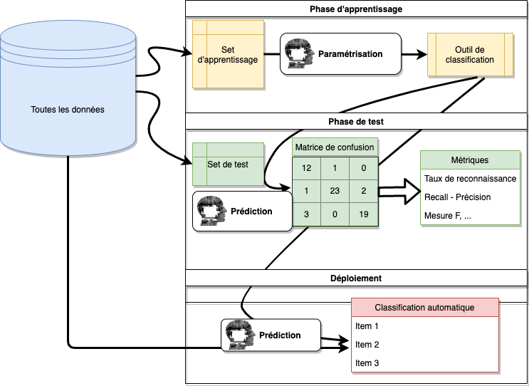

# (PART) SDD III : exploration et prédiction {.unnumbered}

# Classification supervisée I {#classif1}

```{r setup, results='hide', warning=FALSE, include=FALSE}
SciViews::R # We don't add "ml" here to show later on what it gives
```

##### Objectifs {.unnumbered}

-   Comprendre le principe général de la classification supervisée

-   Être capable d'utiliser l'analyse discriminante linéaire pour faire de la classification supervisée

-   Maîtriser les matrices de confusion

-   Comprendre la logique et être capable d'utiliser les différentes métriques calculables sur base de la matrice de confusion

##### Prérequis {.unnumbered}

Avant de vous lancer tête baissée dans de la matière nouvelle, assurez-vous d'avoir installé la SciViews Box `r learnitdown$svbox`. Si ce n'est pas encore fait, retournez à la [page d'accueil pour bien débuter](https://wp.sciviews.org).

Vous devez être à l'aise dans l'utilisation de R, RStudio, (R) Markdown/Quarto, ainsi que Git et GitHub. Si ce n'est pas le cas, l'[annexe B du cours de Science des données I](https://wp.sciviews.org/sdd-umons/?iframe=wp.sciviews.org/sdd-umons-2024/prise.html) devraient vous aider à vous remettre à niveau.

##### À vous de jouer ! {.unnumbered}

`r h5p(159, height = 270, toc = NULL)`

Vous devez maîtriser les bases de Git et de GitHub (avoir un compte GitHub, être capable de cloner un dépôt localement, travailler avec l'onglet **Git** de RStudio pour faire un "commit", "push" et "pull").

##### À vous de jouer ! {.unnumbered}

`r h5p(160, height = 270, toc = NULL)`

L'utilisation de tous ces outils a été expliquée dans les cours précédents [SDD I](https://wp.sciviews.org/sdd-umons) et [SDD II](https://wp.sciviews.org/sdd-umons2). Nous ne reviendrons pas dessus et cette matière est considérée comme acquise.

Outre les outils, ce cours s'appuie sur des notions que nous avons déjà abordées dans le cours de [science des données biologiques 2](https://wp.sciviews.org/sdd-umons2/?iframe=wp.sciviews.org/sdd-umons2-2024/cah-kmeans-div.html) la notion de **classification non supervisée**. De même, la modélisation (via les **régressions**) a aussi fait l'objet d'une attention particulière dans le [cours précédent](https://wp.sciviews.org/sdd-umons2/?iframe=wp.sciviews.org/sdd-umons2-2024/lm.html). Toutes ces connaissances vont servir de pilier de base pour ce que nous étudierons ensemble dans ce module, ainsi que dans les deux suivants concernant la classification supervisée.

##### À vous de jouer ! {.unnumbered}

`r h5p(161, height = 270, toc = NULL)`

Assurez-vous que vous possédez encore bien les bases de l'utilisation de R pour importer, remanier, visualiser des données, pour réaliser un test d'hypothèse, une régression linéaire et une analyse multivariée. Prenez également connaissance des **nouveautés** introduites dans la SciViews Box 2024 au travers du learnr suivant.

##### À vous de jouer ! {.unnumbered}

```{r assign_C01Ia_debug_I, echo=FALSE, results='asis'}
if (exists("assignment"))
  assignment("C01Ia_debug", part = "I",
    url = "https://github.com/BioDataScience-Course/C01Ia_debug",
    course.ids = c(
      'S-BIOG-025'         = !"C01Ia_{YY}M_debug"),
    course.urls = c(
      'S-BIOG-025'         = "https://classroom.github.com/a/j8zZrT-k"),
    course.starts = c(
      'S-BIOG-025'         = !"{W[4]+1} 08:00:00"),
    course.ends = c(
      'S-BIOG-025'         = !"{W[6]+1} 23:59:59"),
    term = "Q1", level = 3,
    toc = "Débogage de code et ADL (partie I)")
```

`r learnr("C00La_refresh", title = "Rappels et nouveautés de la SciViews Box 2024", toc = NULL)`

## Principes de base

Rappelez-vous, la **classification** sert à regrouper les individus d'un jeu de données en différents groupes ou **classes**. Lorsque vous avez utilisé la classification hiérarchique ascendante ou le dendrogramme, vous avez réalisé de la classification *non* supervisée. La classification *non* supervisée permet de choisir des classes librement sur base de l'information de similitude ou différence entre les individus contenus dans le jeu de données.

Nous allons aborder maintenant la **classification supervisée** (un sous-ensemble de l'apprentissage machine ou *"machine learning"* en anglais). Elle permet d'utiliser un ordinateur pour lui faire apprendre à classer des objets selon nos propres critères que nous spécifions par ailleurs. Par exemple, en biologie, nous sommes amenés à classer le vivant (la fameuse classification taxonomique selon la [nomenclature binomiale de Linné](https://www.tela-botanica.org/2018/11/carl-von-linne-pere-de-la-classification-des-plantes-missionbotanique/)). Nous pourrions être amenés à nous faire seconder par un ordinateur pour classer nos plantes en herbier, nos insectes en collections... ou nos photos d'oiseaux ou de poissons. À partir du moment où nous pouvons collecter ou mesurer différentes caractéristiques quantitatives ou qualitatives sur chaque individu, et que pour certains, nous en connaissons le nom scientifique, la classification supervisée pourrait être utilisée pour classer automatiquement d'autres individus, uniquement sur base des mêmes mesures. Mais ceci n'est qu'un exemple d'application possible parmi beaucoup d'autres en biologie...

```{block2, type='note'}
Les techniques de classification supervisée font l'objet d'une effervescence toute particulière ces derniers temps, en particulier dans leurs versions d'apprentissage profond ou *deep learning* en anglais. Ces méthodes sont, en général (mais pas obligatoirement pour les approches plus traditionnelles) appliquées sur de très gros jeux de données contenant des dizaines de milliers, des centaines de milliers, voire des millions, ou d'avantage d'observations. C'est précisément ce très grand nombre d'observations qui mérite que nous essayions d'automatiser leur classement.
```

Un jeu de données est composé d'observations (les lignes du tableau) et de variables (les colonnes du tableau) sur ces observations. En classification supervisée, les observations se nomment les **items** ou les **cas** (nos différents spécimens de plantes, insectes...) et les variables se nomment les **attributs** (les variables quantitatives ou qualitatives mesurées sur chaque spécimen).

##### À vous de jouer ! {.unnumbered}

`r h5p(162, height = 270, toc = "Vocabulaire de la classification supervisée")`

En taxonomie assistée par ordinateur, nous cherchons donc à accélérer le dépouillement de gros échantillons en identifiant de manière automatique (ou semi-automatique) la faune et/ou la flore qui les composent. L'approche le plus souvent employée est l'analyse d'image pour mesurer des caractères visuels sur ces photographies. Il s'agit donc d'une classification sur base de critères morphologiques. Les organismes qui composent la faune et/ou la flore sont les items et les critères morphologiques sont les attributs. Vous avez certainement déjà rêvé d'avoir quelqu'un qui fait votre travail à votre place... pourquoi pas votre ordinateur ?

Parmi tous les items, on va choisir un sous-ensemble représentatif que l'on classe manuellement sans erreur. On obtient donc un ensemble de groupes connus et distincts. On va diviser ce sous-ensemble en un **set d'apprentissage** pour entraîner l'algorithme de classification, et un **set de test** pour en vérifier les performances.

La classification supervisée va se décomposer en réalité en trois phases.



1.  **Apprentissage** : un **classifieur**, basé sur un **algorithme de classification** est **entraîné** (paramétré) pour classer les items sur base du **set d'apprentissage**.

2.  **Test** : les **performances** du classifieur sont évaluées à l'aide du **set de test**.

3.  **Déploiement** : si le classifieur obtient des performances satisfaisantes, il est utilisé pour classer **automatiquement** tous les autres items du jeu de données.

```{block2, type='warning'}
Les trois phases sont appliquées sur des individus *différents*, donc souvent sur des tableaux de données *différents* eux aussi. Vous devez veiller à ce que ces trois tableaux soient **compatibles entre eux**, c'est-à-dire, qu'ils contiennent les mêmes variables dans les mêmes formats. En particulier, vous devez veiller à ce que la variable à prédire porte le même nom et soit sous forme **factor** dans R, à la fois dans le set d'apprentissage et dans le set de test.

Vous devez également veiller à ce qu'il n'y ait pas de données manquantes, si la méthode de classification utilisée ne les supporte pas (cas le plus fréquent). Les modifications éventuelles des données sont donc à réaliser *avant* de séparer le tableau de données initial en set d'apprentissage et set de test. De cette façon, le pré-traitement n'est effectué qu'une seule fois, et nous sommes certains que les deux tableaux d'apprentissage et de test sont conformes après séparation. Pour le déploiement, n'oubliez pas d'effectuer les mêmes préparatifs des variables avant de prédire les classes à partir de ce troisième tableau.

Dans R, une série de packages prévus pour fonctionner ensemble selon un système cohérent appelé **[tidymodels](https://www.tidymodels.org)** offre une autre façon plus flexible de préparer les attributs, ce que l'on appelle en anglais le *feature engineering*, grâce au package {[recipes](https://recipes.tidymodels.org/)}. La transformation est encodée dans le classifieur lui-même et est appliquée automatiquement de la même façon sur le set de test, de validation ou pour toute prédiction ultérieure. Dans ce cas, il est préférable, au contraire, de partir des variables brutes ayant été altérées à minima.
```

Il y a de très nombreux domaines d'applications de ces techniques de classification supervisée de type *"machine learning"*. Par exemple en médecine, elles s'utilisent pour analyser les mesures effectuées par un scanner, un système de radiographie aux rayons X, un électrocardiogramme ou un électroencéphalogramme... pour y détecter des anomalies. Votre moteur de recherche favori sur Internet utilise ces techniques pour classer les pages en "pertinentes" et "non pertinentes". La reconnaissance vocale ou de l'écriture manuscrite entrent dans cette catégorie également, de même que l'analyse de sentiment sur base de texte (déterminer l'état d'esprit de l'auteur du texte sur base des mots et expressions qu'il utilise).

Il faut s'attendre à ce que dans quelques années, des algorithmes plus efficaces, et des ordinateurs plus puissants pourront effectuer des tâches aujourd'hui dévolues à des spécialistes, comme le médecin spécialisé en radiographie pour l'exemple cité plus haut. Nous sommes même à l'aube des véhicules capables de conduire tous seuls, sur base de l'analyse des images fournies par leurs caméras ! Et bien sûr... les LLM (*large language models* en anglais) ont récemment une percée dans la vie de monsieur tout le monde avec ChatGPT et des dizaines de systèmes similaires. Ces systèmes, basés sur l'apprentissage profond, effectuent également une sorte de classification supervisée très élaborée des mots les plus probables dans un discours l'un après l'autre... ce qui finit par former un texte original qui ressemble à ce qu'un humain aurait écrit (mais parfois le sens laisse à désirer, parfois pas) ! Le même principe est également appliqué pour créer ou retoucher des images ou des vidéos.

##### À vous de jouer ! {.unnumbered}

`r h5p(163, height = 270, toc = "Set d'apprentissage et de test")`

### Conditions d'application

Il y a néanmoins certaines conditions d'application à satisfaire préalablement pour pouvoir utiliser efficacement l'apprentissage machine :

-   **Tous les groupes sont connus et disjoints**. Chaque cas appartient à une et une seule classe (sinon, refaire un découpage plus judicieux des classes). Un individu ne peut appartenir simultanément à deux ou plusieurs classes, et nous ne pouvons pas rencontrer de cas n'appartenant à aucune classe. Éventuellement, rajouter une classe fourre-tout nommée "autre" pour que cette condition puisse être respectée.

-   **La classification manuelle est réalisée sans erreur** dans les sets d'apprentissage et de test. C'est une contrainte forte. Vérifiez soigneusement vos sets avant utilisation. Éventuellement, recourez à l'avis de plusieurs spécialistes et établissez un *consensus*, ou éliminez les cas litigieux... mais attention alors à ne pas déroger à la condition suivante !

-   **Toute la variabilité est représentée dans le set d'apprentissage**. Vous devez vous assurer de rassembler les individus représentant toute la variabilité de chaque classe pour la phase d'apprentissage (et de test aussi).

-   **Les mesures utilisées sont suffisamment discriminantes entre les classes**. Vous devez vous arranger pour définir et mesurer des attributs qui permettent de séparer efficacement les classes. Vous pourrez le constater visuellement en représentant, par exemple, deux attributs quantitatifs sur un graphique en nuage de points, et en y plaçant les points représentant vos individus en couleurs différentes en fonction de leurs classes. Si des regroupements bien distincts sont visibles sur le graphique, vous êtes bons... sinon c'est mal parti. Utilisez éventuellement des techniques comme l'analyse des composantes principales (ACP) pour visualiser de manière synthétique un grand nombre d'attributs. L'**ingénierie et sélection judicieuse des attributs** est une partie cruciale, mais difficile de la classification supervisée. L'apprentissage profond ("deep learning") tente de s'en débarrasser en incluant cette partie du travail dans le programme d'apprentissage lui-même.

-   **Le système est statique : pas de changement des attributs des items à classer par rapport à ceux des sets d'apprentissage et de test**. Des situations typiques qui peuvent se produire et qui ruinent votre travail sont un été particulièrement chaud et sec par rapport aux saisons pendant lesquelles des plantes ont été prélevées pour le set d'apprentissage. Par conséquent, vos fleurs ont des caractéristiques morphologiques différentes suite à cette longue canicule et sont donc moins bien, voire, totalement mal classées. Un autre exemple serait le changement d'appareil de RMN qui donne des images légèrement différentes du précédent. Le set d'apprentissage de la première RMN ne permet alors peut-être pas de créer un classifieur capable de classer valablement les analyses réalisées avec le second appareil.

-   **Toutes les classes ont des représentants dans les sets**. Il parait assez évident que si le set d'apprentissage ne contient aucun item pour une classe, l'algorithme de classification ne peut pas être entraîné à reconnaître cette classe-là. Par contre, il est également indispensable que le set de test soit pourvu d'un minimum d'items par classe, afin d'établir correctement une estimation des performances du classifieur pour *chaque* classe. Attention avec une répartition aléatoire entre apprentissage et test pour une très petite quantité totale de données dans une ou plusieurs classes, cette situation pourrait apparaître par le biais du hasard.

En pratique, ces conditions d'application ne sont *pas* remplies strictement dans les faits, mais le but est de s'en rapprocher le plus possible. Par exemple, il est impossible en pratique de garantir qu'il n'y ait absolument *aucune* erreur dans les sets d'apprentissage et de test. Si le taux d'erreur reste faible (quelques pour cent voire encore moins), l'impact de ces erreurs sera suffisamment négligeable. Par contre, avec 20 ou 30% d'erreurs, par exemple, nous ne pourrons plus travailler valablement.

##### À vous de jouer ! {.unnumbered}

`r h5p(164, height = 270, toc = "Condition d'application")`

## Mesure de performances

Avant de nous lancer dans la découverte de différents algorithmes, nous devons nous intéresser aux outils et métriques qui permettent d'évaluer la qualité d'un classifieur dans l'étape de test. C'est, en effet, à travers eux que vous pourrez juger de la pertinence ou non de votre classifieur.

### Matrice de confusion

L'un des outils les plus importants pour évaluer la qualité d'un algorithme de classification supervisée est la **matrice de confusion**. Cette matrice est représentée sous la forme d'un *tableau de contingence à double entrée* qui croise les classes prédites par l'ordinateur avec les classes prédites manuellement pour ces mêmes items. En cas de concordance, les items sont dénombrés le long de la diagonale de cette matrice carrée. Donc, tous les dénombrements hors diagonale représentent des erreurs faites par l'ordinateur (en vertu du postulat de base que le classement manuel est établi sans ambiguïté et sans erreur).

|              | **Espèce 1** | **Espèce 2** | **Espèce 3** | **Espèce 4** |
|--------------|--------------|--------------|--------------|--------------|
| **Espèce 1** | **correct**  | erreur       | erreur       | erreur       |
| **Espèce 2** | erreur       | **correct**  | erreur       | erreur       |
| **Espèce 3** | erreur       | erreur       | **correct**  | erreur       |
| **Espèce 4** | erreur       | erreur       | erreur       | **correct**  |

Considérons la matrice de confusion suivante, obtenue suite à la classification de trois fruits.

```{r, echo=FALSE}
conf <- dtf(
  Orange    = c(25, 0, 1),
  Mandora   = c(0, 16, 9),
  Mandarine = c(0, 8, 18))
rownames(conf) <- c("Orange", "Mandora", "Mandarine")

knitr::kable(conf, col.names = c("Orange", "Mandora", "Mandarine"),
  caption = "Matrice de confusion dont les colonnes représentent la classification par ordinateur et les lignes la classification manuelle.")
```

Quel que soit le nombre de classes, il est toujours possible de réduire la matrice de confusion dès lors qu'on se focalise sur *une* classe en particulier. Par exemple, si nous nous intéressons aux performances de notre classifieur pour les mandoras, nous pouvons réduire notre matrice de confusion de la manière suivante (deux matrices simplifiées similaires peuvent naturellement être calculées pour les deux autres classes, orange et mandarine).

```{r, echo=FALSE, message=FALSE}
mandora <- dtf(
  Mandora       = c("TP = 16", "FP = 9"),
  `Pas mandora` = c("FN = 8", "TN = 44"))
rownames(mandora) <- c("Mandora", "Pas mandora")

knitr::kable(mandora, col.names = c("Mandora", "Pas mandora"),
  caption = "Matrice de confusion dont les colonnes représentent la classification par ordinateur et les lignes la classification manuelle pour les mandoras.")
```

Les métriques principales dans cette dernière matrice de confusion réduite à une taille de 2x2 (on parle aussi de **classification binaire**) sont :

-   TP : Vrais positifs (*True Positive* en anglais). C'est le nombre d'items de la classe d'intérêt correctement classé. Concernant nos mandoras, il s'agit du nombre d'items classé comme des mandoras par l'ordinateur et qui sont effectivement des mandoras.

-   TN : Vrais négatifs (*True Negative*). C'est le nombre d'items classé dans toutes les autres classes de manière correcte. Concernant nos mandoras, il s'agit du nombre d'items qui ne sont pas classés comme des mandoras et qui ne sont effectivement pas des mandoras.

-   FP : Faux positifs (*False Positive*). C'est le nombre d'items des autres classes qui sont erronément classés dans notre classe d'intérêt. Concernant nos mandoras, il s'agit du nombre d'items classés comme des mandoras par l'ordinateur alors qu'ils n'en sont pas.

-   FN : Faux négatifs (*False Negative*). C'est le nombre d'items de la d'intérêt qui sont classés par l'ordinateur dans une autre classe. Concernant nos mandoras, il s'agit du nombre de mandoras qui sont erronément classées par l'ordinateur comme des oranges ou des mandarines.

```{r, echo=FALSE, message=FALSE}
conf_mat <- dtf(
  Positif = c("TP", "FP"),
  Négatif = c("FN", "TN"))
rownames(conf_mat) <- c("Positif", "Négatif")

knitr::kable(conf_mat,
  caption = "Matrice de confusion théorique dont les colonnes représentent la classification par ordinateur et les lignes la classification manuelle.")
```

##### À vous de jouer ! {.unnumbered}

`r h5p(165, height = 270, toc = "Vrais et faux positifs ou négatifs")`

### Métriques de performance

De nombreuses métriques existent pour quantifier les performances d'un classifieur sur base de la matrice de confusion (dont certaines nécessitent la simplification en matrice 2x2, mais pas toutes). Partons d'un exemple fictif pour illustrer les calculs :

```{r}
# Classification manuelle en 3 classes A, B, C (la "vérité")
manu <- c("A", "B", "C", "A", "A", "C", "B", "C", "B", "B")
# Classification automatique (par l'ordinateur)
auto <- c("B", "B", "C", "C", "A", "C", "B", "C", "A", "B")

# Matrice de confusion
matconf <- table(Manuel = manu, Automatique = auto)
knitr::kable(as.matrix(matconf),
  caption = "Données fictives de classification en trois classes A, B et C.")
```

-   **Taux de reconnaissance global** (*Accuracy* en anglais)

$$acc(\%) = \frac{TP+TN}{TP+TN+FP+FN}\cdot 100$$

Il s'agit d'une métrique qui quantifie globalement le modèle et qui se généralise facilement à plus de deux classes. Si vous observez bien les termes dans l'équation, vous constaterez que c'est en fait la somme des valeurs sur la diagonale divisée par la somme totale. Cela nous mène au calcul à la main suivant dans R, sachant que `diag()` extrait les éléments sur la diagonale d'une matrice carrée :

```{r}
# Taux global de reconnaissance (en %)
acc <- (sum(diag(matconf)) / sum(matconf)) * 100
acc
```

-   **Erreur globale** (*Error*)

$$err = 100 - acc(\%) = \left(1-\frac{TP+TN}{TP+TN+FP+FN} \right) \cdot 100$$

L'erreur globale est le complément du taux de reconnaissance global et la somme des deux est toujours de 100%. Il s'agit aussi de la somme des éléments hors diagonale divisée par la somme totale de la matrice carrée. Cette métrique se généralise également à des cas à plus de deux classes.

```{r}
# Erreur globale (en %)
100 - acc
```

-   **Rappel** (*Recall*)

$$recall(\%) = \frac{TP}{TP+FN} \cdot 100$$

Dans la littérature, vous pouvez également retrouver les noms suivants : taux de vrais positifs *True Positive Rate (TPR)*, sensitivité *Sensitivity*, *Power*, *Probability of detection*. Le rappel est une métrique centrale dans la mesure où elle se focalise, pour une classe donnée, sur la fraction d'items du set d'apprentissage que l'ordinateur a pu trouver. Cela répond donc à une question particulière du type : "est-ce que je suis capable d'aller trouver mes items d'intérêt dans l'ensemble ?" Donc, pour les métriques qui s'intéressent à une classe en particulier (c'est valable pour les suivantes également), nous en avons autant que de classes. Voici comment on calcule le rappel pour les classes A, B et C à la main dans R sur notre exemple fictif :

```{r}
# Rappel pour la classe A (%)
recallA <- matconf[1, 1] / sum(matconf[1, ]) * 100
recallA
```

```{r}
# Rappel pour la classe B (%)
recallB <- matconf[2, 2] / sum(matconf[2, ]) * 100
recallB
```

```{r}
# Rappel pour la classe C (%)
recallB <- matconf[3, 3] / sum(matconf[3, ]) * 100
recallB
```

##### À vous de jouer ! {.unnumbered}

`r h5p(168, height = 270, toc = "Métriques : rappel")`

-   **Spécificité** (*specificity*)

$$specif(\%) = \frac{TN}{(TN+FP)} \cdot 100$$

Dans la littérature, vous pouvez également retrouver les noms suivants : taux de vrais négatifs *True Negative Rate (TNR)*, sélectivité *Selectivity*. La spécificité apparaît complémentaire au rappel, même si traditionnellement, on complète souvent rappel par précision (voir ci-dessous). On peut aussi la calculer à partir du **taux de faux positifs** (FPR) :

$$FPR(\%) = \frac{FP}{TN + FP} \cdot 100$$

À partir du FPR, la spécificité se calcule alors comme son complément :

$$specif(\%) = 100 - FPR = \left(1-\frac{FP}{TN + FP} \right) \cdot 100$$

À noter aussi le taux de faux négatifs (FNR) qui est un point de vue complémentaire naturellement au taux de faux positifs  :

$$FNR(\%) = \frac{FN}{TP + FN} \cdot 100$$

Pour calculer ces métriques à la main dans R sur notre exemple fictif, nous ferons :

```{r}
# Taux de faux négatifs (par ligne) pour A (en %)
FNR <- ((sum(matconf[1, ]) - matconf[1, 1]) / sum(matconf[1, ])) * 100
FNR
```

```{r}
# Taux de faux positifs (par colonne) pour A (en %)
# Notez que TN + FP est en fait tout sauf la première ligne
FPR <- ((sum(matconf[, 1]) - matconf[1, 1]) / sum(matconf[-1, ])) * 100
FPR
```

```{r}
# Spécificité pour A (en %)
specA <- 100 - FPR
specA
```

-   **Précision** (*Precision*)

$$prec(\%) = \frac{TP}{TP+FP} \cdot 100$$

Dans la littérature, vous pouvez également retrouver les noms suivants : *Positive Predicted Value (PPV)*, *Reproducibility*, *Repeatability*. La précision s'intéresse à une question très différente du rappel, mais néanmoins complémentaire : "quelle est la fraction effectivement de classe X que l'ordinateur a classée comme X ?"

Un calcul manuel dans R donne :

```{r}
# Précision pour A (en %)
precA <- matconf[1, 1] / sum(matconf[, 1]) * 100
precA
```

Si la classification ne peut se faire sans erreurs (cas le plus fréquent), nous pouvons améliorer la précision, mais au détriment du rappel, ou *vice-versa*. Selon le contexte, nous avons plutôt intérêt à favoriser l'un ou l'autre. Par exemple, pour le dépistage de la COVID-19, une maladie contagieuse, il vaut mieux un test avec un rappel le plus élevé possible (pour ne pas déclarer des patients malades comme faussement sains), quitte à sacrifier un peu la précision (avoir une fraction un peu plus grande de faux positifs dans la partie de la population considérée comme atteinte d'après le test... et qui ferait une quarantaine inutilement).

Dans d'autres situations, il vaut mieux au contraire, favoriser la précision. Si nous voulons inclure des sujets atteints d'une maladie rare dans une étude, nous n'aurons pas intérêt à échantillonner la population au hasard. En effet, notre échantillon contiendra trop d'individus sains par rapport aux rares malades. Nous pourrions alors utiliser la classification supervisée pour déterminer qui est malade ou sain, et ensuite effectuer un échantillonnage stratifié dans les deux classes (50% de chaque classe dans l'échantillon final pour notre étude). Évidemment, dans ce cas, si la précision est très faible, nous aurons énormément de faux positifs dans la fraction détectée comme malade. Cela réduirait alors la représentativité des individus malades dans l'échantillon, par rapport à un classifieur qui montre une précision plus grande pour la classe des malades.

##### À vous de jouer ! {.unnumbered}

`r h5p(169, height = 270, toc = "Choix de métriques")`

Ces deux exemples sont extrêmes. Dans la majorité des cas, nous recherchons plutôt un bon équilibre entre rappel et précision, et ce, pour toutes les classes. Les mesures de **score _F_** tentent de synthétiser rappel et précision, ou rappel et spécificité en un seul nombre pour une classe donnée, afin de représenter au mieux cette recherche d'un compromis entre les deux.

-   **Score F** (*F-measure*)

$$Fscore = 2 \cdot \frac{precision \cdot recall}{precision + recall}$$

Dans la littérature, vous pouvez également retrouver les noms suivants : *F1-score*, *harmonic mean of precision and recall*.

```{r}
# Mesure F ou F1-score pour A (en %)
2 * (recallA * precA) / (recallA + precA)
```

-   **Précision balancée** (*Balanced accuracy*)

$$ball\ acc = \frac{specificity + recall}{2}$$

```{r}
# Précision balancée pour A (en %)
(specA + recallA) / 2
```

##### À vous de jouer ! {.unnumbered}

`r learnr("C01La_confusion", title = "Matrice de confusion et métriques", toc = "Matrice de confusion et métriques")`

### Micro- et macro-moyenne des métriques

Avec la série de métriques présentées ici, vous avez suffisamment d'outils à votre disposition pour quantifier les performances de vos classifieurs selon différents points de vue. Nous en verrons encore quelques autres, ainsi que des graphiques de diagnostic plus loin dans le cours. Un point reste à éclaircir toutefois : quelles sont les métriques utilisables dans les cas à deux classes (classification binaire), à plus de deux classes (classification multiclasse), et comment généraliser à plus de deux classes ? Vous savez déjà que le cas multiclasse peut toujours se résumer à deux classes lorsque l'on a choisi une classe cible : en réduisant la matrice de confusion à cette classe *versus* le reste. Cela nous mène à calculer la métrique pour *chaque classe* qui devient cible tour à tour. Pour cette raison, on l'appelle **métrique par classe**.

- Les métriques qui se généralisent au cas multiclasse sont le **taux de reconnaissance global** et l'**erreur globale**.

- Les métriques limitées à la classification binaire (calculées "par classe" dans le cas multi) sont **toutes les autres** (à part la précision balancée qui a une version multiclasse que nous n'avons pas discutée ici).

Il existe une technique qui permet de résumer globalement les métriques qui se calculent par classe seulement en une seule valeur pour l'ensemble du classifieur dans le cas multiclasse. Il s'agit de calculer la métrique pour chaque classe, et ensuite d'effectuer la **moyenne de toutes les valeurs obtenues**. En fait, il y a deux moyens d'y arriver :

-   Soit on fait le calcul "un contre tous" en rassemblant tout ce qui n'est pas de la classe cible en une classe "autre" comme nous avons fait jusqu'ici dans le calcul "par classe". Cela nous amène à calculer *p* métriques pour les *p* classes, et ensuite d'en faire la moyenne. C'est ce qu'on appelle la métrique **macro-moyenne** (*macro-average* en anglais). À noter que la moyenne peut être simple ou pondérée en fonction de la représentation des différentes classes dans le set de test. Si la moyenne est pondérée, la métrique donnera plus d'importance aux classes abondantes. Ce n'est pas toujours désiré, car alors, le classifieur sera d'autant moins performant que les classes sont rares... au bénéfice de performances globales. Or ces performances globales sont *déjà* quantifiées par le taux global de reconnaissance ou l'erreur globale qui en est le complément.

-   Soit le calcul se fait deux à deux par paire de classes jusqu'à avoir calculé la métrique pour toutes les paires possibles. Cette approche est la même que pour le calcul d'une matrice de distances entre individus, ou pour le calcul d'une matrice de corrélations, par exemple. Cependant, le calcul est optimisé et réalisé différemment, mais le principe est celui-là. Dans ce cas, nous appellerons cette métrique **micro-moyenne** (*micro-average* en anglais). Ce calcul tient compte des proportions relatives des individus à travers toute la matrice de confusion et se rapproche de la version pondérée de la variante macro-moyenne pour cette raison. En présence de classes très déséquilibrées, nous avons donc le même biais que pour la version pondérée (et pour le taux global de reconnaissance ou l'erreur globale) qui accorde plus d'importance aux classes les plus abondantes. D'autre part, la méthode micro-moyenne considère tour à tour un individu mal classé comme faux positif et comme faux négatif selon la classe cible. Il en résulte que le nombre moyen de faux positifs et de faux négatifs est *toujours* le même. Donc, les variantes micro-moyennes de rappel, précision et score F sont toutes trois égales et les deux points de vue de l'analyse (récupérer un maximum d'items avec le rappel, ou obtenir un classement exempt d'items mal classés avec la précision) s'effacent complètement. Par contre, la métrique quantifiera mieux que la macro-moyenne non pondérée les performances globales toutes classes confondues et se rapprochera à cet égard du taux global de reconnaissance.

Nous pourrons noter ces métriques globales de deux façons. Prenons le rappel. Soit nous écrivons **macro-rappel** et **micro-rappel**, soit nous écrivons **rappel(macro-moyenne)** et **rappel(micro-moyenne)**. On ajoutera l'adjectif **"pondérée"** (*"weighted"*  en anglais) si nécessaire, comme **rappel(micro-moyenne pondérée)**. Les deux notations se rencontrent.

Plus loin dans le résumé d'une matrice de confusion effectuée avec le package {mlearning}, vous verrez qu'une telle métrique est calculée pour le score F (à la fois la version macro- et micro-moyenne) qui fait un compromis entre rappel et précision. Ainsi les scores **F(macro-moyenne)** et **F(micro-moyenne)** sont également de bonnes métriques globales, et elles seront même plus utiles lorsqu'il y a de fortes disparités dans les performances d'une classe à l'autre que le taux de reconnaissance globale (surtout dans la version *non* pondérée de la macro-moyenne et en présence de proportions par classes très déséquilibrées).

##### Pour en savoir plus {.unnumbered}

-   Vous pouvez retrouver des indices supplémentaires via le lien suivant : [Statistics calculated on confusion matrix](https://github.com/BioDataScience-Course/sdd_lessons/blob/2024-2025/C01/more/confusion_matrix.pdf).

-   Une [autre présentation](https://datascientest.com/matrice-de-confusion) de la matrice de confusion et des métriques.

-   Une [explication du micro- et macro-moyenne](https://kobia.fr/classification-metrics-multi-class-simple/) dans le cas multiclasse en français. *Lecture vivement conseillée si vous n'avez pas compris les explications succinctes dans ce cours : le calcul y est bien plus détaillé.*

##### À vous de jouer ! {.unnumbered}

Ce projet sera traité par groupe de quatre étudiants.

```{r assign_C01Ga_metrics_I, echo=FALSE, results='asis'}
if (exists("assignment2"))
  assignment2("C01Ga_metrics", part = "I",
    url = "https://github.com/BioDataScience-Course/C01Ga_metrics",
    course.ids = c(
      'S-BIOG-025'         = !"C01Ga_{YY}M_metrics"),
    course.urls = c(
      'S-BIOG-025'         = "https://classroom.github.com/a/2jy2rMUP"),
    course.starts = c(
      'S-BIOG-025'         = !"{W[5]+1} 08:00:00"),
    course.ends = c(
      'S-BIOG-025'         = !"{W[12]+2} 23:59:59"),
    term = "Q1", level = 0, n = 4,
    toc = "Aide-mémoire sur les métriques et optimisation (partie I)",
    clone = TRUE)
```

## Analyse discriminante linéaire

Il existe de nombreux algorithmes de classification supervisée. Nous allons commencer notre exploration de ces outils statistiques avec l'**analyse discriminante linéaire**. Cette analyse recherche la meilleure discrimination possible des groupes par rotation des axes, en diagonalisant la **matrice variance-covariance inter-groupe**, ce qui revient à calculer les combinaisons linéaires des variables initiales qui séparent le mieux ces groupes.

```{block2, type = 'note'}
Le principe de cet algorithme ne vous rappelle rien ? Evidemment que oui, cet algorithme se base sur les mêmes principes que l'ACP.
```

Il n'est pas utile ici de rentrer dans les détails mathématiques. Comme vous connaissez déjà les variances inter/intra-groupes (cf. [ANOVA](https://wp.sciviews.org/sdd-umons/?iframe=wp.sciviews.org/sdd-umons-2024/anova-%25C3%25A0-un-facteur.html)) d'une part, et le principe de rotation des axes de l'[ACP](https://wp.sciviews.org/sdd-umons2/?iframe=wp.sciviews.org/sdd-umons2-2024/analyse-en-composantes-principales.html) d'autre part, vous êtes à même de comprendre la logique derrière l'ADL en combinant ces deux notions. Pour **quantifier la séparation des différentes classes**, nous allons donc réutiliser encore une fois la séparation de la variance totale en variance inter-groupe et variance intra-groupe que nous avons déjà employée dans l'ANOVA. Sauf qu'ici, nous travaillons en multivarié avec des matrices ayant potentiellement un grand nombre de dimensions. Du point de vue purement mathématique, cela ne change rien, car le partitionnement de la variable s'applique tout aussi bien à *N* \> 2 dimensions. Ensuite, nous nous intéressons aux **distances inter-groupes**. Notez que, plus ces distances sont importantes, mieux nous séparons les classes.

Pour rappel, l'ACP est une technique qui effectue la **diagonalisation d'une matrice** (matrice variance-covariance, ou matrice de corrélation des données). D'un point de vue géométrique, nous avons vu que diagonaliser une matrice revient en fait à effectuer une **rotation du système d'axes** représenté par cette matrice, de sorte que les nouveaux axes ainsi obtenus correspondent à une **maximisation de la variance** sur les premiers nouveaux axes. En ACP, on cherchait à "étaler" les données le plus possible sur les deux ou trois premiers axes afin de visualiser comment les points (les individus) se répartissent. Cela correspond donc bien à obtenir la part de variance maximale du jeu de données exprimée sur ces axes.

En ADL, on réutilise le même principe, mais nous substituons la matrice inter-groupe à la matrice variance-covariance pour effectuer cette diagonalisation. Le résultat est une *autre* rotation des axes qui va maximiser, cette fois-ci, les distances inter-groupes... et donc, séparer au mieux linéairement les différentes classes (entendez par là, par une division à l'aide d'hyperplans qui sont les équivalents à *N* dimension de droites de séparation dans un plan à deux dimensions, voir schéma ci-dessous). Les hyperplans de séparations sont déterminés par rapport aux barycentres des différentes classes. En d'autres termes, ils sont placés à égale distance des centres de gravité des différents nuages de points dans la représentation en composantes principales de l'ADL.


À partir de là, l'espace est divisé en plusieurs régions dont les frontières sont linéaires. Chaque région correspond à une classe. Il suffit alors de projeter de nouveaux individus dans cet espace (recalcul des coordonnées selon la rotation du système d'axes et représentation de ces coordonnées dans l'espace des individus de l'ADL). Nous regardons dans quelle sous-région nos points ont été se placer pour en prédire la classe. Pour une autre explication, [voyez ici](https://od-datamining.com/knwbase/lanalyse-discriminante-expliquee-a-ma-fille/).

Cet algorithme présente l'avantage d'être simple et rapide à calculer. Par contre, l'ADL n'est généralement pas la méthode la plus performante en classification supervisée, et elle impose que les différents groupes soient décrits par des sous-espaces uniques et délimités par des hyperplans dans l'hyperespace des *p* variables initiales, soit, une hypothèse de départ très forte. Il est possible de restreindre le classifieur à *q* \< *p* composantes discriminantes principales, afin de simplifier et d'accélérer le calcul, si cela s'avère nécessaire (les détails sortent du cadre de ce cours).

### Manchots antarctiques

Partons d'un exemple pratique sur trois populations de manchots adultes proches de la station de recherche Palmer en Antarctique. Mais avant de charger notre jeu de données, nous allons indiquer à R que nous voulons utiliser le dialecte SciViews, et également son module dédié au "machine learning" (`"ml"` en abrégé). Nous pouvons également indiquer que nous voulons utiliser le français pour les labels, unités et titres de graphiques et de tableaux partout où ce sera disponible avec `lang = "fr"`. N'indiquez rien si vous voulez l'anglais, car c'est la langue par défaut.

```{r}
SciViews::R("ml", lang = "fr")
```

R charge une série de packages qui constituent le dialecte SciViews (cela se fait de manière invisible, sauf si vous indiquez aussi `silent = FALSE`), et il charge aussi des packages R spécifiques du machine learning, comme {mlearning} ou {recipes}. Dorénavant, leurs fonctions sont directement disponibles. **Rappelez-vous bien d'utiliser cette instruction en début de script R ou de document R Markdown ou Quarto à chaque fois que vous voulez utiliser le dialecte SciViews::R**. Si vous avez indiqué `silent = FALSE`, une liste de conflits indique des fonctions homonymes dans différents packages, celles chargées plus haut masquant celles chargées plus bas. Ne vous en préoccupez pas parce que `SciViews::R` s'est arrangé pour que les fonctions que vous utiliserez ici soient celles qui sont directement disponibles. Nous pouvons maintenant lire le jeu de données `penguins` depuis le package {palmerpenguins} à l'aide de `read()` comme nous en avons l'habitude.

```{r}
penguins <- read("penguins", package = "palmerpenguins")
```

La fonction `skimr::skim()` nous donne un aperçu du contenu de ce jeu de données. Si vous voulez des informations supplémentaires, consultez la page d'aide du jeu de données ou [palmerpenguins](https://allisonhorst.github.io/palmerpenguins/).

```{r}
skimr::skim(penguins)
```

Ce jeu de données contient `r ncol(penguins)` variables et `r nrow(penguins)` individus. La variable que nous cherchons à prédire ici est `species` (variable réponse de classe **factor**). Trois espèces de manchots sont étudiées :

-   **Adelie** (152 individus)
-   **Gentoo** (124 individus)
-   **Chinstrap** (68 individus)

Bien que nous n'ayons pas un *plan balancé* (même nombre d'items pour chaque niveau de notre variable réponse), les différences restent encore acceptables, soit un peu plus du simple au double entre Chinstrap et Adelie. Nous pourrions sous-échantillonner les espèces les plus abondantes, mais nous diminuons alors la taille de notre jeu de données. Des techniques existent pour balancer le nombre d'items, dont la plus en vogue : [SMOTE ("Synthetic Minority Over-sampling")](https://rikunert.com/SMOTE_explained). Elle peut s'avérer utile dans des cas plus problématiques, mais il a été démontré que son utilisation dans des situations trop extrêmes mène à des classifieurs moins performants. Il n'y a pas de secrets, *"garbage in, garbage out"* disent justement les Anglais. Vous devez vous assurer au départ d'avoir suffisamment d'items de chaque classe dans votre jeu de données et balancer les effectifs entre les classes du mieux que vous pouvez sans recourir à ce genre de technique. Nous poursuivrons ici sans modifier artificiellement le nombre d'items dans notre jeu de données.

```{block, type = 'info'}
En quoi un nombre différent d'items dans chaque classe peut-il poser problème en classification supervisée ? En fait comme le calcul du classifieur se base souvent sur une métrique globale, comme la minimisation de l'erreur totale, en cas de différences extrêmes dans les effectifs par classe, nous pourrions arriver à des situations paradoxales. Imaginez par exemple une maladie très rare. Si nous partons d'un échantillon aléatoire de la population, même important, nous auront énormément de patients sains, mais forcément très peu de cas positifs. Par exemple, 1,5% de notre set d'apprentissage est constitué de patients malades. Dans ce cas, un classifieur trivial qui classerait tout le monde comme sain ferait globalement 98,5% de prédictions correctes et notre métrique d'erreur totale serait de 1.5%. C'est difficile à battre, et en même temps pas très utile. Donc, deux points à retenir à partir de la réflexion sur ce cas fictif :

1. Toujours essayer de balancer les items dans les classes, mais sans exagération (une différence du simple au double est encore gérable, pour fixer les idées),

2. Le point de référence pour définir si un classifieur est efficace dépend de la classe la plus abondante. Avec un plan balancé à deux classes, un classifieur qui classe correctement 70% des items fait 20% mieux que le classement au hasard. Par contre, si la classe la plus abondante représente 75% du set, il fera *moins bien* de 5% qu'un classement purement au hasard (sic !)
```

Nous nous intéressons uniquement pour l'instant aux variables explicatives numériques, et nous éliminons également au passage les lignes du tableau qui contiennent des valeurs manquantes.

```{r}
penguins %>.%
  sselect(., -year, -island, -sex) %>.%
  sdrop_na(.) ->
  penguins
```

```{block2, type = 'warning'}
La fonction "speedy" `sdrop_na()` (ou son équivalent dans la famille "tidy", `drop_na()`) est bien pratique pour obtenir un tableau de données propre sans aucunes valeurs manquantes. Cependant, elle est assez impitoyable si les colonnes à considérer ne sont pas précisées : toute ligne du tableau qui contient au moins une valeur manquante est éliminée. Toujours sélectionner les valeurs que l'on veut retenir dans le modèle *avant* de l'appliquer, ou alors, préciser le nom des colonnes à utiliser. Sinon, on retirera aussi des lignes pour lesquelles les variables qui ne nous intéressent pas ont aussi des valeurs manquantes (ici, le sexe, par exemple).
```

Le graphique ci-dessous trace un nuage de points pour voir si les trois espèces se différencient selon seulement deux variables. On observe une répartition assez bonne entre nos trois espèces pour les deux variables représentées. Ce graphique nous laisse penser qu'un classifieur basé sur un algorithme de type ADL a de grandes chances d'être efficace pour séparer ces trois espèces. N'oublions pas que nous avons au total quatre attributs à disposition et l'ADL utilisera toute cette information pour séparer les espèces encore mieux.

```{r}
chart(penguins, bill_length ~ flipper_length %color=% species) +
  geom_point() 
```

*N'hésitez pas à explorer par vous-même ce jeu de données : il y a, en effet, pas mal de graphiques intéressants à réaliser avant de se lancer dans une analyse plus approfondie (boites de dispersion, matrice de corrélation ou de nuages de points...)*

Le jeu de données est découpé en un **set d'apprentissage** et un **set de test**. Nous décidons de conserver 2/3 des observations pour le set d'apprentissage.

```{block2, type='warning'}
**Très important :** pensez bien toujours à préparer et remainer vos données *avant* la séparation en set d'apprentissage et set de test. Ainsi, vous vous assurez d'avoir deux tableaux compatibles. Les points à prendre en considération ici sont : (1) vérifier que la variable à prédire est bien sous forme **factor** (utilisez `class(df$var)` pour le déterminer si le tableau s'appelle `df` et la variable s'appelle `var`, ensuite utiliser `df$var <- as.factor(df$var)` si c'est nécessaire), (2) éliminer les variables inutilisées avec `sselect()` ou `select()`, (3) transformer les variables qui doivent l'être avec `smutate()` ou `mutate()` (transformation log, puissance, standardisation, etc., sachant que l'ADL apprécie les  associations linéaires entre les variables), (4) éliminer éventuellement les données manquantes avec `sdrop_na()` ou `drop_na()` tout à la fin et vérifier ensuite qu'il reste suffisamment de données pour construire et tester le classifieur. *Notez bien que nous avons fait tout cela plus haut avec notre jeu de données exemple `penguins`.*

Rappelez-vous bien également plus tard de rendre votre troisième tableau compatible lors de la phase de déploiement. En particulier, si des variables ont été transformées en apprentissage et test, il faut bien évidemment appliquer la même transformation pour ces variables avant prédiction à l'aide du modèle.
```

Nous séparons nos observations en deux sets indépendants. Nous utilisons la fonction `set.seed()` afin de fixer le début du générateur de nombres pseudo-aléatoires, ce qui donne une série de nombres qui ont les mêmes propriétés que des nombres tirés au sort, mais ce tirage au sort est *reproductible* à chaque fois que nous exécutons ce code (**pensez naturellement à changer la valeur du "seed" à chaque fois que vous incluez cette fonction dans votre code. C'est une erreur grave que d'utiliser partout la même valeur !**).

Ensuite, nous utilisons la fonction `intial_split()` en indiquant la fraction souhaitée dans le set d'apprentissage. De manière optionnelle, nous pouvons aussi indiquer `strata =` suivi du nom d'une variable du jeu de données (il s'agit souvent de la variable réponse elle-même) pour *stratifier* le sous-échantillonnage selon cette variable. Cela nous permet de garder les mêmes proportions pour chaque espèce de manchot dans le set d'apprentissage et le set de test. C'est donc très utile. Ensuite, les fonctions `training()` et `testing()` se chargent de récupérer les sous-tableaux d'apprentissage et de test.

```{r}
set.seed(324)
penguins_split <- initial_split(penguins, 2/3, strata = species)
# Récupération du set d'apprentissage
penguins_train <- training(penguins_split)
# Récupération du set de test
penguins_test <- testing(penguins_split)
```

Le set d'apprentissage a `r nrow(penguins_train)` items et le set de test a `r nrow(penguins_test)` individus. Les proportions entre espèces sont ici bien mieux respectées (proportions identiques à l'unité près) qu'avec un échantillonnage au hasard non stratifié sur l'espèce.

-   Pour le set d'apprentissage :

```{r}
table(penguins_train$species)
```

-   Pour le set de test :

```{r}
table(penguins_test$species)
```

#### Apprentissage avec ADL

Nous utilisons le package {mlearning} pour réaliser notre analyse ici. Ce package est chargé automatiquement avec `SciViews::R("ml")`. La fonction `ml_lda()` expose une interface que nous avons déjà employée à de nombreuses reprises. Il faut fournir le set d'apprentissage (`data =`) et la formule. Dans notre cas, nous souhaitons prédire l'espèce à l'aide de plusieurs attributs.

```{r}
penguins_lda <- ml_lda(data = penguins_train,
  species ~ bill_length + bill_depth + flipper_length + body_mass)
```

Cependant dans la situation particulière où **toutes** les variables du tableau sont utilisées pour l'analyse, comme c'est le cas ici, la formule peut être abrégée en `class ~ .`, ce qui signifie que la variable dépendante qualitative `class` (ou variable réponse) est étudiée en fonction de **toutes** les autres variables du tableau, considérées toutes comme des attributs. En fait, ce n'est pas tout à fait synonyme, car dans ce dernier cas, les fonctions du package {mlearning} utilisent des astuces de programmation pour optimiser les calculs (autant en vitesse qu'en utilisation de la mémoire vive). **Il est donc très fortement conseillé d'utiliser cette dernière forme,** ce qui nécessite d'avoir correctement nettoyé son jeu de données au préalable.

```{r}
# Utilisation de la forme condensée de notre formule
penguins_lda <- ml_lda(data = penguins_train, species ~ .)
penguins_lda
```

Nous pouvons visualiser nos données selon les deux premiers axes discriminants (notés `LD1` et `LD2`) à l'aide du graphique suivant :

```{r}
plot(penguins_lda, col = as.numeric(response(penguins_lda)))
```

Nous voyons que la séparation est très bonne. Gentoo est très clairement séparé des deux autres, tandis que la frontière entre Chinstrap et Adelie est un peu moins nette, mais toutefois clairement visible.

<details>

<summary>Visualisation des sous-régions correspondant aux trois espèces dans un plan.</summary>

Bien que {mlearning} n'offre aucune fonction pour visualiser le découpage que réalise l'ADL pour décider à quelle classe un item appartient, nous pouvons la créer avec un peu de code en R (les détails de cette fonction vont au-delà de ce cours, mais si vous êtes curieux, vous pouvez inspecter le code pour comprendre comment elle fonctionne).

Pour visualiser ce qui se passe dans un plan à deux dimensions, nous allons refaire une prédiction à l'aide de deux variables seulement :

```{r}
penguins_train2 <-  sselect(penguins_train, flipper_length, bill_length, species)

penguins_lda2 <- ml_lda(data = penguins_train2, species ~ .)
summary(penguins_lda2)
```

Nous voyons que 72% de la variance interclasse est sur `LD1` et 28% sur `LD2`. Un partitionnement dans le plan des variables de départ est obtenu comme suit :

```{r}
# predplot() function inspired from MASS, chap. 12, p. 340
predplot <- function(object, main = "", len = 100, ...) {
  pen_data <- as.data.frame(penguins_train2)
  plot(pen_data[, 1], pen_data[, 2], type = "n", #log = "xy",
    xlab = "Longueur des nageoires [mm]", ylab = "Longueur du bec [mm]", main = main)
  for (il in 1:3) {
    set <- pen_data$species == levels(pen_data$species)[il]
    text(pen_data[set, 1], pen_data[set, 2],
      labels = substr(as.character(pen_data$species[set]), 1, 3), col = 1 + il)
  }
  xp <- seq(170, 235, length = len)
  yp <- seq(30, 60, length = len)
  penT <- expand.grid(flipper_length = xp, bill_length = yp)
  Z <- predict(object, penT, type = "both",...)
  zp <- as.numeric(Z$class)
  zp <- Z$membership[, 3] - pmax(Z$membership[, 2], Z$membership[, 1])
  contour(xp, yp, matrix(zp, len), add = TRUE, levels = 0, labex = 0)
  zp <- Z$membership[, 1] - pmax(Z$membership[, 2], Z$membership[, 3])
  contour(xp, yp, matrix(zp, len), add = TRUE, levels = 0, labex = 0)
  invisible()
}
predplot(penguins_lda2)
```

Nous distinguons clairement que le plan a été divisé en trois parties séparées par des segments de droites pour en délimiter les frontières. C'est comme cela que fonctionne l'ADL.

</details>

#### Phase de test

Nous allons maintenant vérifier les performances de ce classifieur à l'aide de la matrice de confusion et des métriques que nous pouvons en dériver. Nous commençons par prédire les classes de notre set de test avec notre objet `penguins_lda` (fonction `predict()`). Si elle est appliquée sur l'objet classifieur sans aucun autre argument, ce sont les items du set d'apprentissage qui sont classés. Sinon, on rajoute comme second argument le nom du tableau (de test par exemple) dans l'argument `newdata=` *(à ne surtout pas confondre avec un argument `data=` utilisé ailleurs)* dont le nom est, ici, facultatif.

```{r}
penguins_pred <- predict(penguins_lda, penguins_test)
penguins_pred
```

Cet objet contient donc les `r nrow(penguins_test)` prédictions réalisées par notre classifieur. Nous calculons un tableau de contingence à double entrée en croisant ces données avec les espèces déterminées par les spécialistes qui se trouvent dans la variable `species` de notre set de test (que le classifieur n'a, bien entendu pas utilisée pour faire ses prédictions). Dans le langage de la classification supervisée, ce tableau de contingence à double entrée s'appelle une **matrice de confusion** comme nous l'avons vue au début de ce chapitre.

```{r}
# Argument 1: prédictions, argument 2: valeurs connues pour `species`
penguins_conf <- confusion(penguins_pred, penguins_test$species)
penguins_conf
```

La fonction `plot()` appliquée à notre objet `penguins_conf` de classe **confusion** nous donne une présentation visuelle colorée plus facile à lire que le tableau textuel brut (pensez à des cas plus complexes avec beaucoup plus de classes).

```{r}
plot(penguins_conf)
```

Notre classifieur a commis deux fois deux erreurs sur les données du set de test. Il semble que Gentoo puisse se classifier sans erreurs par rapport aux deux autres espèces, alors qu'une erreur (faible) subsiste dans la discrimination entre Adelie et Chinstrap. Nous obtentions tout le détail des métriques que nous avons étudiées précédemment en faisant appel à `summary()`.

```{r}
summary(penguins_conf)
```

##### À vous de jouer ! {.unnumbered}

`r learnr("C01Lb_ml1", title = "Première analyse discriminante linéaire", toc = "Première analyse discriminante linéaire")`

##### Pièges et astuces {.unnumbered}

Tout comme cela avait déjà été expliqué lors de la présentation de l' [ACP](https://wp.sciviews.org/sdd-umons2/?iframe=wp.sciviews.org/sdd-umons2-2024/analyse-en-composantes-principales.html), il est crucial de bien nettoyer son jeu de données avant de réaliser une ADL. Il est également très important de vérifier que les relations entre les variables prédictives (les attributs) sont linéaires dans le cas de l'analyse discriminante *linéaire*. Sinon, il faut transformer les données de manière appropriée. Il existe d'autres variantes, comme l'analyse discriminante quadratique qui permet de traiter d'autres cas de figure, [voir ici](https://lemakistatheux.wordpress.com/2015/09/04/lanalyse-discriminante-de-fisher/).

##### À vous de jouer ! {.unnumbered}

```{r assign_C01Ia_debug_II, echo=FALSE, results='asis'}
if (exists("assignment"))
  assignment("C01Ia_debug", part = "II",
    url = "https://github.com/BioDataScience-Course/C01Ia_debug",
    course.ids = c(
      'S-BIOG-025'         = !"C01Ia_{YY}M_debug"),
    course.urls = c(
      'S-BIOG-025'         = "https://classroom.github.com/a/j8zZrT-k"),
    course.starts = c(
      'S-BIOG-025'         = !"{W[4]+1} 08:00:00"),
    course.ends = c(
      'S-BIOG-025'         = !"{W[6]+1} 23:59:59"),
    term = "Q1", level = 3,
    toc = "Débogage de code et ADL (partie II)")
```

#### Déploiement

Notre jeu de données ne reprenait que les données du set d'apprentissage et du set de test. Néanmoins, les scientifiques qui ont utilisé ces données pourraient légitimement considérer que le classifieur est suffisamment fiable pour pouvoir classer les trois espèces de manchots sur base des quatre mesures effectuées sur n'importe quel individu. Ainsi, s'ils possèdent par ailleurs des données biométriques sur les manchots de la région pour lesquelles il manque l'identification de l'espèce, ils pourraient utiliser leur classifieur pour les prédire. Si le jeu de donnée biométrique s'appelle par exemple `palmer2data`, ils feront `predict(penguins_lda, palmer2data)` pour obtenir une prédiction des espèces de manchots pour les individus repris dans `palmer2data`.

##### À vous de jouer ! {.unnumbered}

`r h5p(170, height = 270, toc = "Déploiement d'un classifieur")`

##### À vous de jouer ! {.unnumbered}

```{r assign_C01Ib_lda, echo=FALSE, results='asis'}
if (exists("assignment"))
  assignment("C01Ib_lda", part = NULL,
    url = "https://github.com/BioDataScience-Course/C01Ib_lda",
    course.ids = c(
      'S-BIOG-025'         = !"C01Ib_{YY}M_lda"),
    course.urls = c(
      'S-BIOG-025'         = "https://classroom.github.com/a/RRDC_CA1"),
    course.starts = c(
      'S-BIOG-025'         = !"{W[5]+1} 08:00:00"),
    course.ends = c(
      'S-BIOG-025'         = !"{W[6]+1} 23:59:59"),
    term = "Q1", level = 3,
    toc = "Analyse discriminante linéaire")
```

## Récapitulatif des exercices

Dans ce module 1 vous aviez à réaliser les exercices suivants :

`r show_ex_toc()`

##### Progression {.unnumbered}

`r launch_report("01", height = 800)`
