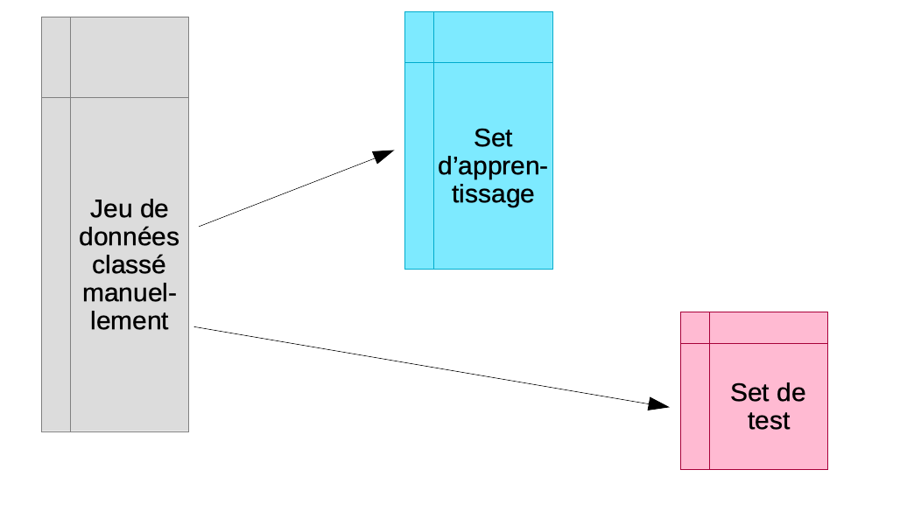
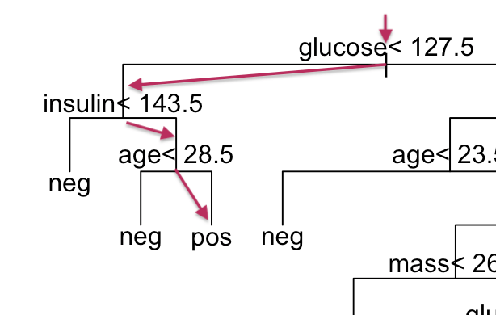

# Classification supervisée II {#classif2}

```{r setup, results='hide', warning=FALSE, include=FALSE}
SciViews::R(lang = "fr")
```

##### Objectifs {.unnumbered}

-   Maîtriser la validation croisée comme approche efficace de partitionnement entre set d'apprentissage et de test

-   Connaître la classification supervisée par la méthode des plus proches voisins et par quantification vectorielle

-   Comprendre et être capable d'utiliser les méthodes par arbres décisionnels (partitionnement récursif et forêt aléatoire)

##### Prérequis {.unnumbered}

Ce module continue la matière vue dans le module précédent et s'appuie dessus. Assurez-vous d'avoir bien compris la logique de la classification supervisée et les trois étapes : apprentissage, test et déploiement.

La matrice de confusion et les métriques qui en sont dérivées doivent aussi être comprises dans le détail. Vous en aurez besoin pour évaluer les performances de vos différents classifieurs dans la phase de test. Vous pouvez bien évidemment vous aider de l'aide-mémoire sur les métriques que vous avez rédigé pendant les séances précédentes.

##### À vous de jouer ! {.unnumbered}

`r h5p(181, height = 270, toc = NULL)`

Enfin, vous devez être également capable de créer un classifieur avec R (en utilisant l'ADL).

##### À vous de jouer ! {.unnumbered}

`r h5p(182, height = 270, toc = NULL)`

S'il subsiste des doutes ou des incompréhensions pour ces aspects clés de la classification supervisée, vous feriez mieux d'approfondir le module \@ref(classif1) *avant* d'aborder celui-ci.

## Validation croisée

Rappelez-vous qu'une règle à laquelle il ne faut *jamais* déroger, c'est de ne pas utiliser les mêmes individus en apprentissage et en test.



Souvent, la grosse difficulté est d'obtenir suffisamment d'items de chaque classe identifiés manuellement pour permettre à la fois l'apprentissage et le test. Un test sur les **mêmes** objets que ceux utilisés lors de l'apprentissage mène à une surestimation systématique des performances du classifieur. Nous sommes donc contraints d'utiliser des cas différents dans les deux cas. Naturellement, plus, nous avons d'items dans le set d'apprentissage **et** dans le set de test, et meilleur sera notre classifieur et notre évaluation de son efficacité.

La **validation croisée** permet de résoudre ce dilemme en utilisant en fin de compte *tous* les cas, *à la fois* dans le set d'apprentissage et dans le set de test, mais *jamais simultanément*. L'astuce consiste à diviser aléatoirement l'échantillon en *k* sous-ensembles à peu près égaux en effectifs. Ensuite, l'apprentissage suivi du test est effectué *n fois indépendamment*. À chaque fois, on sélectionne tous les sous-ensembles sauf un pour l'apprentissage, et le sous-ensemble laissé de côté est utilisé pour le test. L'opération est répétée de façon à ce que chaque sous-ensemble serve de set de test tour à tour. Finalement, on rassemble les résultats obtenus sur les *k* sets de tests, donc, sur tous les cas de notre échantillon et on calcule la matrice de confusion complète en regroupant donc les résultats des *k* étapes indépendantes. Enfin, on calcule les métriques souhaitées sur cette matrice de confusion afin d'obtenir une évaluation approchée et non biaisée des performances du classifieur complet (entraîné sur l'ensemble des données à disposition). L'animation suivante visualise le processus pour que cela soit plus clair dans votre esprit.

`r img("02-classification2/cv.gif", caption = "Principe de fonctionnement de la validation croisée avec k = 7.")`

##### À vous de jouer ! {.unnumbered}

`r h5p(183, height = 270, toc = "Principe de la validation croisée.")`

Au final, nous aurons utilisé tous les individus à la fois en apprentissage et en test, mais jamais simultanément. Le rassemblement des prédictions obtenues à chaque étape (en sommant les différentes matrices de confusion) nous permet d'obtenir une grosse matrice de confusion qui contient le même nombre d'individus que l'ensemble de notre jeu de données initial. Naturellement, nous n'avons pas le même classifieur à chaque étape, et celui-ci n'est pas aussi bien construit que s'il utilisait véritablement *toutes* les observations. Mais plus le découpage est fin et plus nous nous en approchons. À la limite, pour *n* observations, nous pourrions réaliser *k* = *n* sous-ensembles, c'est-à-dire que chaque sous-ensemble contient un et un seul individu. Nous avons alors à chaque fois le classifieur le plus proche possible de celui que l'on obtiendrait avec véritablement toutes les observations puisqu'à chaque étape nous ne perdons qu'un seul individu en phase d'apprentissage. La contrepartie est un temps de calcul potentiellement très, très long puisqu'il y a énormément d'étapes. **Cette technique porte le nom de validation par exclusion d'une donnée ou *leave-one-out cross-validation* en anglais, LOOCV en abrégé**. À l'autre extrême, nous pourrions utiliser *k* = 2. Mais dans ce cas, nous n'utilisons que la moitié des observations en phase d'apprentissage à chaque étape. C'est le plus rapide, mais le moins exact.

##### À vous de jouer ! {.unnumbered}

`r h5p(184, height = 270, toc = "Principe de la validation par exclusion d'une donnée.")`

En pratique, un compromis entre exactitude et temps de calcul nous mène à choisir souvent la **validation croisée dix fois** (*ten-fold cross-validation* en anglais). Nous divisons aléatoirement en dix sous-ensembles d'à peu près le même nombre d'individus et nous répétons donc l'opération apprentissage -\> test seulement dix fois. Chacun des dix classifieurs a donc été élaboré avec 90% des données totales, ce qui représente souvent un compromis encore acceptable pour estimer les propriétés qu'aurait le classifieur réalisé avec 100% des données. Toutefois, si nous constatons que le temps de calcul est raisonnable, rien ne nous empêche d'augmenter le nombre de sous-ensembles, voire d'utiliser la version par exclusion d'une donnée, mais en pratique nous observons tout de même que cela n'est pas raisonnable avec de très gros jeux de données et avec les algorithmes les plus puissants, mais aussi les plus gourmands en temps de calcul comme la forêt aléatoire (ou les réseaux de neurones que nous aborderons dans le prochain module).

### Application sur les manchots

Appliquons cela tout de suite avec l'ADL sur nos manchots. Plus besoin de séparer le jeu de données en set d'apprentissage et de test indépendants. La fonction `cvpredict(, cv.k = ...)` va se charger de ce partitionnement selon l'approche décrite ci-dessus en `cv.k` étapes. Notre analyse s'écrit alors :

```{r, message=FALSE, results='hide'}
SciViews::R("ml", lang = "fr")
```

```{r}
# Importation et remaniement des données (comme précédemment)
penguins <- read("penguins", package = "palmerpenguins") %>.%
  sdrop_na(.) ->
  penguins
```

Une fois notre tableau complet, correctement nettoyé et préparé, nous faisons[^02-classification-ii-1] :

[^02-classification-ii-1]: Ici nous avons choisi de conserver toutes les variables dans le jeu de données. Mais nous ne pouvons utiliser que les variables quantitatives comme attributs avec l'ADL. Nous spécifions donc les variables à utiliser dans la formule complète. Nous aurions aussi bien pu créer d'abord un tableau réduit à ces variables plus la classe et ensuite utiliser la formule `class ~ .` comme nous l'avons fait dans le module précédent. Vous pouvez ainsi comparer les deux approches possibles.

```{r}
# ADL avec toutes les données
penguins_lda <- ml_lda(data = penguins, species ~ bill_length +
  bill_depth + flipper_length + body_mass)
# Prédiction par validation croisée 10x
set.seed(7567) # Pensez à varier le nombre à chaque fois ici !
penguins_pred <- cvpredict(penguins_lda, cv.k = 10)
# Matrice de confusion
penguins_conf <- confusion(penguins_pred, penguins$species)
plot(penguins_conf)
```

Ici, nous avons quatre erreurs, mais attention, ceci est comptabilisé sur trois fois plus de données que précédemment, puisque l'ensemble du jeu de données a servi ici en test, contre un tiers seulement auparavant. Donc, notre estimation des performances du classifieur est légèrement meilleure, mais la tendance générale avec une parfaite séparation de "Gentoo", mais une petite erreur entre "Chinstrap" et "Adelie" reste la même. Les métriques sont disponibles à partir de notre objet `penguins_conf` comme d'habitude :

```{r}
summary(penguins_conf)
```

Notez cependant ici que vous ne devez pas vous contenter de générer et imprimer le tableau contenant toutes les métriques. En fonction de votre objectif, vous choisissez les métriques les plus pertinentes en les indiquant dans l'argument `type=` de `summary()` dans l'ordre que vous voulez. L'argument `sort.by=` permet, en outre, de trier les lignes de la meilleure à la moins bonne valeur pour une métrique donnée. Par exemple, si nous ne voulons que "Recall", "Precision" et "Fscore" dans cet ordre, en triant par "Recall", nous ferons :

```{r}
summary(penguins_conf, type = c("Recall", "Precision", "Fscore"), sort.by = "Recall")
```

Précédemment, nous avions 3,5% d'erreur, et maintenant, nous n'en avons plus que 1,2%. C'est normal que notre taux d'erreur baisse, car nos classifieurs par validation croisée utilisent 90% des données alors qu'auparavant, nous n'en utilisions que les 2/3. Les performances de nos classifieurs s'améliorent avec l'augmentation des données jusqu'à atteindre un palier. Il faut essayer de l'atteindre en pratique : s'il est possible d'ajouter plus de données, nous comparons avant-après, et si les performances s'améliorent, nous ajoutons encore plus de données jusqu'à atteindre le palier. Notez aussi que la quantité de données nécessaires dépend également de l'algorithme de classification. En général, plus il est complexe, plus il faudra de données. Pensez-y si vous en avez peu et utilisez alors préférentiellement des algorithmes plus simples comme ADL dans ce cas.

Si nous voulons faire un "leave-one-out", nous ferions (sachant que nos données comptent `r nrow(penguins)` cas, nous indiquons ici `cv.k = 333`) :

```{r}
penguins_pred_loo <- cvpredict(penguins_lda, cv.k = 333)
# Matrice de confusion
penguins_conf_loo <- confusion(penguins_pred_loo, penguins$species)
plot(penguins_conf_loo)
```

```{r}
summary(penguins_conf_loo, type = c("Recall", "Precision", "Fscore"), sort.by = "Recall")
```

Le résultat est le même. Donc, nous venons de montrer que, dans le cas de ce jeu de données et de l'ADL, une validation croisée dix fois permet d'estimer les performances du classifieur aussi bien que l'approche bien plus coûteuse en calculs (333 classifieurs sont calculés et testés) du "leave-one-out". Bien évidemment, ce ne sera pas toujours le cas.

##### À vous de jouer ! {.unnumbered}

`r h5p(185, height = 270, toc = "Utilisation de la fonction cvpredict().")`

##### À vous de jouer ! {.unnumbered}

`r learnr("C02La_cv", title = "Validation croisée", toc = "Validation croisée")`

##### À retenir {.unnumbered}

-   Bien que plus complexe en interne, la validation croisée est très facile à utiliser avec {mlearning} grâce à la fonction `cvpredict()`,

-   L'approche par validation croisée optimise l'utilisation des données à disposition. C'est la technique à préférer, sauf si nous disposons vraiment de données à profusion.

## Différents algorithmes

Les algorithmes de classification supervisée se subdivisent en trois grandes classes :

-   ceux qui **utilisent un modèle** (linéaire ou non linéaire) sous-jacent pour mettre en relation les attributs et les classes. Par exemple, l'analyse discriminante linéaire que nous connaissons déjà appartient à cette catégorie. Nous verrons également les machines à vecteurs supports et les réseaux de neurones dans cette catégorie.

-   ceux qui font appel à un **indice de similarité** calculé entre les individus (attribution de la classe correspondant aux individus les plus ressemblants à celui qu'on teste). Ce sont les techniques dites du plus proche voisin et de la quantification vectorielle (voir ci-après dans ce module).

-   enfin, les techniques qui définissent une suite de règle de division dichotomique du jeu de données (qui se matérialisent par un ou plusieurs **arbres de décision**). Il s'agit du partitionnement récursif et de la forêt aléatoire, par exemple. Nous aborderons ces méthodes à la fin du module.

Nous avons déjà étudié l'analyse discriminante linéaire dans le précédent module et nous allons découvrir ici quelques autres algorithmes de chaque catégorie, ainsi que dans le module suivant. Enfin, nous mettrons tout cela en musique pour étudier différents algorithmes de classification en pratique, en vue de choisir celui qui nous semble le plus adéquat pour le cas étudié.

### Indiens diabétiques

Afin d'explorer et comparer l'utilisation de différents algorithmes de classification supervisée, nous reprendrons notre jeu de données `pima` concernant une population d'Amérindiens qui sont connus pour compter un haut taux d'obèses et de diabétiques. Nous avions déjà utilisé ces données pour [illustrer l'ACP dans le cours de Science des Données biologiques II](https://wp.sciviews.org/sdd-umons2/?iframe=wp.sciviews.org/sdd-umons2-2024/analyse-en-composantes-principales.html). Pour rappel, le jeu de données se présente comme suit :

```{r, warning=FALSE}
SciViews::R("ml")
pima <- read("PimaIndiansDiabetes2", package = "mlbench")
tabularise$headtail(pima)
```

Nous avons huit variables quantitatives (discrète comme `pregnant`, ou continues pour les autres) et une variable qualitative `diabetes`. Voici quelques informations sur ces différentes variables :

-   `diabetes`, variable qualitative à deux niveaux indique si l'individu est diabétique (`pos`) ou non (`neg`). C'est naturellement la variable réponse que l'on cherchera à prédire ici,
-   `pregnant` est le nombre de grossesses que cette femme a eues (il s'agit uniquement d'un échantillon de femmes de 21 ans ou plus),
-   `glucose` est le taux de glucose dans le plasma sanguin (test standardisé renvoyant une valeur sans unités),
-   `pressure` est la pression sanguine diastolique, en mm de mercure,
-   `triceps` est l'épaisseur mesurée d'un pli de peau au niveau du triceps en mm. Il s'agit d'une mesure permettant d'estimer l'obésité, ou en tous cas, la couche de graisse sous-cutanée à ce niveau,
-   `insulin` est la détermination de la quantité d'insuline deux heures après prise orale de sucre dans un test standardisé, en µU/mL,
-   `mass` est en réalité l'IMC, indice de masse corporelle que vous connaissez bien (masse/ taille^2^), en kg/m^2^, un autre indice d'obésité couramment employé,
-   `pedigree` est un indice de prédisposition au diabète établi en fonction des informations sur la famille (sans unités),
-   `age` est l'âge de l'Amérindienne exprimé en années.

Du point de vue du balancement des observations, nous avons ceci :

```{r}
table(pima$diabetes)
```

Nous avons plus de cas négatifs que de positifs et pourrions souhaiter balancer les deux classes. La différence n'est cependant pas à ce point dramatique et nous continuerons dans cet exemple avec les données telles quelles.

Ce jeu de données contient 768 cas, mais deux variables (`triceps` et `insulin`) ont un très grand nombre de valeurs manquantes comme nous le voyons ci-dessous (notez au passage cette fonction `naniar::vis_miss()` qui permet de visualiser les données manquantes dans des jeux de données de taille moyenne à grande).

```{r}
naniar::vis_miss(pima)
```

Comme pour l'ACP, nos sets d'apprentissage et de test ne peuvent pas contenir de valeurs manquantes. Si nous utilisons `drop_na()` sur tout le tableau, toute ligne contenant au moins une valeur manquante sera éliminée. Cela donne ceci :

```{r}
pima1 <- sdrop_na(pima)
nrow(pima1)
```

Nous avons certes un tableau propre, mais nous avons perdu près de la moitié des données ! Or nous n'avons jamais assez de données en classification supervisée. Nous pourrions aussi considérer la possibilité de laisser tomber les *colonnes* qui contiennent trop de valeurs manquantes. En première approche, afin de déterminer si la perte de ces variables pourrait être préjudiciable à notre analyse, nous pourrions inspecter la matrice de corrélation.

```{r}
pima1 %>.%
  sselect(., -diabetes) %>.%
  correlation(.) %>.%
  plot(.)
```

Nous observons que `triceps` est le plus fortement corrélé à `mass`, ce qui est logique puisqu'il s'agit de deux mesures différentes de l'obésité.

```{r}
chart(data = pima1, triceps ~ mass %color=% diabetes) +
  geom_point() +
  stat_smooth(method = "lm", formula = y ~ x)
```

De même, `insulin` est corrélée à `glucose`, également deux tests qui étudient le profil de variation du sucre dans le sang et d'une hormone associée.

```{r}
chart(data = pima1, insulin ~ glucose %color=% diabetes) +
  geom_point() +
  stat_smooth(method = "lm", formula = y ~ x)
```

Enfin, et pour être complet, notons aussi que les variables `pregnant` et `age` sont également corrélées (0,68). C'est assez logique que les filles moins âgées aient eu moins de grossesses que les autres.

Cependant, les corrélations de Pearson sont moyennes (0,66, 0,58, et 0,68 respectivement) et les nuages de points assez dispersés. Nous pourrions donc nous demander s'il vaut mieux garder plus de données avec moins de variables pour notre apprentissage et test... nous allons créer `pima2` sans `insulin` et `triceps` et nous comparerons l'analyse faite avec `pima1` (plus de variables, moins de cas) et `pima2` (moins de variables, plus de cas).

```{r}
pima %>.%
  sselect(., -insulin, -triceps) %>.%
  sdrop_na(.) %->%
  pima2
nrow(pima2)
```

Dans ce second jeu de données, nous avons pu tout de même conserver `r nrow(pima2)` cas. [L'ACP que nous avions réalisée sur ces données](https://wp.sciviews.org/sdd-umons2/?iframe=wp.sciviews.org/sdd-umons2-2024/analyse-en-composantes-principales.html) nous montrait que la variance se répartir à 53% sur deux axes, mais qu'il faut considérer cinq axes pour capturer 90% de cette variance. Ceci suggère, comme la matrice de corrélation, que les différentes variables apportent chacune une information complémentaire. Au final, nous n'observions pas de séparation nette sur le graphique des individus de l'ACP entre la sous-population diabétique et celle qui ne l'est pas. Nous allons reconsidérer la question ici à l'aide de techniques plus spécifiques visant à *prédire* qui est diabétique ou non en fonction des huit (`pima1`) ou six (`pima2`) attributs à disposition, et ce, à l'aide de différents algorithmes de classification supervisée. Commençons par voir ce que cela donne avec l'ADL que nous connaissons maintenant bien, en utilisation, une validation croisée dix fois.

```{r}
set.seed(364)
pima1_lda <- ml_lda(data = pima1, diabetes ~ .)
pima1_lda_conf <- confusion(cvpredict(pima1_lda, cv.k = 10), pima1$diabetes)
plot(pima1_lda_conf)
summary(pima1_lda_conf, type = c("Fscore", "Recall", "Precision"))
```

Et avec `pima2`, cela donne :

```{r}
set.seed(2673)
pima2_lda <- ml_lda(data = pima2, diabetes ~ .)
pima2_lda_conf <- confusion(cvpredict(pima2_lda, cv.k = 10), pima2$diabetes)
plot(pima2_lda_conf)
summary(pima2_lda_conf, type = c("Fscore", "Recall", "Precision"))
```

Nous avons 22% d'erreur avec `pima1` et 23% d'erreur avec `pima2`. Ces résultats se tiennent dans le cas présent. Ce n'est évidemment pas toujours le même résultat. Nous allons voir ce que cela donne avec d'autres algorithmes de classification dans la suite.

## K plus proches voisins

K plus proches voisins (*k-nearest neighbours* en anglais ou k-NN en abrégé) est certainement la technique la plus intuitive en classification supervisée. Malgré sa simplicité inhérente, elle offre de bonnes prestations. La classification supervisée s'effectue par une analyse de la matrice de [distances de Mahalanobis](https://qastack.fr/stats/62092/bottom-to-top-explanation-of-the-mahalanobis-distance) (équivalente à la distance euclidienne ou géométrique appliquée sur des données réduites de variance unitaire) entre un individu d'intérêt à reconnaître et les individus du set d'apprentissage.


En d'autres termes, il s'agit de calculer la distance géométrique qui sépare un individu d'intérêt de tous les individus du set d'apprentissage dans un espace réduit, c'est-à-dire, un espace où chaque variable est mise à l'échelle de telle manière que sa variance soit unitaire. La classe attribuée à l'individu d'intérêt sera la même que celle du, ou des *k* individus les plus proches (d'où le nom de la méthode). Des variantes utilisent naturellement d'autres calculs de distances : euclidiennes, manhattan, etc.

Un seul paramètre doit donc être défini : *k*, représentant le nombre d'individus proches considérés. Un vote à la majorité permet de déterminer à quel groupe appartient l'objet testé. En cas d'ex æquo, la classe de l'individu du set d'apprentissage le plus proche est utilisée. Pour minimiser le risque d'ex æquo, *k* est généralement choisi impair. Dans notre schéma, nous utilisons *k* = 3, valeur qui s'est avérée optimale dans beaucoup de situations. La recherche de la valeur optimale de *k* dans le cadre de l'application finale sera évidemment possible ultérieurement.

##### À vous de jouer ! {.unnumbered}

`r h5p(186, height = 270, toc = "Principe des K plus proches voisins")`

### Pima avec k-NN

La méthode des k plus proches voisins est implémentée dans {mlearning} dans la fonction `ml_knn()`. En pratique, il suffit de substituer cette fonction dans la logique du code {mlearning}. Un argument est `k=` qui indique le nombre de *k* voisins à prendre en compte.

```{r}
set.seed(3675)
pima1_knn <- ml_knn(data = pima1, diabetes ~ ., k = 3)
pima1_knn_conf <- confusion(cvpredict(pima1_knn, cv.k = 10), pima1$diabetes)
plot(pima1_knn_conf)
summary(pima1_knn_conf, type = c("Fscore", "Recall", "Precision"))
```

Ici, nous avons 28% d'erreur, soit plus qu'avec l'ADL. *Mais la valeur `k = 3` n'est pas le meilleur choix ici. Expérimentez par vous-même pour découvrir combien de plus proches voisins, nous devons considérer pour minimiser l'erreur.*

Pour `pima2`, nous obtenons :

```{r}
set.seed(127)
pima2_knn <- ml_knn(data = pima2, diabetes ~ ., k = 3)
pima2_knn_conf <- confusion(cvpredict(pima2_knn, cv.k = 10), pima2$diabetes)
plot(pima2_knn_conf)
summary(pima2_knn_conf, type = c("Fscore", "Recall", "Precision"))
```

Avec 27% d'erreur, nous avons un résultat similaire encore une fois, mais toujours légèrement moins bon que l'ADL.

## Quantification vectorielle

Un des désavantages de la méthode des k plus proches voisins est que l'on doit conserver *toutes* les données du set d'apprentissage et confronter systématiquement tout nouvel individu à l'ensemble des cas de ce set. L'idée derrière la quantification vectorielle (*learning vector quantization* en anglais, LVQ en abrégé) est que les données initiales peuvent sans doute être synthétisées : des individus proches dans l'espace de Malahanobis peuvent être remplacés par des "individus moyens ou centroïdes" tout en apportant à peu près le même effet. Du coup, nous réduisons la quantité d'information à conserver et nous accélérons les calculs dans les phases de test et déploiement.

Une étape supplémentaire dans le calcul du classifieur est introduite. Le set d'apprentissage initial est résumé en un dictionnaire ou *codebook* en anglais, dans lequel les groupes initiaux sont remplacés par un ou plusieurs centroïdes. Ces centroïdes sont, en quelque sorte, des "portraits robots" des différentes classes et ils résument les caractéristiques des individus appartenant à ces classes. La classification supervisée se fait par une méthode similaire aux k plus proches voisins, mais en utilisant les centroïdes du dictionnaire en lieu et place des individus du set d'apprentissage.

En plus du paramètre *k*, il faut donc également définir `size=`, le nombre de centroïdes qui seront calculés dans le dictionnaire. Il est possible de calculer librement les différents centroïdes en fonction de la dispersion des données, ou bien d'imposer que le même nombre de centroïdes soit calculé pour chaque classe.


##### À vous de jouer ! {.unnumbered}

`r h5p(187, height = 270, toc = "Principe de la quantification vectorielle")`

### Pima avec LVQ

Voyons ce que cela donne sur nos données `pima1` et `pima2`, en utilisant la fonction `ml_lvq()` de {mlearning} qui utilise les arguments `size=` pour la taille du dictionnaire et `k.nn=` pour le nombre de proches voisins à considérer ensuite :

```{r}
set.seed(846)
pima1_lvq <- ml_lvq(data = pima1, diabetes ~ ., k.nn = 3, size = 30)
pima1_lvq_conf <- confusion(cvpredict(pima1_lvq, cv.k = 10), pima1$diabetes)
plot(pima1_lvq_conf)
summary(pima1_lvq_conf, type = c("Fscore", "Recall", "Precision"))
```

Nous avons choisi arbitrairement de prendre un dictionnaire de taille 30 et trois plus proches voisins. Avec ces valeurs, nous avons 25% d'erreur, ce qui nous situe entre k-NN et ADL en termes de performances. *Essayez par vous-même d'autres valeurs de `size =` et `k.nn =` pour optimiser encore ce résultat.*

Avec `pima2`, une taille de dictionnaire de 30 toujours et trois plus proches voisins, nous obtenons 24% d'erreur :

```{r}
set.seed(25)
pima2_lvq <- ml_lvq(data = pima2, diabetes ~ ., k.nn = 3, size = 30)
pima2_lvq_conf <- confusion(cvpredict(pima2_lvq, cv.k = 10), pima2$diabetes)
plot(pima2_lvq_conf)
summary(pima2_lvq_conf, type = c("Fscore", "Recall", "Precision"))
```

##### À vous de jouer ! {.unnumbered}

```{r assign_C02Ia_zoo, echo=FALSE, results='asis'}
if (exists("assignment"))
  assignment("C02Ia_zoo", part = NULL,
    url = "https://github.com/BioDataScience-Course/C02Ia_zoo",
    course.ids = c(
      'S-BIOG-025'         = !"C02Ia_{YY}M_zoo"),
    course.urls = c(
      'S-BIOG-025'         = "https://classroom.github.com/a/n_smIDv1"),
    course.starts = c(
      'S-BIOG-025'         = !"{W[7]+1} 08:00:00"),
    course.ends = c(
      'S-BIOG-025'         = !"{W[8]+1} 23:59:59"),
    term = "Q1", level = 3,
    toc = "Création d'un classifieur optimal")
```

## Partitionnement récursif

Le partitionnement récursif est un algorithme de classification supervisée qui crée un arbre dichotomique où, à chaque nœud, une variable permet de déterminer si le parcours de l'arbre doit être poursuivi vers la gauche du nœud (lorsque la valeur de la variable est inférieure à un seuil fixé), ou vers sa droite (si la valeur est supérieure ou égale à ce seuil). La variable utilisée à chaque nœud ainsi que la valeur du seuil sont déterminées par l'algorithme. Cela est fait de manière à maximiser la séparation entre les deux sous-entités ainsi obtenues qui doivent discriminer au mieux entre les différents groupes à identifier. Le traitement est poursuivi tout au long de l'arbre de manière récursive jusqu'à aboutir à une extrémité, nommée "feuille". Cette feuille de l'arbre représente une classe donnée. Notez qu'il peut très bien y avoir plusieurs feuilles qui représentent une même classe. La classe attribuée à un individu est donc celle à laquelle on aboutit après avoir parcouru l'arbre de la base jusqu'aux feuilles.

![Schéma du principe d'un arbre de classification en quatre classes A, B, C et D en utilisant les attributs x, y et z. À chaque nœud, un attribut et un seuil sont choisis afin d'établir une règle de décision (en rouge). Pour un individu dont il faut prédire la classe, nous parcourons l'arbre de branche en branche depuis tout en haut et bifurquons à gauche ou à droite selon la comparaison au seuil fixé à chaque nœud : vers la gauche si la variable est inférieure au seuil, vers la droite si elle en est supérieure ou égale. Les feuilles représentent chacune une classe (en bleu, duplications possibles). Arrivés à une feuille, nous obtenons donc la classe prédite pour cet individu.](images/02-classification2/rpart.png)

Vous pouvez aussi visionner une [magnifique présentation animée de ce qu'est un arbre de partitionnement ou décisionnel](http://www.r2d3.us/visual-intro-to-machine-learning-part-1/) (pensez bien à sélectionner le français en tout début de document et faites défiler jusqu'à la fin de l'histoire, **lien vivement conseillé !**). Dans cette présentation, la notion de **suréchantillonnage** (*oversampling* en anglais) est abordée. C'est un problème qui se rencontre souvent en classification supervisée, tout comme en régression. Dans le cas de l'arbre de partitionnement, la solution consiste à élaguer les branches de moindre importance de l'arbre. [Cette page explique de manière très claire de quoi il s'agit](http://www.r2d3.us/visual-intro-to-machine-learning-part-2/).

### Pima avec rpart

Pour rendre ceci plus concret, calculons l'arbre de partitionnement récursif pour `pima1`. Le package {mlearning} offre la fonction `ml_rpart()` pour ce faire.

```{r}
set.seed(465)
pima1_rpart <- ml_rpart(data = pima1, diabetes ~ .)
pima1_rpart_conf <- confusion(cvpredict(pima1_rpart, cv.k = 10), pima1$diabetes)
plot(pima1_rpart_conf)
summary(pima1_rpart_conf, type = c("Fscore", "Recall", "Precision"))
```

Ici, nous obtenons 25% d'erreur. Un intérêt du partitionnement récursif est de pouvoir visualiser le "dendrogramme" qui matérialise les règles choisies. Si cet arbre est relativement petit, nous pouvons aisément lire et tenter de comprendre la logique derrière ces règles. Les méthodes `plot()` et `text()` permettent de tracer l'arbre décisionnel calculé. Différents arguments permettent d'adapter la présentation du dendrogramme. Voyez l'aide en ligne de `?plot.rpart` et `?text.rpart`.

```{r}
# Visualisation et annotation de l'arbre
plot(pima1_rpart, margin = 0.03, uniform = TRUE)
text(pima1_rpart, use.n = FALSE)
```

Comment lire cet arbre ? Nous partons de tout en haut, et à chaque nœud correspond une variable et un seuil. Si la variable est inférieure au seuil, nous parcourons l'arbre vers la gauche. Si au contraire, la variable est supérieure ou égale au seuil, nous nous dirigeons vers la droite. Nous réitérons l'opération à chaque nœud, jusqu'à arriver à une feuille. À ce niveau, nous lisons la classe associée à la feuille. Nous attribuons enfin cette classe à l'individu. Considérons une femme Pima pour laquelle nous avons enregistré les informations suivantes :

-   âge = 34 ans,
-   elle a eu quatre enfants (`pregnant`),
-   son test glucose a donné la valeur de 118 et son insuline a été mesurée à 145 µU/mL,
-   sa pression sanguine est de 82 mm Hg (`pressure`),
-   au niveau corpulence, elle a un IMC de 33,2 (`mass`) et le pli de peau au niveau de son triceps est de 28 mm,
-   enfin son indice de susceptibilité au diabète d'après ses antécédents familiaux a été calculé à 0,43.

D'après notre classifieur par arbre de partitionnement, est-elle diabétique ou non ? Pour y répondre, nous devons traverser l'arbre de haut en bas jusqu'à aboutir à une feuille.

1.  La première règle rencontrée est "glucose \< 127,5". Comme la valeur mesurée est de 118, nous continuons vers la gauche,

2.  Seconde règle rencontrée : "insulin \< 143,5". La valeur mesurée est de 145. Cette fois, nous bifurquons à droite,

3.  Nous arrivons à la règle "age \< 28,5". À 33 ans, nous continuons à nouveau vers la droite pour aboutir à une feuille de l'arbre `pos`. Ainsi pour cette dame, la **prédiction est qu'elle est diabétique**.



Notons que toutes les variables n'ont pas été utilisées. `glucose` et `age` sont repris trois fois dans l'arbre. Les variables `insulin`, `mass`, `pressure` et `pedigree` sont également utilisées. Par contre, `triceps` n'est jamais utilisée, de même que `pregnant`. C'est une première indication de l'importance des variables dans la discrimination des classes, même si la version à partir de la forêt aléatoire à base de l'indice Gini (voir plus loin) sera plus efficace pour indiquer cela.

Voyons ce que cela donne avec `pima2`. Pour rappel, ce jeu de données contient pratiquement deux fois plus de cas que `pima1`, mais pour cela, nous avons dû éliminer les variables `triceps` et `insulin`. Dans notre partitionnement récursif de `pima1`, `triceps` n'était pas utilisé, par contre, `insulin` était utilisé deux fois.

```{r}
set.seed(9643)
pima2_rpart <- ml_rpart(data = pima2, diabetes ~ .)
pima2_rpart_conf <- confusion(cvpredict(pima2_rpart, cv.k = 10), pima2$diabetes)
plot(pima2_rpart_conf)
summary(pima2_rpart_conf, type = c("Fscore", "Recall", "Precision"))
# Visualisation et annotation de l'arbre
plot(pima2_rpart, margin = 0.03, uniform = TRUE)
text(pima2_rpart, use.n = FALSE)
```

Ici, nous sommes légèrement en dessous des 25%. L'arbre est différent. La perte de la variable `insulin` semble avoir été bien compensée par un nombre d'observations plus grand dans `pima2`.

##### Pour en savoir plus {.unnumbered}

-   Explication sur la façon dans les règles sont établies dans l'arbre [ici](http://perso.ens-lyon.fr/lise.vaudor/classification-par-arbres-decisionnels/).

## Forêt aléatoire

La forêt aléatoire, ou *random forest* en anglais (RF) est un algorithme introduit par Breiman (2001) qui créé un ensemble d'arbres décisionnels individuels, dont la variable discriminante à chaque nœud est choisie dans un sous-ensemble aléatoire de toutes les *p* variables utilisées (afin d'introduire une variation aléatoire dans chaque arbre de partitionnement qui est donc toujours différent des autres). Lorsque l'ensemble des arbres est créé, un vote à la majorité est appliqué en utilisant la réponse donnée par chaque arbre pour déterminer à quelle classe appartient l'individu étudié. **C'est actuellement un des algorithmes les plus performants de classification supervisée.** Par contre, étant donné qu'il faut créer plusieurs centaines d'arbres, le temps de calcul est généralement plus élevé qu'avec des méthodes simples comme ADL, k plus proches voisins, ou l'utilisation d'un arbre unique.

```{block, type='note'}
La combinaison de plusieurs classifieurs donne quasi-systématiquement des meilleurs résultats qu'un classifieur seul. On parle alors d'**ensemble** de classifieurs. La forêt aléatoire en est un excellent exemple. Plusieurs autres techniques existent pour combiner des classifieurs et améliorer les résultats, mais leur développement sort du cadre de ce cours :

- **stacking :** Les résultats d'un ou plusieurs classifieurs sont utilisés comme variables d'entrée pour un autre classifieur. En d'autre terme, les classifieurs sont reliés en série les uns derrière les autres.

- **bagging : ** pour **b**ootstrap **agg**regating améliore la stabilité et la précision de la classification. Quelques méthodes sont implémentées notamment dans le package R {ipred}. Le principe consiste à générer plusieurs sets d'apprentissage artificiellement par échantillonnage avec remplacement (technique de bootstrap), à entraîner des classifieurs sur chaque set, et à ensuite résumer les résultat par un vote à la majorité.

- **boosting :** entraîne successivement des classifieurs en se focalisant sur les erreurs du précédent. L'un des algorithmes les plus performants actuellement, **XGBoost** fait partie de cette catégorie (voir le package {xgboost} dans R).
```

Pour la forêt aléatoire, les paramètres principaux à définir sont le nombre d'arbres et le nombre de *p* attributs à choisir aléatoirement parmi tous les attributs à chaque nœud pour établir la règle de décision. C'est, entre autres, par cette présélection aléatoire de candidats de départ pour les règles que la variation est créée d'un arbre à l'autre. Cette présélection aléatoire est réitérée, naturellement, à chaque nœud de chaque arbre. Les paramètres choisis ici sont de 500 arbres et de 2*p*/3 attributs conservés aléatoirement à chaque nœud. Ces valeurs se sont montrées efficaces dans des études antérieures, et l'algorithme est, par ailleurs, relativement robuste face aux variations de ces paramètres autour des valeurs par défaut.


### Pima avec forêt aléatoire

La forêt aléatoire est disponible dans {mlearning}. Son utilisation est similaire aux autres fonctions du package, avec ici la fonction `ml_rforest()` et ses arguments `ntree=` pour le nombre d'arbres, et `mtry=` pour le nombre de variables à sélectionner au hasard à chaque nœud. Par défaut, 500 arbres sont construits et les 2/3 des variables sont utilisées. Voyons ce que cela donne avec ces valeurs par défaut :

```{r}
set.seed(74356)
pima1_rf <- ml_rforest(data = pima1, diabetes ~ .)
pima1_rf_conf <- confusion(cvpredict(pima1_rf, cv.k = 10), pima1$diabetes)
plot(pima1_rf_conf)
summary(pima1_rf_conf, type = c("Fscore", "Recall", "Precision"))
```

Nous avons ici un peu plus de 21% d'erreur, soit le meilleur score de peu devant l'ADL. Notons que le temps de calcul est déjà non négligeable sur ce petit jeu de données (faites attention à de très gros jeux de données avec cette technique).

```{r}
set.seed(9764)
pima2_rf <- ml_rforest(data = pima2, diabetes ~ .)
pima2_rf_conf <- confusion(cvpredict(pima2_rf, cv.k = 10), pima2$diabetes)
plot(pima2_rf_conf)
summary(pima2_rf_conf, type = c("Fscore", "Recall", "Precision"))
```

Avec 23% d'erreur, nous avons encore une fois le meilleur classifieur. Nous pouvons encore effectuer deux choses à partir d'ici : (1) optimiser les paramètres, et (2) étudier l'importance des variables dans la classification. Concernant le nombre d'arbres, un graphique montre la variation de l'erreur en fonction du nombre d'arbres dans notre forêt.

```{r}
plot(pima1_rf)
```

Comme il y a très clairement un aspect probabiliste ici, le graphique indique les erreurs minimales et maximales observées en rouge et en vert, respectivement. En noir, la tendance générale. Nous voyons qu'avec quelques arbres, l'erreur est plus importante, mais elle diminue ici rapidement pour se stabiliser vers les 200 arbres. Donc, si nous voulons gagner du temps de calcul sans perdre en performance, nous pourrions définir ici `ntree = 200` dans `ml_rforest()`. Différentes valeurs pour l'argument `mtry()` pourraient aussi parfaitement être étudiées, mais en pratique, la valeur par défaut donne bien souvent déjà les meilleurs résultats.

Un autre graphique présente l'importance des variables : `varImpPlot()` du package {randomForest}.

```{r}
randomForest::varImpPlot(pima1_rf)
```

Le critère utilisé est la diminution de l'indice Gini à chaque fois que la variable en question apparaît à un nœud d'un des arbres de la forêt. L'indice Gini, pour une probabilité *p*, est *p*(*p* - 1). Plus les probabilités s'éloignent de 0,5, plus l'indice est petit. Appliqué à la proportion d'items par classe, plus les sous-groupes résultant d'une division dans l'arbre sont purs (c'est-à-dire, non contaminés par des individus appartenant à d'autres classes), plus la probabilité d'une classe s'approche de 1 tandis que celle des autres tend vers zéro... et donc l'indice Gini diminue. Donc, la variable qui a le plus contribué à diminuer Gini est aussi celle qui est la plus **discriminante** entre les classes, ici c'est clairement `glucose`, suivi de `insulin` et `age`. Par contre, `triceps`, `pregnant` et `pressure` ont une moindre importance.

Sur cette base, nous pouvons décider de simplifier notre modèle en laissant tomber, par exemple, les trois dernières variables de moindre importance et en nous limitant à 200 arbres.

```{r}
set.seed(85436)
pima1_rf2 <- ml_rforest(data = pima1, diabetes ~ glucose + insulin + age + mass + pedigree,
  ntree = 200)
pima1_rf2_conf <- confusion(cvpredict(pima1_rf2, cv.k = 10), pima1$diabetes)
plot(pima1_rf2_conf)
summary(pima1_rf2_conf, type = c("Fscore", "Recall", "Precision"))
```

Effectivement, avec un petit peu moins de 22%, c'est l'un des meilleurs scores jusqu'ici, tout en réduisant le nombre d'attributs nécessaires et d'arbres à calculer. Dans le module suivant, nous étudierons encore quelques concepts autour de la classification supervisée afin de réaliser un choix éclairé du meilleur classifieur.

##### À vous de jouer ! {.unnumbered}

`r h5p(188, height = 270, toc = "La fonction mlRforest()")`

##### Trucs et astuces {.unnumbered}

Pour l'instant {mlearning} utilise les fonctions du package {randomForest} qui reprend le code original de Breiman. Cependant, d'autres implémentations plus performantes ont été développées depuis. En particulier, le package R {ranger} implémente une version parallélisée (utilisation de plusieurs cœurs du processeur pour effectuer le calcul en parallèle) bien plus rapide sur les ordinateurs actuels. Si la vitesse est un frein à l'utilisation de la forêt aléatoire dans votre application, allez voir du côté de cette implémentation.

##### À vous de jouer ! {.unnumbered}

`r h5p(189, height = 270, toc = "Les types d'algorithmes")`

##### À vous de jouer ! {.unnumbered}

`r learnr("C02Lb_ml2", title = "K plus proches voisins, méthode par arbres et forêt aléatoire", toc = "K plus proches voisins, méthode par arbres et forêt aléatoire")`

## Optimisation et métriques

Maintenant que vous avez découvert différents algorithmes de classification supervisée, que vous êtes capable d'utiliser la validation croisée et les matrices de confusion pour en dériver des métriques, vous avez les éléments nécessaires en main pour vous attaquer à l'optimisation de votre classifieur. La tâche n'est pas simple, car vous avez, en fait, de nombreux paramètres sur lesquels influer. C'est essentiellement par la pratique que vous allez "sentir" ce qui fonctionne bien ou moins bien. Il est cependant utile à ce stade de faire un bilan. Quels sont les moyens d'optimiser un classifieur ? Quelles métriques utiliser pour surveiller votre progression ? De combien devez-vous améliorer votre métrique pour considérer que le gain est appréciable ?

##### Éléments de réflexion

-   Il n'y a pas que le taux d'erreur qui soit utile. Quelquefois, l'intérêt se porte sur une ou plusieurs classes cibles. Dans ce cas, des métriques plus ciblées comme le rappel ou la précision sont utiles.
-   Le rappel et la précision s'intéressent à deux **points de vue** complémentaires par rapport à une classe cible : combien parmi tous les objets de la classe sont détectés comme tel par le classifieur d'un côté, *versus* combien parmi tout ce qui est classé par l'ordinateur dans la classe cible en fait effectivement partie. Si vous regardez la matrice de confusion, vous constatez qu'il s'agit de traiter l'erreur soit selon les *lignes*, soit selon les *colonnes* de cette matrice. Selon le contexte, on est amené à optimiser l'un ou l'autre, sachant qu'un compromis est toujours nécessaire. Le **score F**, par contre, tente de synthétiser ce compromis dans un cas plus général en une seule valeur.
-   La répartition des individus entre les classes va influer les performances du classifieur. Il est souvent souhaitable d'avoir à peu près le même nombre de cas dans chaque classe. Mais dans une classification où le résultat global compte, une distribution proche de celle qui sera rencontrée dans les échantillons en test et en déploiement donne de meilleurs résultats pour, par exemple, l'erreur globale. **Attention !** Le point de référence dépend largement de la répartition des individus. Pour un classifieur binaire, si nous avons 50% des cas dans chaque classe, un classifieur naïf qui classerait tout le monde dans la classe la plus abondante ferait 50% d'erreur. C'est donc notre point de référence et le classifieur que nous construisons doit faire mieux que cela. S'il ne produit que 20% d'erreur, c'est donc une amélioration très nette des performances. Par contre, si nous avons une répartition 90% / 10% des individus entre les deux classes, notre classifieur naïf qui classe tout le monde dans la classe la plus abondante ne ferait déjà plus que 10% d'erreur. Dans ce dernier cas, notre classifieur doit donc faire mieux que cela. Ainsi, un classifieur qui montre les mêmes 20% d'erreur sera ici considéré comme très mauvais !

**Préparez un schéma qui explicite votre méthode d'optimisation d'un classifieur, ainsi qu'une liste des éléments à prendre en compte sur base de tout ce que vous avez appris jusqu'ici. Ces aspects importants seront discutés en présentiel et seront cruciaux lorsque vous aurez à relever le challenge au module suivant.**

```{=html}
<!-- À vous de jouer ! {.unnumbered}

Vous allez maintenant discuter par équipe ces différents aspects. **Les équipes seront désignées par vos encadrants. Ne créez encore aucun projet avant qu'il ne vous soit dit de le faire. Au sein de chaque équipe, un responsable de la création du "team" sera désigné, et ensuite, les autres participants se placeront dans ce même "team".**

{r assign_C02Ga_optimisation_I, echo=FALSE, results='asis'}
if (exists("assignment2"))
  assignment2("C02Ga_optimisation", part = "I",
    url = "https://github.com/BioDataScience-Course/C02Ga_optimisation",
    course.ids = c(
      'S-BIOG-025'         = !"C02Ga_{YY}M_optimisation"),
    course.urls = c(
      'S-BIOG-025'         = "https://classroom.github.com/a/..."),
    course.starts = c(
      'S-BIOG-025'         = !"{W[7]+1} 9:00:00"),
    course.ends = c(
      'S-BIOG-025'         = !"{W[9]+4} 23:59:59"),
    term = "Q1", level = 4, n = 4,
    toc = "Optimisation de classifieur",
    clone = TRUE)
-->
```

##### À vous de jouer ! {.unnumbered}

Ce projet sera traité par groupe de quatre étudiants. Il vous permettra de synthétiser vos connaissances acquises sur l'optimisation de classifieurs en apprentissage machine.

```{r assign_C01Ga_metrics_II, echo=FALSE, results='asis'}
if (exists("assignment2"))
  assignment2("C01Ga_metrics", part = "II",
    url = "https://github.com/BioDataScience-Course/C01Ga_metrics",
    course.ids = c(
      'S-BIOG-025'         = !"C01Ga_{YY}M_metrics"),
    course.urls = c(
      'S-BIOG-025'         = "https://classroom.github.com/a/2jy2rMUP"),
    course.starts = c(
      'S-BIOG-025'         = !"{W[5]+1} 08:00:00"),
    course.ends = c(
      'S-BIOG-025'         = !"{W[12]+2} 23:59:59"),
    term = "Q1", level = 0, n = 4,
    toc = "Aide-mémoire sur les métriques et optimisation (partie II)",
    clone = TRUE)
```

## Récapitulatif des exercices

Dans ce second module, vous aviez à réaliser les exercices suivants :

`r show_ex_toc()`

##### Progression {.unnumbered}

`r launch_report("02", height = 800)`
