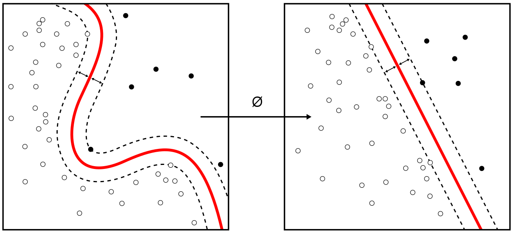

# Classification supervisée III {#classif3}

```{r setup, results='hide', warning=FALSE, include=FALSE}
SciViews::R("ml", lang = "fr")
```

##### Objectifs {.unnumbered}

-   Prendre conscience de l'impact des proportions relatives par classes sur les classifieurs et les métriques et maîtriser ce phénomène

-   Appréhender le seuil de détection, les courbes ROC et l'AUC comme mesures indépendantes du seuil de détection dans un cas à deux classes

-   Comprendre et être capable d'utiliser les algorithmes de machine à vecteurs supports et les réseaux neuronaux, découvrir l'apprentissage profond.

-   Mettre en œuvre toutes les notions apprises dans les trois modules consacrés à la classification supervisée dans le cadre d'un cas plus complexe, sous forme de challenge.

##### Prérequis {.unnumbered}

Ce module constitue le troisième volet d'une trilogie consacrée à la classification supervisée. Le niveau de difficulté allant crescendo, assurez-vous d'avoir bien assimilé toutes les notions importantes et les subtilités étudiées dans les deux premiers volets avant d'aborder celui-ci.

## Métriques et proportions

À partir du moment où la classification ne se fait pas sans erreurs, nous avons la présence de faux positifs et de faux négatifs. Le fait d'être un faux positif ou un faux négatif dépend essentiellement du point de vue, c'est-à-dire, de la classe d'intérêt. Cependant ces erreurs restent des erreurs, quel que soit le point de vue (sauf si nous fusionnons les classes confondues, bien évidemment). Un élément important à considérer est que le taux d'erreur, qu'il soit global ou local tel que mesuré, par exemple, par le rappel ou la précision pour une classe cible **dépend énormément des proportions d'occurrences observées dans les différentes classes**, et ce, aussi bien dans la phase d'apprentissage que de test ou de déploiement.

Ce problème nous ramène, en réalité à des calculs basiques de probabilités et au théorème de Bayes que nous avons abordés dans le [module 6 du premier cours de science des données biologiques](https://wp.sciviews.org/sdd-umons/?iframe=wp.sciviews.org/sdd-umons-2024/proba.html%23th%C3%A9or%C3%A8me-de-bayes). **Rappelez-vous, nous avions traité le cas du dépistage d'une maladie, dont le résultat dépendait du fait que la maladie est fréquente ou rare dans la population (sa prévalence)**. Si vous ne vous souvenez plus de quoi il s'agit, il peut être utile de relire maintenant les sections 6.1.1 à 6.1.3 de ce premier cours, car ce contenu s'applique parfaitement ici.

##### À vous de jouer ! {.unnumbered}

`r h5p(239, height = 270, toc = "Dépistage d'une maladie rare")`

Pour illustrer une nouvelle fois ce phénomène, prenons un cas extrême. Admettons que notre classifieur soit capable de discerner **sans aucune erreur** une classe parmi deux possibles, disons la classe A. Quel sera le rappel ? Ça, c'est facile, comme tous les individus A seront classés comme A par notre classifieur, nous n'aurons *aucun* faux négatif. Donc, le rappel qui est $TP / (TP + FN)$ vaudra toujours 1 ou 100%, et ce, quelles que soient les proportions relatives de A et de B dans notre échantillon. **En absence d'erreur, il n'y a pas d'ambiguïté ni de dépendance aux proportions relatives.**

Par contre, calculons maintenant la précision pour A, si nous savons que notre même classifieur a tendance à classer 10% des individus B comme des A (faux positifs *FP*). La précision étant le rapport $TP / (TP + FP)$, interviennent ici ces faux positifs qui dépendent eux *de ce que notre classifieur est capable de faire par rapport à la classe B*. Dix pour cent de faux positifs, oui, mais sur combien d'items ? Prenons deux cas :

1.  La classe A est prédominante dans l'échantillon, disons qu'elle représente 80% de l'ensemble. Pour 100 individus, nous aurons donc 80 A, tous vrais positifs, et 20 B, dont 10%, soit deux sont faussement classés comme A. La précision est donc de $80 / (80 + 2)$, soit un peu moins de 98%. C'est un très bon résultat.

2.  Dans notre second cas, les proportions sont inversées. Nous avons 20% de A et 80% de B. Donc, les vrais positifs pour 100 individus seront de 20 (tous les A) et les faux positifs seront 10% de 80, soit 8. La précision devient donc $20 / (20 + 8)$, soit un tout petit peu plus de 71%.

##### À vous de jouer ! {.unnumbered}

`r h5p(240, height = 270, toc = "Calcul de précision")`

**Dans le second cas, la précision pour la classe A a diminué de manière très nette, rien qu'en changeant les proportions relatives de A et de B dans notre échantillon, les performances de notre classifieur n'ayant absolument pas été modifiées entre les deux situations.** Nous venons de démontrer que certaines métriques, dès qu'il y a la moindre erreur de classification possible, sont très sensibles aux proportions relatives des individus dans les classes. Notons que la diminution de la précision dans le cas (2) est liée à la fois à la diminution des vrais positifs (puisqu'il y a moins de A dans notre set), et à l'augmentation des faux positifs, qui dépendent eux de la quantité de B en augmentation.

À l'extrême, il devient très difficile de classer correctement des items appartenant à des classes rares à cause de ce phénomène. En effet, si A ne représente plus que 1% de l'échantillon, nous aurons un seul vrai positif, et 10% de 99, soit pratiquement 10 faux positifs pour un lot de 100 individus. Donc, la précision pour A devient $1 / (1 + 10)$, soit 9% seulement. Nous verrons alors notre classifieur comme *très mauvais* à l'examen des items qu'il prétend être des A, et pour lesquels la grosse majorité ne le sera pas. Pourtant, il classe A sans aucune erreur et ne fait que 10% d'erreur pour B, ce qui, présenté de la sorte, passe pour un bon classifieur.

```{block, type = 'warning'}
Plusieurs métriques qui mesurent les performances de nos classifieurs sont très sensibles aux proportions relatives des différentes classes. Comme l'optimisation des classifieurs se fait sur base de ces métriques, elle est elle-même dépendante des proportions relatives des classes dans le set d'apprentissage.

De plus, si les proportions relatives des items dans les classes diffèrent entre le set de test et les échantillons à classer lors du déploiement du classifieur, les valeurs calculées lors de la phase de test seront biaisées et ne refléteront pas du tout les performances réelles du classifeur, une fois déployé.
```

### Proportions en apprentissage

Une première conséquence intéressante de ce que nous venons d'observer est que les proportions relatives des items dans le *set d'apprentissage* vont conditionner le comportement de notre classifieur. Si nous voulons augmenter le rappel pour une classe, nous pouvons augmenter ses proportions de manière relative aux autres classes dans le set d'apprentissage. Mais si nous ne voulons pas perdre en précision, nous éviterons d'avoir des proportions trop déséquilibrées entre les classes. C'est pour cette raison qu'il est souvent conseillé de procéder à un ré-échantillonnage dans le but d'obtenir un effectif à peu près égal entre les différentes classes dans le set d'apprentissage. Par contre, changer les proportions de la sorte nous mène à une erreur globale plus grande en déploiement si les proportions initiales étaient représentatives de la "réalité terrain". Donc, à nous à définir au préalable quelle(s) métrique(s) --et quelle(s) classe(s)-- sont les plus importantes par rapport à nos objectifs. Dans le challenge, vous aurez à réfléchir à cette question !

##### À vous de jouer ! {.unnumbered}

`r h5p(241, height = 270, toc = "Proportions et taux global de reconnaissance")`

Reprenons l'exemple de nos Amérindiens de la tribu Pima confrontés au diabète (en n'utilisant que les cas complets).

```{r, warning=FALSE}
SciViews::R("ml", lang = "fr")
pima <- read("PimaIndiansDiabetes2", package = "mlbench")
pima1 <- sdrop_na(pima)
table(pima1$diabetes) |>
  tabularise()
```

Comme nous l'avions déjà signalé, nous avons deux fois plus de cas négatifs que de cas positifs. Revenons sur notre classifieur à forêt aléatoire avec 500 arbres :

```{r}
set.seed(3631)
pima1_rf <- ml_rforest(data = pima1, diabetes ~ ., ntree = 500)
pima1_rf_conf <- confusion(cvpredict(pima1_rf, cv.k = 10), pima1$diabetes)
summary(pima1_rf_conf)
```

Notez que le rappel (*Recall*) est plus faible pour les cas positifs (61%) que pour les cas négatifs (88%). Ce n'est pas forcément toujours comme cela, mais relativement fréquent, car notre classifieur est optimisé pour réduire l'erreur globale. Dans cette situation, ayant plus de cas négatifs, il vaut mieux déclarer un cas douteux comme négatif puisque le risque de se tromper est plus faible que de le déclarer positif. La précision pour `pos` est de 71%. Admettons que nous souhaitons maintenant étudier un maximum de ces Indiennes diabétiques. Le rappel pour la classe `pos` est notre métrique importante, or c'est la valeur la plus faible actuellement. Comme faire pour l'augmenter sans changer d'algorithme de classification ? Et bien, une des façons de procéder consiste à changer délibérément les proportions des classes dans le set d'apprentissage. Si nous prenons le même nombre d'individus positifs que négatifs en **sous-échantillonnant**, cela donne ceci :

```{r, warning=FALSE}
# Rééchantillonnage du set
set.seed(845)
pima1 %>.%
  group_by(., diabetes) |>
  sample_n(130L, replace = FALSE) ->
  pima1b
table(pima1b$diabetes) |>
  tabularise()
```

```{r}
set.seed(854)
pima1b_rf <- ml_rforest(data = pima1b, diabetes ~ ., ntree = 500)
pima1b_rf_conf <- confusion(cvpredict(pima1b_rf, cv.k = 10), pima1b$diabetes)
summary(pima1b_rf_conf)
```

Le rappel pour la classe `pos` est monté de 60% (`pima1`) à 80% (`pima1b`). En première approche, nous devrions nous réjouir de ce résultat, d'autant plus que la précision semble être montée en même temps à presque 79% pour la même classe. Notre nouveau classifieur semble nettement plus efficace pour trouver les Indiennes diabétiques dans l'ensemble de la population. **Mais attention ! N'oublions jamais que les métriques sont sensibles aux proportions et que justement, nous venons de les "trafiquer".** À titre d'exercice, vous pouvez examiner l'effet d'un changement encore plus radical, par exemple, si vous prenez deux ou trois fois plus de cas positifs que négatifs dans votre set d'apprentissage.

##### À vous de jouer ! {.unnumbered}

`r h5p(242, height = 270, toc = "Rappel avec proportions modifiées")`

```{block, type = 'note'}
Il existe plusieurs approches pour modifier les proportions relatives dans vos classes pour les sets de test et d'apprentissage. Celle que nous venons d'utiliser consiste à **réduire** le nombre d'items des classes les plus abondantes. Ici, nous comprenons intuitivement qu'une perte d'information n'est pas une bonne chose.

Nous pouvons aussi manipuler les **poids** des individus en les augmentant pour les classes rare dans le set d'apprentissage, si la fonction qui calcule le classifieur supporte cette option, par exemple, `classwt=` pour `ml_rforest()`. Si ce n'est pas le cas, nous pouvons simuler un poids de 2 ou de 3 en dupliquant ou tripliquant ces individus dans le set d'apprentissage (mais alors attention : la validation croisée n'est plus utilisable, car on risque d'avoir les mêmes individus dupliqués ou tripliqués en apprentissage et en test simultanément).

Enfin, il existe des techniques d'augmentation du nombre d'items par classe via la synthèse de cas artificiels en se basant sur l'information contenue dans le tableau de départ. L'une des techniques les plus utilisées s'appelle "SMOTE". Ce [blog](https://towardsdatascience.com/stop-using-smote-to-treat-class-imbalance-take-this-intuitive-approach-instead-9cb822b8dc45) l'explique en même temps qu'il montre que cela peut être dangereux d'augmenter artificiellement le nombre d'items. Nous vous conseillons donc d'utiliser plutôt l'une des deux approches expliquées ci-dessus (réduction des classes abondantes ou surpondération, éventuellement en les dupliquant, des items des classes rares dans le set d'apprentissage). Mais n'exagérez jamais trop dans la façon dont vous distordez les proportions par classes par rapport à la réalité, et gardez toujours à l'esprit que vos métriques sont alors biaisées de manière optimiste.
```

Voici comment nous pouvons surpondérer les classes plus rares par duplication, dans le cas de notre jeu de données `pima1`. Nous commençons par définir une fonction `over_undersample()` que vous pouvez réutiliser dans vos projets ou dans le challenge[^03-classification-iii-1]. Vous lui donnez le vecteur de classes dont il faut modifier les proportions. Vous donnez aussi un vecteur de pondérations (1 = garder tout, \< 1 = sous échantillonner la classe dans ces proportions, et \> 1 = suréchantillonner la classe). Une pondération de 2 signifie dupliquer tous les items dans la classe, par exemple. Si vous ne donnez pas de vecteur de pondération, la fonction homogénéisera les proportions dans toutes les classes automatiquement. Un argument `total=` indique la taille souhaitée du jeu de données rééchantillonné. Enfin, l'argument `min_warning` permettra d'imprimer un message d'avis si l'effectif d'un classe est inférieur à cette valeur (10 par défaut). Le résultat renvoyé doit être utilisé pour sélectionner les lignes du tableau (voir exemple d'application ci-dessous).

[^03-classification-iii-1]: La fonction `over_undersample()` sera incluse dans la prochaine version du package {mlearning}, donc pour la SciViews Box 2025.

```{r}
over_undersample <- function(x, weights = NULL,
    total = round(sum(weights * table(x))), min_warning = 10) {
  stopifnot(is.factor(x))
  levels_x <- levels(x)
  nlevels <- length(levels_x)
  stopifnot(nlevels >= 2)
  # There may not be empty levels
  table_x <- table(x)
  if (any(table_x == 0))
    stop("There may be no empty levels. Use droplevels() first?")
  if (any(table_x < min_warning))
    warning("Some levels have less than ", min_warning, " items.")
  # Default value for weights = get evenly distributed classes
  if (is.null(weights))
    weights <- length(x) / table_x / nlevels
  stopifnot(is.numeric(weights), length(weights) == nlevels)
  stopifnot(length(total) == 1, is.numeric(total), total > 0)
  # This is an error to generate less than min_warning * nlevels items
  if (total < min_warning * nlevels)
    stop("The total cannot be lower than min_warning * number of levels in x")
  # times is the number of times each item must be multiplied to get the desired
  # total number of items with the desired class distribution
  times <- weights / sum(weights * table_x) * total
  # For integer number of times, we replicate, but for fraction, we randomly
  # subsample
  # For the repetition, it is enough to use rep() with times[x] (times is
  # truncated by rep). times[x] selects the number of times each item must be
  # repeated, depending on its class, because the factor object internally
  # stores the levels as integers
  idx <- rep(1:length(x), times = times[x])
  # For the fraction part of times, we need to subsample each level
  frac <- times %% 1
  split_x <- split(1:length(x), x)
  for (i in 1:nlevels) {
    level <- levels_x[i]
    level_idx <- split_x[[level]]
    split_x[[level]] <- sample(level_idx,
      size = round(frac[[i]] * length(level_idx)))
  }
  # All indices are idx + unlisted split_x
  structure(sort(c(idx, unname(unlist(split_x)))), times = times)
}

```

**Répétons-le :** dans le cas du suréchantillonnage, on va dupliquer des items. Cela signifie que l'on ne peut pas diviser ensuite en set d'apprentissage et set de test, ni utiliser la validation croisée. Nous ne pouvons suréchantillonner **que le set d'apprentissage**, et nous devons nous assurer qu'aucun item dupliqué ne soit ensuite dispatché entre le set d'apprentissage et celui de test (sinon, on aura les *mêmes items* des deux côtés, ce qui interdit).

```{r, warning=FALSE}
# Séparer d'abord set d'apprentissage et set de test
set.seed(9856)
pima1_split <- initial_split(pima1, 2/3, strata = diabetes)
# Récupération du set d'apprentissage
pima1_train <- training(pima1_split)
# Récupération du set de test
pima1_test <- testing(pima1_split)
table(pima1_train$diabetes) |> # Tableau mal balancé
  tabularise() 
```

Ensuite, nous homogénéisons les classes en dupliquant les cas positifs, *mais uniquement dans le set d'apprentissage*.

```{r, warning=FALSE}
# Pondération double pour les cas positifs en les dupliquant
resample_idx <- over_undersample(pima1_train$diabetes,
  weights = c(neg = 1, pos = 2))
pima1_train <- pima1_train[resample_idx, ]
table(pima1_train$diabetes) |> # Tableau mieux balancé sans perte
  tabularise() 
```

Bien évidemment, si les classes sont extrêmement inégales en effectifs, nous pouvons réaliser les deux approches simultanément : dupliquer, voire tripliquer les classes rares et sous-échantillonner les classes plus abondantes.

### Probabilités *a priori*

Nous pouvons estimer les proportions relatives des classes dans les données à classer. Il suffit de réaliser un échantillonnage aléatoire de taille raisonnable (par exemple, un minimum de 100 individus pour exprimer les résultats en pour cent), et de comptabiliser les proportions observées dans chaque classe. Ces proportions seront appelées les **probabilités *a priori*** (*prior probabilities* en anglais). Pour nos Indiennes Pima, les probabilités *a priori* (si l'échantillonnage de départ est bien aléatoire et réalisé dans les règles de l'art) sont déterminées en fonction de la table de contingence, mais plus loin, nous devrons fournir un vecteur numérique, donc nous convertissons directement ici à partir des proportions calculées sur l'ensemble des données. Voici comment le faire dans R pour obtenir un vecteur nommé des proportions par classes :

```{r}
pima_prior <- table(pima$diabetes) / nrow(pima)
pima_prior <- structure(as.numeric(pima_prior), names = names(pima_prior))
pima_prior
```

```{block, type = 'note'}
Dans le cas où les probabilités *a priori* ne sont pas calculée à partir des données mais sont obtenues depuis la littérature, il suffit de créer un vecteur numérique avec `c()` en nommant les différentes probabilités du même nom que les niveaux de la variable facteur réponse. Par exemple, ici, notre variable réponse a les niveaux `neg` et `pos`. Si nous trouvons l'information que la prévalence du diabète dans cette population est de 13.5%, nous écrirons nos probabilités *a priori* comme `pima_prior <- c(neg = 0.865, pos = 0.135)`. La somme des probabilités doit être de un bien entendu.
```

##### À vous de jouer ! {.unnumbered}

`r h5p(243, height = 270, toc = "Probabilités a priori et set d'apprentissage")`

De nombreux algorithmes de classification peuvent nous renvoyer des probabilités d'appartenir à une classe (la prédiction de la classe n'est que celle qui a la probabilité la plus élevée, en réalité). L'arbre de probabilités (résolution graphique), ou un calcul simple de probabilités faisant intervenir le théorème de Bayes (résolution numérique) permet de combiner les probabilités *a priori* et les probabilités issues du classifieur pour calculer ce que nous appelons les **probabilités *a posteriori***, c'est-à-dire les probabilités d'être A ou B approchant les valeurs que nous observerons en déploiement de notre classifieur. Ce calcul nous l'avions déjà fait dans le [module 6 du cours I](https://wp.sciviews.org/sdd-umons/?iframe=wp.sciviews.org/sdd-umons-2024/proba.html%23th%C3%A9or%C3%A8me-de-bayes). Nous ne redéveloppons pas ces calculs ici. Encore une fois, vous êtes invité à relire cette section si vous ne vous en souvenez plus.

Dans {mlearning}, les probabilités *a priori* peuvent être injectées dans l'objet **confusion** pour corriger nos métriques en faveur de valeurs plus réalistes relatives aux probabilités *a posteriori*. Donc, pour nos métriques obtenues à l'aide du set d'apprentissage `pima1b` aux proportions modifiées, nous rétablissons des valeurs plus plausibles par rapport à la population étudiée, et en même temps, plus comparables avec les métriques sur `pima1` en procédant comme suit :

```{r}
prior(pima1b_rf_conf) <- pima_prior
summary(pima1b_rf_conf)
```

Nous voyons que les valeurs de rappels ne sont pas modifiées par cette correction. Nous avons toujours 80% pour la classe `pos`. Le gain de 20% de cette métrique pour `pos` reste acquis ici. Par contre, la précision a diminué à 66%, et donc le score F a lui aussi diminué. Notre précision pour les cas `pos` est donc maintenant moins bonne qu'avec `pima1` de 5% à situation comparable, c'est-à-dire, à probabilités *a priori* égales entre les classes. Ceci est normal. Tout classifieur doit faire un **compromis** entre rappel et précision. Si nous gagnons pour l'un, nous perdons inévitablement pour l'autre. Notre score F nous indique toutefois un gain global pour `pos` puisque nous sommes passés de 65% à un peu plus de 72%. **L'augmentation artificielle de l'effectif de `pos` en apprentissage a un effet globalement positif pour cette classe.** Mais comme tout est affaire de compromis, nous perdons alors sur les métriques de l'autre classe, `neg`.

##### À retenir {.unnumbered}

Si vous êtes amené à modifier les proportions des différentes classes dans votre set d'apprentissage (pratique conseillée si les proportions sont trop différentes d'une classe à l'autre), n'oubliez pas de repondérer les calculs des métriques via `prior()` afin d'avoir des valeurs plus représentatives des performances de votre classifieur en situation. **Ne comparez jamais des métriques calculées avec des probabilités *a priori* entre elles !**

##### À vous de jouer ! {.unnumbered}

`r learnr("C03La_roc", title = "Proportions par classes et courbes ROC", toc = "Proportions par classes et courbes ROC")`

##### À vous de jouer ! {.unnumbered}

```{r assign_C03Ia_cardiovascular_I, echo=FALSE, results='asis'}
if (exists("assignment"))
  assignment("C03Ia_cardiovascular", part = "I",
    url = "https://github.com/BioDataScience-Course/C03Ia_cardiovascular",
    course.ids = c(
      'S-BIOG-025'         = !"C03Ia_{YY}M_cardiovascular"),
    course.urls = c(
      'S-BIOG-025'         = "https://classroom.github.com/a/1d1Y9FRD"),
    course.starts = c(
      'S-BIOG-025'         = !"{W[9]+1} 08:00:00"),
    course.ends = c(
      'S-BIOG-025'         = !"{W[10]+1} 23:59:59"),
    term = "Q1", level = 3,
    toc = "Métriques en fonction des proportions & SVM (partie I)")
```

## Courbes ROC

Avant d'aborder les courbes ROC, nous devons nous concentrer sur le **seuil de détection** (*cutoff* en anglais). Dans un classifieur à deux classes avec la forêt aléatoire, un vote à la majorité des arbres revient à dire que plus de la moitié des arbres a voté pour la classe retenue. Ceci correspond donc à un seuil de 50%. Mais qu'est-ce qui vous empêcherait d'utiliser un seuil différent ? Intuitivement, nous réalisons tout de suite que si nous **durcissons** le seuil pour la classe cible (par exemple, un individu ne sera déclaré de cette classe, appelée *A*, qu'à partir du moment où 70% ou plus des arbres ont voté en ce sens), nous aurons au final *moins* d'individus *A* dans notre prédiction. Cela aura probablement pour conséquence d'augmenter la précision (car plus de cas difficiles à discriminer auront été attribués à la classe *B*, or il est possible de montrer qu'une partie importante de l'erreur se situe justement dans ces cas moins nets). En revanche, cela diminue le rappel (car parmi ces cas difficiles, il y a tout de même des *A* qui ne sont plus classés comme tels). Rappelez-vous toujours du fameux compromis rappel - précision. Choisir un seuil moins sensible, par exemple 30%, aura l'effet inverse d'augmenter les prédictions *A*, ainsi que le rappel, mais de diminuer précision et sensibilité. Sachant cela, nous pouvons nous demander s'il existe un seuil optimal. La courbe ROC permet de le déterminer.

```{block, type = 'note'}
Outre la variation des proportions relatives des individus dans le set d'apprentissage, nous pouvons aussi faire varier les performances de notre classifieur entre rappel et précision en modifiant le **seuil de détection**.
```

La **courbe ROC (pour "Receiver Operating Characteristic")** est une courbe qui représente le comportement de notre classifieur à deux classes pour tous les seuils de détection possibles. Si nous utilisons les probabilités d'appartenance à la classe cible renvoyées par notre classifieur au lieu des prédictions, nous pourrions choisir librement à partir de quelle probabilité nous considérons qu'un item est de cette classe. En prenant des seuils de 0 à 1 (ou 100%), nous balayons toutes les possibilités. À chaque seuil, nous pouvons calculer le taux de vrais positifs et le taux de faux positifs. La courbe ROC représente ces résultats avec le taux de faux positifs sur l'axe X et le taux de vrais positifs sur l'axe Y. Pour illustrer cela, nous allons calculer la courbe ROC pour notre classifieur forêt aléatoire `pima1_rf`.

##### À vous de jouer ! {.unnumbered}

`r h5p(244, height = 270, toc = "Courbe ROC")`

Tout d'abord, il nous faut obtenir les "probabilités". Selon les algorithmes ce sont réellement des probabilités, ou alors, des nombres entre 0 et 1 qui ont des propriétés similaires. Dans le cas de la forêt aléatoire, c'est la proportion des arbres qui ont voté pour la classe. On parlera alors plus justement d'un nombre qui quantifie l'appartenance à la classe (*membership* en anglais), plutôt que de probabilités. Voici comment nous pouvons obtenir ces appartenances :

```{r}
pima1_rf_mem <- cvpredict(pima1_rf, cv.k = 10, type = "membership")
head(pima1_rf_mem)
```

Nous utilisons le package {ROCR} (déjà chargé via `SciViews::R("ml")`) qui demande uniquement les appartenances à la classe cible (ici `pos`, donc la seconde colonne), ainsi qu'un vecteur indiquant par 0 ou 1 si l'individu appartient effectivement ou non à cette classe cible. C'est l'objet `prediction`. À partir de là, nous calculons un objet `performance` en indiquant les deux métriques que nous voulons utiliser ("true positive rate" `tpr` et "false positive rate" `fpr` pour la courbe ROC), et nous réalisons ensuite le graphique.

```{r}
# 1) Formater les prédictions pour ROCR
pima1_rf_predobj <- prediction(pima1_rf_mem[, 2], pima1$diabetes == "pos")
# 2) Calculer les performances avec les deux métriques tpr et fpr
pima1_rf_perf <- performance(pima1_rf_predobj, "tpr", "fpr")
# 3) Tracer notre graphique ROC
plot(pima1_rf_perf)
abline(a = 0, b = 1, lty = 2)
```

<!-- TODO: create autoplot.performance() & chart.performance() or a roc() function that produces a data frame (see attributes(pima1_rf_perf)) -->

Le trait pointillé représente ce que donnerait un classifieur de référence qui classe en `pos` ou `neg` au hasard, et donc, il obtient autant de faux positifs que de vrais positifs quel que soit le seuil choisi. En dessous, nous ferions moins bien que le hasard. Au-dessus, notre classifieur est meilleur. Et plus nous nous rapprochons du coin supérieur gauche du graphique avec notre courbe, meilleur sera notre classifieur (plus haut taux de vrais positifs pour plus bas taux de faux positifs). Ainsi le choix du seuil peut se faire pour un point de la courbe qui s'approche le plus du coin supérieur gauche.

Une façon de quantifier globalement les performances de notre classifieur quel que soit le seuil est de **calculer l'aire sous cette courbe**. Pour un classifieur au hasard de référence, elle sera de 0.5 puisque le triangle inférieur délimité par le trait pointillé représente la moitié de l'aire totale du graphique. Plus l'aire sous la courbe (**AUC** ou *Area Under the Curve* en anglais) se rapprochera de un, meilleur sera notre classifieur. Voici une des façons de calculer l'AUC dans R :

```{r}
pROC::auc(pima1$diabetes, pima1_rf_mem[, 2])
```

Si vous voulez, l'AUC est un peu comme le *R*^2^ de la régression linéaire : pour un même jeu de données, nous pouvons superposer les courbes de deux ou plusieurs classifieurs sur le graphique, et calculer leurs AUCs respectifs pour nous aider à choisir le meilleur. Par contre, avec deux jeux de données différents (proportions par classes différentes), les valeurs ne sont plus comparables. Ainsi, si nous voulons comparer notre classifieur issu de `pima1b` avec celui de `pima1`, nous devons d'abord réajuster les proportions pour que les deux soient comparables, voir [ici](https://jennybc.github.io/purrr-tutorial/ls12_different-sized-samples.html).

```{r}
pima1b_rf_mem <- cvpredict(pima1b_rf, cv.k = 10, type = "membership")
# Tableau membership + vraies valeurs
pima1b_rf_mem <- dtx(membership = pima1b_rf_mem[, 2], diabetes = pima1b$diabetes)

# Rééchantillonnage pour rétablir les bonnes proportions
# (calcul un peu compliqué, mais pas besoin de comprendre les détails ici
# pour comprendre la logique générale du calcul effectué)
set.seed(36433)
pima1b_rf_mem %>.%
  as_dtf(.) %>.% # Il faut un data.frame ici car unnest() ne fonctionne pas sur un data.table
  group_by(., diabetes) |> nest() |> ungroup() %>.% 
  mutate(., n = pima_prior * nrow(pima1)) %>.% 
  mutate(., samp = purrr::map2(data, n, sample_n, replace = TRUE)) %>.% 
  select(., -data) %>.%
  unnest(., samp) ->
  pima1b_resampled
table(pima1b_resampled$diabetes)
```

Une fois le réajustement des proportions réalisé dans `pima1b_resampled`, nous pouvons superposer les deux courbes ROC pour nos classifieurs `pima1_rf` et `pima1b_rf`. Pour superposer un graphique sur l'autre, utiliser l'argument `add = TRUE` pour le second avec les fonctions graphiques de R de base utilisées ici.

```{r}
pima1b_rf_predobj <- prediction(pima1b_resampled$membership,
  pima1b_resampled$diabetes == "pos")
pima1b_rf_perf <- performance(pima1b_rf_predobj, "tpr", "fpr")
# Graphique relatif à pima1
plot(pima1_rf_perf, col = "darkgreen")
# Ajout de celui relatif à pima1b sur le même graphique
plot(pima1b_rf_perf, col = "darkred", add = TRUE)
abline(a = 0, b = 1, lty = 2)
legend("bottomright", inset = 0.1, legend = c("pima1", "pima1b"), lty = 1,
  col = c("darkgreen", "darkred"))
```

```{r}
pROC::auc(pima1b_resampled$diabetes, pima1b_resampled$membership)
```

Nous pouvons observer que notre second classifieur `pima1b_rf` est effectivement globalement légèrement plus performant que `pima1_rf`, avec toutefois des précautions d'usage puisque les données utilisées ne sont pas *strictement* identiques. Seulement les proportions relatives dans les deux classes ont été alignées entre les deux courbes. Par contre, selon le seuil de détection choisi, le classifieur `pima1_rf` peut localement égaler, ou même dépasser légèrement les performances de `pima1b_rf`. De manière générale, les courbes ROC seront parfaitement utilisables *sans ajustement nécessaire par contre,* pour comparer deux modèles différents obtenus à partir d'exactement les *mêmes* données.

## Machine à vecteurs supports

Les **machines à vecteurs supports** (*Support Vector Machine* en anglais, ou SVM en abrégé) forment une autre famille d'algorithmes utilisables en classification supervisée. Au départ, l'idée est simple : il s'agit de déterminer le meilleur hyperplan qui divise l'hyperespace représenté par les attributs décrivant un cas à deux classes. Avec deux attributs seulement (cas le plus simple, disons *x~1~* et *x~2~*), cela signifie que nous recherchons une **droite** qui divise notre plan *x~1~-x~2~* en deux, chaque région issue de cette séparation représentant le domaine de l'une des deux classes.

Jusqu'ici, l'idée nous semble assez similaire à l'ADL. La grosse différence, c'est que dans l'ADL nous utilisons toutes les données pour définir la position de la frontière, alors que dans SVM, nous n'utilisons que les individus au niveau des frontières qui forment les fameux "vecteurs supports" à l'origine du nom de la technique. Ces vecteurs supports définissent une **marge** autour des frontières. Ces dernières sont positionnées de telle façon que la marge en question soit la plus large possible. En d'autres termes, nous cherchons à définir un "no-man's land", un fossé le plus large possible autour d'une frontière tracée entre deux classes. Cette approche s'avère judicieuse et performante en pratique.


Bon, il nous reste à contourner deux limitations pour que la méthode soit utilisable dans des situations plus générales :

1.  La frontière entre les deux classes n'est pas forcément linéaire, et en pratique, la plupart du temps elle ne le sera pas.
2.  Comment généraliser à une situation à plus de deux classes ?

Abordons ces deux points successivement ci-dessous.

### Approche par noyau

Le problème de frontière non linéaire se résout par une transformation de l'hyperespace initial vers une version **déformée** habilement par projection. Si la fonction qui effectue la déformation est correctement choisie, une frontière non linéaire peut être linéarisée, un peu comme une transformation bien choisie des données pour un nuage de points peut éventuellement le linéariser (nous avons abondamment utilisé cette astuce en modélisation).



La transformation appliquée est une fonction mathématique appelée **noyau** (*kernel* en anglais). Un certain nombre de noyaux ont été définis pour transformer des frontières de forme précise. Par exemple, si la frontière initiale est circulaire, un noyau existe pour linéariser cette frontière en transformant notre plan en hyperbole tridimensionnelle en calculant une troisième dimension telle que *x~3~ = x~1~^2^ + x~2~^2^*. Découper notre hyperbole 3D par une frontière plane revient alors à découper notre plan initial à l'aide d'une frontière circulaire. Ceci est illustré dans la vidéo suivante.

```{r, echo=FALSE}
vembedr::embed_youtube("3liCbRZPrZA", width = 770, height = 433)
```

##### À retenir {.unnumbered}

Avec SVM, le choix du noyau et de ses paramètres est une étape cruciale pour obtenir de bons résultats. Il se peut que vous ayez à essayer différents noyaux et différents paramètres de manière itérative avant d'arriver à un résultat satisfaisant. Par contre, une fois le noyau correctement défini, la technique s'avère très puissante.

### SVM multiclasses

Bien qu'il ne semble pas évident au premier abord que SVM ne soit défini que pour un cas à deux classes seulement, c'est ainsi que les mathématiciens l'ont développée. Par contre, cette limitation peut être dépassée par une astuce simple : ramener les situations multiclasses à des cas à deux classes. Nous avons déjà observé, en effet, pour la matrice de confusion que nous pouvons toujours réduire un problème multiclasses à deux classes seulement dès lors que nous choisissons une classe cible. Nous calculons ensuite cette classe cible *versus* tout ce qui n'est pas de cette classe-là. Cette approche est dite "macro", par contraste avec l'approche "micro" ou les classes sont confrontées individuellement deux à deux.

##### À vous de jouer ! {.unnumbered}

`r h5p(245, height = 270, toc = "SVM et nombre de classes")`

Par exemple pour trois classes A, B, et C, dans l'approche "macro" nous comparerons A avec B + C en un classifieur unique pour décider si l'item appartient à A ou non. Dans l'approche "micro", nous comparerons A avec B d'un côté, puis A avec C d'un autre côté (deux classifieurs différents). Nous établirons ensuite un consensus entre ces deux classifieurs pour décider si l'item appartient à la classe A ou non. Ensuite dans les deux approches, nous faisons de même en ciblant cette fois-ci la classe B, et puis finalement la classe C. En rassemblant tous les résultats et en comparant les probabilités d'appartenance aux différentes classes renvoyées par les classifieurs individuels binaires, nous obtenons finalement un classifieur global multiclasse. C'est ainsi que SVM multiclasse fonctionne.

```{block, type = 'info'}
La décomposition d'un classifieur multiclasses en une série de classifieurs binaire par approche "macro" ou "micro" est utile en SVM. Elle l'est aussi pour établir des métriques de performance globales sur base de métriques qui ne se calculent normalement qu'avec deux classes. Nous l'avons déjà abordé dans le module précédent.

Par exemple, dans le cas du score *F*, nous pouvons calculer un score *F* global pour l'ensemble d'un classifieur multiclasses en moyennant les scores *F* de chaque classe. Par contre, comme deux approches co-existent, nous avons donc deux versions : le score *F* "micro" et le score *F* "macro". Le premier déterminera une balance entre les comparaisons deux à deux (un comparé à un) de toutes les classes, tandis que le second envisagera le problème de manière plus globale (un comparé à tous). Les deux points de vue se complètent plus qu'ils ne s'opposent.

**Les scores *F* "micro" et "macro" sont des métriques globales plus utiles que le taux global de reconnaissance (TGR) car ils tiennent compte des performances pour toutes les classes là ou le TGR ne quantifie la situation que de manière générale, délaissant ainsi la classification réalisée pour les classes les plus rares au bénéfice des classes abondantes.** Pour faire un parallèle avec la régression, le *R*^2^ est un critère utile pour définir l'ajustement d'une droite, mais le critère d'Akaiké sera plus efficace pour définir le meilleur modèle. En classification, c'est pareil : le TGR quantifie les performances globales, mais les scores *F* micro et macro sont des biens meilleurs critères pour choisir son classifieur optimal.

Les scores *F* micro et macro sont calculés sur nos objets **confusion** et renvoyés par `summary()`. Prenez donc la bonne habitude de les utiliser comme critères globaux de performance de vos classifieurs multiclasses de préférence au TGR ou au taux d'erreur globale.
```

##### À retenir {.unnumbered}

Les approches "micro" et "macro" permettent toutes deux de transformer un problème multiclasses en plusieurs problèmes de classification binaire. C'est autant utile pour certains algorithmes comme SVM que pour certaines métriques comme le score *F*.

### SVM et Pima

Voyons maintenant ce que donne un classifieur SVM sur notre jeu de données `pima1`. Une version de SVM étant disponible dans {mlearning} avec la fonction `ml_svm()`, nous pouvons appliquer cet algorithme facilement avec un code R qui nous est à présent familier (nous choisissons ici la validation croisée dix fois pour en quantifier les performances).

```{r}
set.seed(3674)
pima1_svm <- ml_svm(data = pima1, diabetes ~ .)
pima1_svm_conf <- confusion(cvpredict(pima1_svm, cv.k = 10), pima1$diabetes)
plot(pima1_svm_conf)
summary(pima1_svm_conf)
```

Ici, avec tous les arguments par défaut de `mlSvm()` nous avons un taux d'erreur de 24%, mais plus important, des *F* micro et macro d'environ 71%. Si nous comparons à notre classifieur forêt aléatoire sur les mêmes données, nous avions 21% d'erreur et *F* micro ou macro de 0.75. Donc, notre SVM non optimisé fait moins bien que la forêt aléatoire... mais le travail n'est pas terminé. Le noyau par défaut (`kernel =`) est `radial`. Les autres options (voir `?e1071::svm`) sont `linear` pour aucune transformation, `polynomial` (dans ce cas, préciser aussi `degree` et `coef0`, 3 et 0 respectivement par défaut) pour une frontière plus générale et `sigmoid` (préciser `coef0`, 0 par défaut).

Un noyau linéaire fait mieux que le noyau radial :

```{r}
set.seed(857)
pima1_svm2 <- ml_svm(data = pima1, diabetes ~ ., kernel = "linear")
pima1_svm2_conf <- confusion(cvpredict(pima1_svm2, cv.k = 10), pima1$diabetes)
plot(pima1_svm2_conf)
summary(pima1_svm2_conf)
```

On se rapproche des scores de la forêt aléatoire ici avec un *F* micro et macro de 74%. Le noyau sigmoïde est ici désastreux, mais le noyau polynomial de degré 2 et avec un `coef0 = 1` donne ceci :

```{r}
set.seed(150)
pima1_svm3 <- ml_svm(data = pima1, diabetes ~ ., kernel = "polynomial",
  degree = 2, coef0 = 1)
pima1_svm3_conf <- confusion(cvpredict(pima1_svm3, cv.k = 10), pima1$diabetes)
plot(pima1_svm3_conf)
summary(pima1_svm3_conf)
```

Avec un *F* micro de 74.7% et un *F* macro de 74%, nous nous rapprochons très fortement des performances de la forêt aléatoire.

##### À retenir {.unnumbered}

L'algorithme SVM est potentiellement très performant, mais il est délicat parce que de nombreux paramètres doivent être optimisés. Nous n'avons discuté que le noyau, mais il y a aussi la mise à l'échelle des variables ou non, la pondération des observations, etc., comme paramètres optimisables.

##### Pour en savoir plus {.unnumbered}

-   [Une explication des SVM plus en détails](https://zestedesavoir.com/tutoriels/1760/un-peu-de-machine-learning-avec-les-svm/) (en français)

-   Une présentation de SVM en français [détaillant un peu plus l'aspect mathématique de SVM](https://www.math.univ-toulouse.fr/~besse/Wikistat/pdf/st-m-app-svm.pdf).

## Réseaux de neurones artificiels

L'idée de cet algorithme vient de l'étude du fonctionnement de notre cerveau, d'où son nom, par analogie. Le modèle est constitué de plusieurs couches *i* interconnectées. Les nœuds *j* de ces connexions constituent les neurones artificiels. La première couche est constituée des attributs mesurés sur les individus et la dernière couche renseigne les classes à identifier (Venables & Ripley 2003). Là où les couches intermédiaires permettent de paramétrer le système d'apprentissage. Les connexions entre neurones sont caractérisées par les seuils ω~ij~ variants de 0 à 1, et le transfert du "signal" est, par exemple, modélisé par des fonctions logistiques variant entre ces deux extrêmes. Ces seuils permettent de moduler les relations entre neurones et ainsi de déterminer la classe à laquelle un individu appartient à partir des valeurs des attributs mesurés sur celui-ci, par la transmission des signaux de proche en proche, dont le passage est autorisé ou bloqué en fonction des seuils de déclenchement définis (Venables & Ripley 2003). Ce type de fonctionnement est, en effet, parfaitement comparable au transfert d'un influx nerveux le long d'un réseau de neurones dans notre cerveau.

Les réseaux de neurones artificiels sont des techniques très sophistiquées. Elles admettent potentiellement un grand nombre de paramètres différents (nombres de couches cachées, nombre de neurones par couche, fonction utilisée pour modéliser le signal, règle de définition des seuils...). Dans le cas de notre étude, nous utilisons un algorithme simple, dit à une seule couche cachée, et dont tous les autres paramètres sont conservés aux valeurs fournies par défaut dans le logiciel R. En pratique, il faudrait donc passer pas mal de temps sur l'optimisation d'un réseau de neurones pour en obtenir le meilleur.


### Pima avec réseau de neurones

Un réseau de neurones simple à une seule couche cachée est disponible avec la fonction `ml_nnet()` dans {mlearning}. L'utilisation est similaire aux autres fonctions du package :

```{r}
set.seed(85460)
pima1_nnet <- ml_nnet(data = pima1, diabetes ~ .)
pima1_nnet_conf <- confusion(cvpredict(pima1_nnet, cv.k = 10), pima1$diabetes)
plot(pima1_nnet_conf)
summary(pima1_nnet_conf)
```

Avec les valeurs par défaut, notre réseau de neurones obtient des résultats décevants, avec un *F* micro de seulement 0.59 et un *F* macro de 0.50. Par contre, la fonction a beaucoup d'arguments qui représentent autant de paramètres à optimiser. Tout comme SVM, les réseaux de neurones nécessitent beaucoup de travail pour être optimisés correctement. De plus, il leur faut en général énormément de données en apprentissage avant d'avoir de bons résultats. Notre jeu de données `pima1` avec ses `r nrow(pima1)` est un peu juste pour cet algorithme.

Une version plus évoluée du réseau de neurones, avec de très nombreuses couches a des propriétés nettement plus intéressantes qui en font l'un des outils les plus efficaces actuellement en apprentissage machine. Mais nous entrons ici dans le domaine de l'apprentissage profond...

#### Pour en savoir plus {.unnumbered}

-   [Cette page](https://www.lebigdata.fr/reseau-de-neurones-artificiels-definition) présente les réseaux de neurones avec beaucoup de détails. En particulier, la vidéo "qu'est-ce qu'un réseau de neurones artificiels ?" est très claire, mais un peu longue malheureusement (près de 24min). En français.

### Apprentissage profond

L'apprentissage profond (*deep learning* en anglais) est un domaine fascinant et plein d'avenir qui représente une forme moderne de réseaux de neurones exploitant la puissance de calcul des ordinateurs actuels. C'est un des piliers de l'intelligence artificielle. La vidéo suivante, bien qu'étant une publicité pour un acteur majeur du secteur (NVIDIA pour ne pas le nommer), est très bien faite pour comprendre les enjeux réels au-delà du buzz autour de l'intelligence artificielle et est même surprenante (mais vous devez la visionner pour comprendre pourquoi !)

```{r, echo=FALSE}
vembedr::embed_youtube("e2_hsjpTi4w", width = 770, height = 433)
```

Un réseau d'apprentissage profond est un très gros réseau de neurones contenant des centaines, des milliers, voire encore plus de neurones artificiels interconnectés en plusieurs couches. Il offre une telle plasticité au niveau de l'apprentissage qu'il est capable de s'adapter aux situations les plus complexes.

Cette animation montre bien les différentes étapes d'apprentissage d'un réseau profond par rapport à un problème simple en apparence seulement : la conduite autonome d'un véhicule.

```{r, echo=FALSE}
vembedr::embed_youtube("wL7tSgUpy8w", width = 770, height = 433)
```

Encore une autre vidéo qui montre comment un réseau profond a appris à marcher **tout seul**.

```{r, echo=FALSE}
vembedr::embed_youtube("gn4nRCC9TwQ", width = 770, height = 433)
```

Malheureusement, l'apprentissage profond nécessite une quantité importante de calculs et tous les ordinateurs ne sont pas capables d'entraîner un tel modèle. Il faut généralement utiliser des processeurs GPU (donc des cartes graphiques puissantes) pour arriver à des vitesses d'apprentissage raisonnables. Nous allons donc nous limiter à un renvoi vers une petite démonstration simpliste juste pour vous illustrer la façon dont cela se passe.

Le jeu de données [MNIST](http://yann.lecun.com/exdb/mnist/) est un jeu de données ultra-classique et historique dans le développement de l'apprentissage profond. Il s'agit de plusieurs dizaines de milliers de chiffres manuscrits qui ont été numérisés. Le but est de créer un classifieur capable de reconnaître l'écriture manuscrite de nombres en reconnaissance, donc les chiffres de 0 à 9. La résolution de ce problème dans R est présentée [ici](https://tensorflow.rstudio.com/tutorials/beginners/). C'est un excellent point de départ si vous voulez vous lancer dans l'apprentissage profond. Dans le cadre de ce cours, nous n'irons cependant pas plus loin. Sachez toutefois que les meilleurs classifieurs en apprentissage profond sont actuellement capables de faire aussi bien, *voire mieux* dans la lecture de nombres en écriture manuscrite qu'un opérateur humain !

```{=html}
<!--{r assign_C02Ga_optimisation_II, echo=FALSE, results='asis'}
if (exists("assignment2"))
  assignment2("C02Ga_optimisation", part = "II",
    url = "https://github.com/BioDataScience-Course/C02Ga_optimisation",
    course.ids = c(
      'S-BIOG-025'         = !"C02Ga_{YY}M_optimisation"),
    course.urls = c(
      'S-BIOG-025'         = "https://classroom.github.com/a/..."),
    course.starts = c(
      'S-BIOG-025'         = !"{W[7]+1} 9:00:00"),
    course.ends = c(
      'S-BIOG-025'         = !"{W[9]+5} 23:59:59"),
    term = "Q1", level = 4, n = 4,
    toc = "Optimisation de classifieur",
    clone = TRUE)
-->
```
##### À vous de jouer ! {.unnumbered}

`r learnr("C03Lb_ml3", title = "SVM et réseaux de neurones", toc = "SVM et réseaux de neurones")`

Complétez à présent votre projet individuel.

```{r assign_C03Ia_cardiovascular_II, echo=FALSE, results='asis'}
if (exists("assignment"))
  assignment("C03Ia_cardiovascular", part = "II",
    url = "https://github.com/BioDataScience-Course/C03Ia_cardiovascular",
    course.ids = c(
      'S-BIOG-025'         = !"C03Ia_{YY}M_cardiovascular"),
    course.urls = c(
      'S-BIOG-025'         = "https://classroom.github.com/a/1d1Y9FRD"),
    course.starts = c(
      'S-BIOG-025'         = !"{W[9]+1} 08:00:00"),
    course.ends = c(
      'S-BIOG-025'         = !"{W[10]+1} 23:59:59"),
    term = "Q1", level = 3,
    toc = "Métriques en fonction des proportions & SVM (partie II)")
```

Vous devez aussi terminer le projet de groupe initié au module 1 (métriques) et continué au module 2 (optimisation).

```{r assign_C01Ga_metrics_III, echo=FALSE, results='asis'}
if (exists("assignment2"))
  assignment2("C01Ga_metrics", part = "III",
    url = "https://github.com/BioDataScience-Course/C01Ga_metrics",
    course.ids = c(
      'S-BIOG-025'         = !"C01Ga_{YY}M_metrics"),
    course.urls = c(
      'S-BIOG-025'         = "https://classroom.github.com/a/2jy2rMUP"),
    course.starts = c(
      'S-BIOG-025'         = !"{W[5]+1} 08:00:00"),
    course.ends = c(
      'S-BIOG-025'         = !"{W[12]+2} 23:59:59"),
    term = "Q1", level = 0, n = 4,
    toc = "Aide-mémoire sur les métriques et optimisation (partie III)",
    clone = TRUE)
```


##### Pour en savoir plus {.unnumbered}

Cette [vidéo](https://www.youtube.com/watch?v=UOvPeC8WOt8&feature=youtu.be) explique dans le détail le principe de fonctionnement d'un réseau profond et l'illustre justement sur l'apprentissage de la classification de chiffres manuscrits.

## Challenge

Vous avez dû apprendre beaucoup de techniques complémentaires pour arriver à entraîner correctement votre classifieur (différents algorithmes, validation croisée, matrice de confusion, métriques, courbes ROC...). Nous vous proposons maintenant de mettre tout cela en application sous la forme d'un challenge. Vous allez travailler individuellement et vous tenterez de créer le meilleur classifieur pour détecter les vins excellents parmi un ensemble de vins de toutes catégories. Mais attention, l'exercice n'est pas facile. Vous allez devoir ruser pour gagner des places dans le classement, et mettre en œuvre toutes les techniques étudiées dans les modules 1 à 3 pour arriver aux meilleurs résultats !

##### À vous de jouer ! {.unnumbered}

```{r assign_C03Ca_ml_wine, echo=FALSE, results='asis'}
if (exists("challenge"))
  challenge("C03Ca_ml_wine", part = NULL,
    url = "https://github.com/BioDataScience-Course/C03Ca_ml_wine",
    course.ids = c(
      'S-BIOG-025' = !"C03Ca_{YY}M_ml_wine",
      'sdd3late'   = !"C03Ca_{YY}M_ml_wine"),
    course.urls = c(
      'S-BIOG-025' = "https://classroom.github.com/a/wvLUo0Rh",
      'sdd3late'   = "https://classroom.github.com/a/wvLUo0Rh"),
    course.starts = c(
      'S-BIOG-025' = !"{W[9]+3} 13:30:00",
      'sdd3late'   = !"{W[9]+3} 13:30:00"),
    course.ends = c(
      'S-BIOG-025' = !"{W[9]+3} 18:00:00",
      'sdd3late'   = !"{W[9]+3} 18:00:00"),
    level = 4, n = 1,
    toc = "Challenge machine learning (vins)")
```

::: nocourse
Vous n'êtes pas correctement enregistré pour ce cours. Vous ne pouvez pas participer à ce challenge. Si vous êtes étudiant•e de l'UMONS, vérifiez que vous vous êtes bien enregistré•e via Moodle...
:::

::: {.S-BIOG-025 .S-BIOG-043 .S-BIOG-077}
Vous pouvez soumettre vos résultats pendant une période de temps précise via l'application ci-dessous :

`r launch_shiny("https://sdd.umons.ac.be/C03Ca_ml_wine/", height = 800, delay = 20, toc = NULL, alt1 = "*Cliquez pour visualiser le classement.*", alt2 = "*Cliquez pour visualiser le classement.*")`
:::

##### Pour en savoir plus {.unnumbered}

-   Un [résumé de la classification supervisée](https://vas3k.com/blog/machine_learning/) sur un ton un peu humoristique (en anglais).

-   Un [ouvrage complet consacré au "machine learning" dans R](https://bradleyboehmke.github.io/HOML/), en anglais. Cet ouvrage est excellent pour progresser en classification supervisée avec R.

-   [Tidymodels](https://www.tidymodels.org/), un écosystème complet de packages R pour modéliser des données, dont la classification supervisée.

-   [mlr3](https://mlr3.mlr-org.com/), un autre écosystème logiciel pour le "machine learning avec R"

-   [Tutoriels pour l'apprentissage profond avec R](https://tensorflow.rstudio.com/tutorials/) en utilisant tensorflow, une librairie de fonctions dédiée à l'apprentissage profond.

-   [Torch for R](https://torch.mlverse.org/), une autre librairie de fonctions dédiée à l'apprentissage profond (torch est réputé pour être plus facile et plus intuitif que Tensorflow). En anglais.

## Récapitulatif des exercices

Dans ce module 3, vous aviez à réaliser les exercices suivants :

`r show_ex_toc()`

##### Progression {.unnumbered}

`r launch_report("03", height = 800)`
