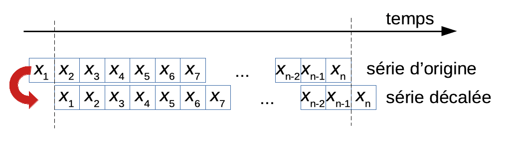
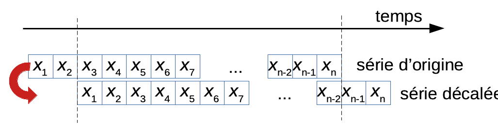

# Séries chronologiques I {#series1}

```{r setup, results='hide', warning=FALSE, include=FALSE}
SciViews::R("ts", lang = "fr")
```

##### Objectifs {.unnumbered}

-   Comprendre ce qu'est une série chronologique (ou spatio-temporelle)

-   Manipuler les séries chronologiques dans R, les décrire et en faire des représentations graphiques appropriées

-   Maîtriser la notion d'autocorrélation, la fonction d'autocorrélation et son interprétation

-   Pouvoir détecter des tendances locales, globales et des cycles dans les séries

##### Prérequis {.unnumbered}

Ce module nécessite d'être à l'aise avec R, RStudio et R Markdown. Les cinq premiers modules du cours 1 (en particulier, la [visualisation](https://wp.sciviews.org/sdd-umons/?iframe=wp.sciviews.org/sdd-umons-2024/introvisu.html) et le [traitement des données](https://wp.sciviews.org/sdd-umons/?iframe=wp.sciviews.org/sdd-umons-2024/import.html)) doivent être acquis. La notion de corrélation ([partie du module 6 du cours 1](https://wp.sciviews.org/sdd-umons/?iframe=wp.sciviews.org/sdd-umons-2024/corr%25C3%25A9lation.html)) doit également être bien comprise au départ.

```{block2, type='note'}
Nous utiliserons ici essentiellement le package R {pastecs} qui est une réécriture entre autres par l'un des auteurs de ce cours du logiciel PASSTEC 2000, un programme écrit initialement en Visual Basic par le [Prof. Frédéric Ibañez](https://www.ncbi.nlm.nih.gov/pmc/articles/PMC4247415/) dans les années 1980, sous la direction de ce dernier. C'est au Prof. Ibañez que l'on doit d'avoir rassemblé un grand nombre de techniques utiles en écologie et en biologie en général en matière d'analyse de séries spatio-temporelles, et d'en avoir démontré l'utilité quelque fois pour la première fois.
```

## Observations dépendantes du temps

Démarrons tout de suite notre étude des séries chronologiques par plusieurs exemples concrets qui vont nous emmener dans les plaines enneigées du Grand Nord canadien, au sommet d'un volcan à Hawaï, dans le cerveau d'un patient épileptique ou au large de la mer Méditerranée.

Afin de configurer R pour utiliser le dialecte SciViews et charger les packages supplémentaires nécessaires à l'analyse de séries spatio-temporelles, vous entrez l'instruction suivante en début de script R, ou dans le chunk de "setup" d'un document R Markdown ou Quarto (aussi pour utiliser le français là où les traductions existent) :

```{r}
SciViews::R("ts", lang = "fr")
```

### Lynx

Vous vous intéressez au Lynx du Canada (*Lynx canadensis*) du point de vue de la dynamique de population à long terme. Pour réaliser une étude rétrospective, vous recherchez la meilleure façon de déterminer la variation interannuelle de cette espèce à l'époque où elle était encore abondante (au 19^e^ siècle et au début du 20^e^ siècle).

.jpg)](images/04-series1/lynx.jpg)

Il apparaît que le nombre de lynx capturés par les trappeurs de l'époque est la meilleure information que vous puissiez obtenir (observations indirectes, ou "proxy" dans le jargon statisticien). La compilation de données de captures entre 1821 et 1934 en nombre d'individus donne ceci[^04-series-i-1] :

[^04-series-i-1]: Notez que l'on obtient un objet **tbl_ts**, soit un data frame de type tibble spécial qui reconnait la variable temporelle (on l'appelle aussi un **tsibble** comme vous pouvez le constater en imprimant l'objet).

```{r}
lynx <- read("lynx", package = "datasets")
class(lynx)
lynx
```

Le tableau brut des données n'est pas très parlant. Avec les séries chronologiques, c'est la représentation graphique qui révèle le mieux ce qu'il contient. Comme il y a continuité dans le temps entre les observations, le graphique le plus approprié ici utilise `geom_line()` au lieu du `geom_point()` auquel nous sommes habitués. Les traits entre les observations figurent cette continuité temporelle. Par convention, le temps se déroule de gauche à droite sur l'axe des abscisses. Cela donne ceci :

```{r}
chart(lynx, trapping ~ time) +
  geom_line()
```

Nous sommes tout de suite surpris par la variation importante dans les captures d'une année à l'autre. Il semble que les années de captures abondantes reviennent à intervalle régulier. Mais comment analyser plus à fond ces données ? Notons d'emblée que l'unité d'échantillonnage (territoire Canadien) est la même pour chaque mesure. Donc, il n'y a **pas indépendance** des observations les unes par rapport aux autres. Intuitivement, nous pouvons d'ailleurs facilement imaginer cela. Connaissant les captures à une année, nous pouvons considérer que celles l'année d'avant ou l'année d'après ne sont pas complètement indépendantes, puisqu'il s'agit de la *même* population de lynx qui est échantillonnée. Cette continuité dans le temps *doit* être figurée sur le graphique en reliant les points. C'est donc une erreur de représenter une telle série chronologique à l'aide d'un nuage de points classique qui, quant à lui, figure des points séparés les uns des autres pour des observations indépendantes. Plus précisément, relier les points indique à la fois qu'il y a variation continue et aussi qu'il y a probablement un certain degré de dépendance entre les observations.

### CO~2~ à Hawaï

Nous sommes en période de grands changements climatiques et de réchauffement planétaire, ce n'est plus un secret pour personne. Une des causes identifiées de ces changements est l'augmentation du CO~2~ dans l'atmosphère suite à la combustion massive d'énergie fossile (charbon, gaz et pétrole). Ces changements ont des effets bien visibles sur le vivant. En biologie, nous devons souvent confronter nos observations par rapport aux changements du milieu, et donc, nous manipulons fréquemment des séries chronologiques de données physico-chimiques. Le CO~2~ (en ppm ou parties par million) a été mesuré dans l'atmosphère au [laboratoire NOAA situé en haut du volcan Mauna Loa à Hawaï](https://www.esrl.noaa.gov/gmd/ccgg/trends/).

 situé en plein milieu de l'Océan Pacifique et à 3400m d'altitude sur le volcan Mauna Loa à Hawaï d'où provient la série `co2`.](images/04-series1/mauna_loa.jpg)

Cet observatoire est situé dans une zone suffisamment éloignée des principales sources industrielles de production de CO~2~, en plein milieu de l'Océan Pacifique, pour que les mesures n'en soient pas affectées directement, ou de manière négligeable. Les données suivantes présentent l'évolution du CO~2~ atmosphérique entre 1959 et 1998 :

```{r}
co2 <- read("co2", package = "datasets")
class(co2)
co2
```

Notez bien qu'ici, les données sont dans un autre format, un objet de classe **ts**. Ce sont les données de séries temporelles régulières de R de base. Nous pouvons appliquer la fonction R de base `plot()` pour en faire le graphique (et cette fonction relie les points automatiquement comme vous pouvez le constater) :

```{r}
plot(co2)
```

Les libellés des axes ne sont pas parfaits, mais les arguments `xlab =` et `ylab =` de la fonction `plot()` nous permettons de les redéfinir. Ici, nous en profitons pour découvrir qu'il est possible de formater ce texte à l'aide de `expression()`. Pour mettre le "2" en indice dans "CO~2~", on écrira `CO[2]`. Pour tous les autres formatages possibles, voir `?plotmath`.

```{r}
plot(co2, xlab = "Temps [années]", ylab = expression(paste(CO[2], " atmosphérique [ppm]")))
```

Si nous voulons utiliser `chart()`, il nous faut d'abord transformer nos données en **tsibble** à l'aide de `tsibble::as_tsibble()` :

```{r}
co2_tsbl <- tsibble::as_tsibble(co2)
co2_tsbl
```

Notez que sans en changer le nom (pour `lynx`, nous avions du code qui le faisait et rajoutait aussi les labels des variables de manière transparente), les colonnes sont par défaut :

-   **index** pour la colonne du temps
-   **value** pour la colonne des données observées.

De plus, la date est un objet **yearmonth** que `chart()` n'apprécie pas trop. Donc, nous le transformons en **Date** avec `as.Date()`.

```{r}
chart(co2_tsbl, value ~ as.Date(index)) +
  geom_line() +
  labs(x = "Temps [années]", y = expression(paste(CO[2], " atmosphérique [ppm]")))
```

Ici aussi, nous observons très clairement des variations qui se répètent à intervalle régulier, probablement des **variations saisonnières**. Mais par-dessus ces fluctuations, une augmentation à plus long terme est effectivement particulièrement visible. Une fois de plus, les différentes observations ont toutes été réalisées au *même* endroit et une forte interdépendance est à suspecter entre les observations successives.

### EEG

L'électro-encéphalogramme consiste à mesurer de manière non invasive l'activité électrique de notre cerveau. L'épilepsie est un dérèglement majeur du fonctionnement cérébral qui se marque particulièrement bien au niveau de l'EEG.

.](images/04-series1/eeg.jpg)

Le graphique suivant montre à quoi ressemble un signal enregistré par un EEG pendant une crise d'épilepsie (sachant qu'il y a autant de signaux différents que d'électrodes utilisées) :

```{r}
eeg <- read("eeg", package = "TSA")
class(eeg)
plot(eeg)
```

Cette série chronologique est comptabilisée sur l'axe du temps simplement avec le numéro de la mesure commençant par 2001, mais en réalité, 256 mesures sont réalisées par seconde ici. Dans cette série, les fluctuations sont importantes, mais apparaissent difficiles à interpréter sur le graphique brut.

### Plancton méditerranéen

Les séries chronologiques sont aussi appelées séries spatio-temporelles, car sous certaines conditions, elles peuvent aussi servir à représenter des évènements qui varient spatialement, voir dans l'espace et le temps simultanément. Mais attention, quand nous parlons de variation spatiale, il ne peut s'agir que de variation **unidimensionnelle**, par exemple, le long d'un **transect** (tracé rectiligne ou non entre deux points et le long duquel les mesures sont réalisées). Un bon exemple d'une telle variation spatio-temporelle est représenté par l'étude du plancton en mer Méditerranée entre Nice et la Corse.

```{r, echo=FALSE, message=FALSE, fig.cap="Une séries de 68 stations équiréparties le long d'un transect entre Nice et la Corse (trait rouge) sont échantillonnées pour la physico-chimie (`marphy`) et le plancton (`marbio`)."}
chart(data = map_data("france"), lat ~ long %group=% group) +
  geom_polygon(fill = "gray", color = "black") +
  geom_segment(f_aes(43.7 ~ 7.25 %yend=% 42.56 %xend=% 8.75 %color=% "red"),
    linewidth = 0.8, show.legend = FALSE) +
  theme_bw() +
  coord_quickmap() +
  labs(x = "", y = "")
```

Nous avons ici effectivement un axe qui varie spatialement le long du transect, mais en même temps dans le temps, car les 68 stations ne sont pas échantillonnées *simultanément*, mais *successivement dans le temps* au fur et à mesure que le navire océanographique fait route entre Nice et Calvi en Corse. Nous avons déjà utilisé ces données au cours SDD II pour illustrer les analyses multivariées. Voyons ce que donnent les paramètres physico-chimiques sous forme de séries spatio-temporelles (notez que, comme `marphy` est un objet **data.table**, nous utilisons la fonction `tsibble::as_tsibble()` ou `ts()` pour le transformer en séries spatio-temporelles, plus de détails sur ces dernières fonctions seront donnés plus loin ; ici la colonne `Station` doit être créée d'abord et indiquée comme étant l'index à `tsibble::as_tsibble()`) :

```{r}
read("marphy", package = "pastecs") %>.%
  smutate(., Station = 1:nrow(.)) %>.%
  tsibble::as_tsibble(., index = Station) ->
  marphy_tsbl
marphy_tsbl
chart(marphy_tsbl, Temperature ~ Station) +
  geom_line() +
  ylab("Temperature [°C]")
```

Nous avons ici plusieurs variables mesurées aux mêmes stations. La transformation avec `ts()` nous donne alors un objet **mts()** ("multiple time series"), avec un graphique via `plot()` qui est plutôt intéressant :

```{r, fig.height=10, fig.width=7}
read("marphy", package = "pastecs") %>.%
  ts(.) ->
  marphy_ts
class(marphy_ts)
marphy_ts

plot(marphy_ts,
  main = "Masses d'eaux entre Nice et la Corse",
  xlab = "Transect Nice - Calvi (stations)")
```

Ici, nous avons quatre variables enregistrées : la température (°C), la salinité de l'eau, la fluorescence (de la chlorophylle) qui est une mesure indirecte du contenu en phytoplancton dont l'abondance dépend elle-même du contenu en sels nutritifs (azote, phosphore, silice), et enfin la densité de l'eau en g/L. Nous observons ici des variations importantes et parfois assez abruptes. En fait, le transect croise un front constitué par une remontée d'eaux profondes, froides et riches en nutriments en plein milieu. De même, `marbio` est une "data table" que nous nous empressons de convertir avec `ts()`, mais ici nous choisissons trois séries parmi l'ensemble des 24 séries pour la représentation graphique à l'aide de l'opérateur `[,]` :

```{r, fig.height=9, fig.width=7}
read("marbio", package = "pastecs") %>.%
  ts(.) ->
  marbio_ts
colnames(marbio_ts) # Nom des différentes séries dans le jeu de données multivarié
plot(marbio_ts[, c("Acartia", "ClausocalanusA", "Pteropods")],
  main = "Plancton entre Nice et la Corse",
  xlab = "Transect Nice - Calvi (stations)")
```

Ici aussi la distribution du plancton le long du transect n'est pas homogène. Alors que les ptéropodes (mollusques planctoniques) se retrouvent essentiellement près de Nice, les crustacés copépodes comme *Acartia spp* ou *Clausocalanus spp* se retrouvent plutôt en pleine mer.

```{block2, type='note'}
Au travers de ces quatre exemples concrets, nous constatons que les séries spatio-temporelles sont utilisées dans de nombreux domaines en biologie. Le troisième exemple en particulier (EEG) nous laisse un peu démuni. Nous réalisons à ce stade que nous avons besoin d'une toute nouvelle panoplie d'outils pour analyser ce type de données car étant des mesures successives dans le temps d'un *même* individu, nous n'avons **pas d'indépendance des observations les unes par rapport aux autres**, qui est pourtant une hypothèse de départ de pratiquement toutes les techniques statistiques que nous avons étudiées jusqu'ici.
```

##### À vous de jouer ! {.unnumbered}

`r h5p(26, height = 270, toc = "Représentation des séries chronologiques")`

## Qu'est-ce qu'une série chronologique ?

Lorsque nous mesurons de manière répétée le *même* individu à des moments différents, nous parlons de **série chronologique**, de **séries temporelles**, ou de **série spatio-temporelle** (*space-time series* en anglais). Ce dernier terme "spatio-temporel" se réfère, en réalité, à un axe unidimensionnel que nous représentons toujours par convention sur l'axe des abscisses sur un graphique et le long duquel nos observations s'étalent. Il peut s'agir du temps, ou d'une dimension spatiale linéaire (mesures le long d'un **transect**, comme nous l'avons vu pour le plancton méditerranéen), ou d'un mélange des deux, c'est-à-dire que le temps se déroule alors que nous progressons dans nos mesures le long du transect. Quoi qu'il en soit, le fait de mesurer toujours le même individu ou la même entité mène à une interdépendance des observations les unes par rapport aux autres.

Cette propriété de corrélation au sein de la série entre les observations est dite **autocorrélation**. C'est la caractéristique principale d'une série temporelle que de contenir une autocorrélation qui est très souvent non nulle (dans le cas contraire, on parle de **bruit blanc**, *white noise* en anglais). C'est cette autocorrélation qui fait que l'hypothèse d'indépendance des observations entre elles n'est pas respectée, et par conséquent, que nous ne pouvons pas utiliser les outils de statistique classique ici.

Donc, nous devons utiliser des outils statistiques spécialisés qui tiennent compte de cette autocorrélation. Il faut aussi noter que si l'autocorrélation est très forte, nous pourrons aussi l'utiliser à notre avantage. En effet, nous pouvons imaginer *prédire* la valeur que prendra la variable mesurée dans la série au temps $t + \Delta t$, connaissant uniquement la valeur qu'elle prend au temps $t$ (et peut-être aussi, au temps $t - \Delta t$, $t - 2 \Delta t$, $t - 3 \Delta t$...). Nous appellerons $\Delta t$, l'intervalle temporel entre deux mesures successives, le **pas de temps** de notre série.

Une autre caractéristique importante des séries temporelles est l'existence de **cycles**. En effet, de nombreux phénomènes sont périodiques dans le temps (cycles circadiens, lunaires, annuels, etc.) et ils influent sur la biologie et l'écologie des êtres vivants. Il n'est donc pas étonnant de retrouver des cycles similaires dans les séries temporelles en biologie. Plusieurs méthodes existent pour étudier et séparer des cycles ou des **tendances à long terme** du bruit de fond contenu dans les séries temporelles. Nous aborderons ici quelques-uns de ces outils.

Au cours de notre exploration des séries temporelles, nous utiliserons les fonctions standard de R pour la manipulation et l'analyse des séries temporelles. Nous aborderons aussi des outils plus spécialisés contenus dans les packages {pastecs} ("Package for the Analysis of Space-Time Ecological Series") et {xts} ("eXtensible Time Series"). Nous allons successivement étudier comment créer et manipuler des séries temporelles dans R et comment les décrire. Dans le module suivant, nous poursuivrons en apprenant à les décomposer, et enfin, nous verrons comment régulariser des séries irrégulières.

### Séries régulières

Une série régulière est un ensemble de données mesurées sur la même entité (même individu, même unité statistique) avec un **espacement constant dans le temps** (ou le long d'un transect). La série n'a pas de valeurs manquantes. Ce type de série a des avantages énormes, car nous pouvons décaler la série d'un ou plusieurs pas de temps, et les observations après décalage correspondent aux **mêmes dates** que les observations originales, à part aux extrémités bien entendu.



Après avoir effectué un décalage (*lag* en anglais) d'un pas de temps, et moyennant l'élimination de la première observation *x*~1~ de la série d'origine et la dernière observation *x*~n~ de la série décalée, nous obtenons un tableau de 2 lignes et *n* - 1 colonnes. Nous noterons l'opérateur de décalage ou **opérateur retard** *L*, un opérateur qui effectue exactement ce traitement, c'est-à-dire qu'il associe à tout élément de la série régulière, l'observation précédente.

$$L X_t = X_{t-1}$$

Nous pouvons calculer la **corrélation** $r$, par exemple à l'aide du coefficient de corrélation de Pearson (ou de Spearman) entre les deux lignes du tableau obtenu en accolant la série de départ $X_t$ et la même série décalée $LX_t$, amputé des extrémités ne comportant pas de paires d'observations (la version de Spearman se calculera sur les rangs des observations, voir [module 6 du cours SDD I](https://wp.sciviews.org/sdd-umons/?iframe=wp.sciviews.org/sdd-umons-2024/corr%25C3%25A9lation.html)) :

$$r_{X_t,LX_t} = \frac{cov_{X_t,LX_t}}{\sqrt{S^2_{X_t} + S^2_{LX_t}}}$$

Avec $cov$ la covariance et $S^2$ la variance. Cette corrélation étant calculée entre la série et elle-même, elle est appelée **autocorrélation**. Par simplicité, nous pouvons aussi noter le décalage choisi "tau" ($\tau$), et nous aurons alors l'autocorrélation correspondante à ce décalage qui sera notée $r(\tau)$ avec $\tau = 1$. Naturellement, nous pouvons décaler de plus d'un pas de temps. Par exemple, si nous décalons de deux pas de temps, l'opérateur correspondant s'appelle alors *L*^2^ :

$$L^2 X_t = X_{t-2}$$

Ce calcul correspond au schéma suivant :



Si nous voulons rassembler la série de départ *X* et la série décalée *L*^2^ *X*, nous sommes maintenant obligés de laisser tomber les *deux* premières observations de *X* et les deux dernières de *L*^2^ *X*. Nous pouvons naturellement aussi calculer l'autocorrélation $r_{X_t,L^2X_t}$, ou encore, $r(\tau)$ pour $\tau = 2$.

De manière générale, nous définissons *L*^k^, avec *k* pouvant prendre des valeurs entières positives **ou négatives** (la série est décalée dans l'autre sens).

$$L^k X_t = X_{t-k}$$

*L*^0^ est un cas particulier où la série est simplement recopiée aux mêmes dates. Comme la corrélation entre une série et elle-même est toujours parfaite, $r(\tau) = 1$ toujours pour $\tau = 0$. **L'autocorrélation pour un décalage nul vaut toujours un.** Notez que $r(\tau)$ est en fait une fonction dépendant de variations discrètes de $\tau$. On l'appelle donc la **fonction d'autocorrélation** (*autocorrelation function* en anglais). Cette fonction d'autocorrélation est un merveilleux outil pour analyser les caractéristiques de notre série... nous y reviendrons donc dans la partie analyse plus loin.

R propose un type d'objet particulier pour représenter des séries régulières univariées (une seule variable mesurée à chaque fois) : les objets **ts**. Certaines de nos séries d'exemples de la section précédente sont des objets de ce type dès le départ. Prenons `co2` et examinons comment cet objet est représenté.

```{r}
co2 <- read("co2", package = "datasets")
co2
```

Visiblement, à l'impression de `co2`, on voit que c'est un objet particulier.

```{r}
class(co2) # Objet ts
```

De même, la fonction de {pastecs} `is.tseries()` renvoi `TRUE` si l'objet est une des formes de séries temporelles de R :

```{r}
is.tseries(co2)
```

Pour inspecter (aux rayons X) un objet dans R, on peut le "déclasser" avec `unclass()`, ce qui a pour effet d'imprimer son contenu "brut de décoffrage".

```{r}
unclass(co2)
```

Ici, nous voyons qu'il s'agit d'un vecteur de données numériques auquel est ajouté un **attribut** (`attr`) nommé **tsp** pour "**t**ime **s**eries **p**arameters" et qui contient trois valeurs : 1959.000, 1997.917 et 12.000. Où sont les données de temps ? Et que veulent dire ces valeurs de **tsp** ? En fait, pour économiser de la place en mémoire, R n'enregistre pas toutes les dates, mais seulement la première, la dernière et le pas de temps de la série dans **tsp**. À l'aide de ces trois valeurs, il est en fait possible de reconstituer toutes les dates. La fonction `time()` s'en charge :

```{r}
time(co2)
```

Nous obtenons un autre objet **ts** qui contient, cette fois-ci, les dates de chaque observation. Le troisième nombre de **tsp** est la fréquence des observations (ici, 12) par rapport à l'unité de temps choisie (ici l'année). Cela signifie 12 observations par an, soit une par mois. À partir de ces trois nombres, nous pouvons donc reconstituer la séquence des années depuis janvier 1957 jusqu'à décembre 1997 auxquelles les observations ont été réalisées.

Comment connaître l'unité de temps utilisée dans la série ? En fait, cette unité n'est **pas** stockée dans l'objet **ts**. Vous la choisissez librement, vous définissez la date de départ et la date de fin exprimées dans cette unité choisie, ainsi que la fréquence des observations, et votre attribut **tsp** est complètement défini. La fonction `ts()` permet de générer une série temporelle, ou de transformer un vecteur d'observations en une série temporelle. Par exemple, si nous générons des données artificielles à partir d'une distribution normale avec `rnorm()`, et que nous considérons ces données comme une série chronologique mesurée mensuellement entre janvier 2010 et décembre 2014, nous ferions ceci :

```{r}
fake_ser <- ts(rnorm(5 * 12), start = 2010, frequency = 12)
fake_ser
```

Notez comment R formate notre sortie (il assume qu'une série à fréquence de 12 correspond à des données mensuelles). Nous ne devons indiquer que deux des trois paramètres de **tsp**, car le nombre d'observations dans le vecteur fournit l'information manquante pour calculer le troisième paramètre. Quelles sont les dates de ces observations ?

```{r}
time(fake_ser)
```

R mesure ici le temps sous forme décimale. C'est pratique, mais nous n'y sommes pas habitués. Ainsi, il divise l'année en 12 douzièmes, peu importe que certains mois contiennent 31, 30 ou même 28/29 jours. Ainsi, le 1^er^ janvier 2010 est 2010.000. Le 1^er^ février 2010 est 2010 + 1/12 = 2010.083. Et le 1^er^ décembre 2014 est 2014 + 11/12 = 2014.917. La petite erreur de décalage du début de chaque mois est minime et sans impacts pratiques pour nos séries chronologiques biologiques, car le vivant se soucie peu de notre calendrier grégorien. Par contre, pour des données comme le cours de la bourse, par exemple, ce genre d'approximation n'est pas utilisable et il faut alors employer des objets qui manipulent les dates de manière plus précise (mais aussi plus fastidieuse), comme ceux du package {xts} (voir plus loin, les séries irrégulières).

Dans notre série `fake_ser` de fréquence 12, le pas de temps est donc d'un mois, soit 1/12 d'année. **Notez que le pas de temps est en fait l'*inverse* de la fréquence des observations**. Si vous êtes plus à l'aise avec ce pas de temps, vous pouvez le substituer à la fréquence dans la fonction `ts()` via l'argument `deltat =`. Ainsi, indiquer `ts(...., frequency = 12)` ou `ts(...., deltat = 1/12)` est strictement équivalent.

Nous rencontrons également des objets **mts** pour *multivariate time series*. Ces objets contiennent plusieurs variables mesurées sur la même entité au cours du temps. Le vecteur est alors remplacé par une matrice à *n* lignes (le nombre d'observations dans le temps) et *m* colonnes (le nombre de variables mesurées à chaque fois). L'attribut **tsp** est le même que pour **ts**. La sélection des séries au sein de la matrice se fait à l'aide de l'opérateur "crochet" `[,]` où la ou les séries d'intérêt sont reprises en second argument après la virgule soit sous forme d'un vecteur d'entiers qui représentent les positions des colonnes à conserver, soit sous forme d'un vecteur de chaînes de caractères qui reprennent les noms des séries à conserver. Les séries multivariées `marbio_ts` et `marphy_ts` en sont des bons exemples. Les objets **mts** sont également des objets **ts** et des objets **matrix**, qui sont eux-mêmes des **array** (on dit qu'elles *héritent* de ces classes[^04-series-i-2]) :

[^04-series-i-2]: D'un point de vue purement technique, l'"héritage" est un peu particulier dans ces objets dits "S3", mais cela a peu d'importance ici et va bien au-delà de ce que vous devez comprendre pour manipuler les séries spatio-temporelles dans R.

```{r}
class(marphy_ts)
```

Comme la température et la densité sont les première et quatrième colonnes de `marphy_ts`, nous pouvons les extraire par position (et `colnames()` est utilisé pour renvoyer les noms des colonnes dans une matrice et donc par héritage, dans un objet **mts**) :

```{r}
# Nom de toutes les séries dans marphy_ts
colnames(marphy_ts)
# Nom après sélection de deux séries
colnames(marphy_ts[, c(1, 4)])
```

La sélection à l'aide des identifiants est souvent préférable, car plus explicite. Le même résultat est obtenu avec :

```{r}
colnames(marphy_ts[, c("Temperature", "Density")])
```

```{block2, type='warning'}
N'essayez pas d'utiliser la sélection à l'aide de `[,]` sur un objet **ts** contenant une série univariée. Vous génèreriez une erreur car cet objet contient un *vecteur* et non pas une *matrice*. De plus, cela n'a aucun sens de faire une sélection parmi... une seule série dans cet objet !
```

##### À vous de jouer ! {.unnumbered}

`r h5p(27, height = 270, toc = "Création d'un objet ts")`

### Séries à trous

Une série à trous est une série régulière, mais avec des valeurs manquantes. Comme R représente des valeurs manquantes dans un vecteur par `NA`, il est possible de créer et manipuler des séries à trous à l'aide des objets **ts** et **mts**. Par contre, certaines méthodes statistiques ne géreront pas ces valeurs manquantes et refuseront de produire un résultat.

En profitant des propriétés d'autocorrélation de la série, il est possible d'estimer des valeurs raisonnables pour remplacer les données manquantes si elles sont peu nombreuses. Par exemple, il est possible de faire une interpolation linéaire entre les deux observations qui encadrent la valeur manquante. Cette technique, et d'autres seront abordées dans le module suivant dans la section relative à la **régularisation**. Retenez juste, à ce stade, que notre objectif sera de régulariser autant que possible une série à trous avant de l'analyser.

### Séries irrégulières

Dès que le pas de temps entre les observations n'est pas constant, nous parlons de série irrégulière. Les séries irrégulières ne peuvent pas être représentées par des objets **ts** ou **mts** de R qui imposent un pas de temps régulier. Par contre, les packages {zoo} et {xts} permettent de manipuler ce genre de données.

<!-- TODO: introduction rapide à {xts} et conversion entre objets. -->

De manière générale, nous avons toujours intérêt à réaliser une série régulière, ou la plus régulière possible. Ensuite, il faut penser aux techniques de régularisation si c'est faisable pour obtenir une série régulière qui approxime suffisamment bien les données de départ. En effet, la plupart des techniques d'analyse des séries temporelles se basent sur des séries régulières, et en tous cas celles du package {pastecs}.

##### À vous de jouer ! {.unnumbered}

`r h5p(28, height = 270, toc = "Type de série chronologique")`

##### À retenir {.unnumbered}

-   Nous devons nous arranger pour obtenir autant que possible des **séries régulières**. Sinon, les séries à trous, voire légèrement irrégulières, pourront être **régularisées** avant analyses (voir module suivant).

-   R représente des séries régulières à l'aide d'objets **ts** (univariées) ou **mts** (multivariées).

-   Dans ces objets, le temps est encodé grâce à l'attribut **tsp** qui contient trois valeurs : la date de départ, celle de fin et la fréquence des observations.

-   L'unité de temps n'est pas définie par R : vous la choisissez librement. Si la fréquence est 12, R considérera toutefois à l'impression du contenu de l'objet que c'est des mesures mensuelles et que l'unité est l'année. De même si la fréquence est de 4, il considérera des mesures trimestrielles sur une année. Sinon, le temps est manipulé et imprimé par R de manière décimale.

-   Nous pouvons créer un objet **ts** ou **mts** à l'aide de la fonction `ts()`. Nous devons donner le vecteur ou la matrice des observations, ainsi que deux des trois paramètres de **tsp**. Nous pouvons substituer le **pas de temps** à la **fréquence** des observations via l'argument `deltat =`. En fait, `deltat == 1/frequence`, le pas de temps est l'inverse de la fréquence.

-   Les séries irrégulières doivent être représentées, par exemple, par des objets **xts** et le package {xts} propose une large palette de fonction pour manipuler de tels objets.

##### Pour en savoir plus {.unnumbered}

-   [Manuel de {pastecs} en ligne](https://github.com/phgrosjean/pastecs/blob/master/manual/pastecs_manuel_utilisateur.pdf), en français, pour tout savoir sur les nombreuses fonctions disponibles dans le package {pastecs}.

-   [Manipulation des séries temporelles avec {xts} et {zoo}](https://rstudio-pubs-static.s3.amazonaws.com/288218_117e183e74964557a5da4fc5902fc671.html), en anglais, une excellente introduction à {xts}.

-   Le [chapitre 12 de "Analyse et modélisation d'agroécosystèmes"](https://essicolo.github.io/ecologie-mathematique-R/chapitre-temps.html) est consacré aux séries temporelles et il présente des notions en partie complémentaires à ce cours.

-   Le [chapitre 2 de "Forecasting: Principles and Practice"](https://otexts.com/fpp2/graphics.html) présente en anglais les objets **ts** et les graphiques descriptifs utiles pour les séries temporelles. Il va plus loin dans ce domaine que notre cours... et naturellement, c'est aussi une "bible" en ce qui concerne la **prédiction** à partir de séries temporelles, tout un pan de cette discipline que nous n'abordons pas ici.

## Manipulation et description

Tout comme pour les statistiques plus classiques, nous commençons toujours notre exploration de séries chronologiques par une partie purement descriptive, soit numérique, soit graphique. De plus, nous savons que nous ne devons pas espérer obtenir d'emblée des données qui se présentent de manière parfaite. Un petit peu de **manipulation de données** est parfois nécessaire... Nous allons découvrir quelques fonctions utiles dans ce contexte pour les séries chronologiques.

Comme nous l'avons déjà vu, le graphe de base (obtenu par `plot()` ou en utilisant `geom_line()`) est une ligne brisée qui relie les différents points de la série, avec le temps sur l'axe des abscisses, et l'axe des ordonnées représentant les observations de la variable quantitative mesurée au fil du temps.

### Statistiques glissantes

Les descripteurs statistiques tels que la moyenne, la médiane, l'écart type, etc., restent utiles pour les séries temporelles. Par contre, la valeur de ces descripteurs est susceptible de varier au cours du temps, et cette variation donne des indications utiles sur les mécanismes biologiques sous-jacents (par exemple, des fluctuations, des changements brutaux de régimes, etc.). Il nous faut donc calculer ces descripteurs pour des intervalles de temps précis le long de l'axe temporel de notre série. Les **statistiques glissantes** (*sliding statistics* en anglais) correspondent précisément à l'analyse de blocs successifs de données suivant un axe spatio-temporel. Dans {pastecs}, elles se calculent à l'aide de la fonction `stat.slide()`.

##### À vous de jouer ! {.unnumbered}

`r h5p(249, height = 270, toc = "Statistiques glissantes")`

##### Exemple {.unnumbered}

Nous reprenons ici l'exemple du manuel de {pastecs}. On peut calculer des statistiques glissantes pour la série `ClausocalanusA` de `marbio` par groupes de dix stations, les imprimer et faire un graphique de la "moyenne glissante" à l'aide des instructions suivantes :

```{r}
marbio_ts <- ts(read("marbio", package = "pastecs"))
statsl <- stat.slide(1:68, marbio_ts[, "ClausocalanusA"],
  xmin = 0, n = 7, deltat = 10)
statsl
```

```{r}
plot(statsl, stat = "mean", leg = TRUE, lpos = c(55, 2500),
  xlab = "Station", ylab = "ClausocalanusA")
```

Toujours pour la même série, on peut calculer toutes les statistiques sur des intervalles irréguliers, puis représenter l'étendue (minimum, maximum) et la médiane pour chaque intervalle comme suit (ces intervalles correspondent aux différentes masses d'eaux croisées le long du transect, voir légende du graphique) :

```{r}
statsl2 <- stat.slide(1:68, marbio_ts[, "ClausocalanusA"],
  xcut = c(0, 17, 25, 30, 41, 46, 70),
  basic = TRUE, desc = TRUE, norm = TRUE, pen = TRUE, p = 0.95)
statsl2
```

```{r}
plot(statsl2, stat = "median", xlab = "Stations", ylab = "Effectifs",
  main = "Clausocalanus A")     # Médiane
lines(statsl2, stat = "min")    # Minimum
lines(statsl2, stat = "max")    # Maximum
lines(c(17, 17), c(-50,2600), col = 4, lty = 2) # Séparations des masses d'eaux
lines(c(25, 25), c(-50,2600), col = 4, lty = 2)
lines(c(30, 30), c(-50,2600), col = 4, lty = 2)
lines(c(41, 41), c(-50,2600), col = 4, lty = 2)
lines(c(46, 46), c(-50,2600), col = 4, lty = 2)
text(c(8.4, 21, 27.5, 35, 43.5, 57.2), 2300,
  labels = c("Zone périphérique", "D1", "C", "Front", "D2", "Zone centrale")) # Labels
legend(0, 1900, c("série", "médian", "étendue"), col = 1:3, lty = 1)
```

Enfin, on peut extraire différentes statistiques, les valeurs de la série initiale (`y`), les valeurs de temps de la série (`x`), et le vecteur temps de coupure des périodes (`xcut`) à partir de l'objet **stat.slide** renvoyé :

```{r}
statsl2$stat[c("mean", "median", "min", "max"), ]
statsl2$y
statsl2$x
statsl2$xcut
```

##### À vous de jouer ! {.unnumbered}

`r h5p(250, height = 270, toc = "Arguments de stat.slide()")`

##### À vous de jouer ! {.unnumbered}

`r learnr("C04La_ts_intro", title = "Introduction aux séries chronologiques", toc = "Introduction aux séries chronologiques")`

### Manipulations de **ts**

Les jeux de données bricolés artificiellement sont parfois bien utiles pour explorer de nouvelles techniques. En effet, puisque nous les construisons nous-mêmes, nous savons dès le départ de quoi ils sont faits. Et donc, nous pouvons vérifier que le résultat obtenu est bien conforme. Par exemple, nous pouvons construire une série de données mensuelle commençant en avril 1998 (`start = c(1998, 4)`), contenant 100 valeurs et comportant une composante sinusoïdale d'une période annuelle ainsi qu'une composante aléatoire ayant une distribution normale de moyenne nulle et d'écart type 0.5 :

```{r}
tser <- ts(sin((1:100) / 6 * pi) + rnorm(100, sd = 0.5), start = c(1998, 4), 
  frequency = 12)
tser
```

Créons maintenant une série multiple en prenant notre série de départ, ainsi qu'une version décalée de cinq mois à l'aide de la fonction `stats::lag()` et représentons cela graphiquement :

```{r}
mtser <- ts.intersect(tser, stats::lag(tser, 5))
plot(mtser, xlab = "Temps", main = "Série tser et série décalée de 5 mois")
```

#### Manipulation du temps

Les fonctions `tsp()`, `start()`, `end()` et `frequency()` permettent de récupérer les différents paramètres de temps de la série :

```{r}
tsp(tser)
start(tser)
end(tser)
frequency(tser)
```

Nous avons déjà vu la fonction `time()` qui permet de reconstituer le vecteur temps pour la série. La fonction `cycle()` indique l'appartenance de chaque donnée de la série à un cycle. Elle permet, par exemple, de séparer les données par mois si la base de temps est l'année à l'aide de la fonction `split()`. Ensuite, il est possible de traiter ou de représenter séparément les statistiques mois par mois pour en faire, par exemple, des boites de dispersions parallèles :

```{r}
tser.cycle <- cycle(tser)
tser.cycle
boxplot(split(tser, tser.cycle), names = month.abb, col = "cornsilk")
```

##### À vous de jouer ! {.unnumbered}

`r h5p(251, height = 270, toc = "Début d'une série")`

Une autre manipulation courante de l'axe temporel consiste à **agréger** les données en des pas de temps plus longs. `aggregate()` permet de réduire le nombre d'observations en diminuant la fréquence. Par exemple pour transformer la série `tser` qui a un pas de temps d'un mois en une série de pas de temps d'un trimestre, en calculant des **moyennes trimestrielles**, nous ferons (puisqu'il y a quatre trimestres dans une année, nous indiquons 4 ici) :

```{r}
aggregate(tser, 4, mean)
```

Notez encore une fois que R assume que l'unité de temps est l'année et il crée des intitulés particuliers pour des séries de fréquence égale à 4 (Qtr1 -\> Qtr4) ou à 12 (intitulé des mois en abrégé).

Si nous ne souhaitons pas utiliser la série sur toute sa longueur, nous pouvons employer `window()` pour extraire une sous-série contenue dans une fenêtre de temps spécifique sans modifier la fréquence des observations. Par exemple, pour extraire les années 1999 à 2001 complètes de `tser`, on utilisera :

```{r}
window(tser, start = c(1999, 1), end = c(2001, 12))
```

La fonction `stats::lag()` permet de décaler la série en arrière dans le temps (ou en avant si on fournit une valeur de décalage négative) ; nous l'avons déjà utilisée plus haut. La fonction `diff()` calcule la différence entre une série et elle-même décalée dans le temps de *k* observations. Les fonctions `ts.intersect()` et `ts.union()` permettent de réunir deux ou plusieurs séries au sein d'une même matrice multivariée, avec une échelle de temps commune. Les fréquences respectives des séries à assembler doivent être identiques. Là où `ts.intersect()` retient uniquement l'intervalle de temps commun à toutes les séries, `ts.union()` conservera l'ensemble de l'intervalle temporel, toutes séries confondues.

##### À vous de jouer ! {.unnumbered}

`r h5p(252, height = 270, toc = "Réduction de séries")`

##### Exercez-vous ! {.unnumbered}

Manipulez et décrivez les différentes séries en exemples. Notez par exemple que `EEG` est constituée de mesures effectuées à un rythme de 256 par seconde, mais que l'axe du temps reprend simplement les observations les unes après les autres (ou si vous préférez, une "unité" de temps de 1/256 sec et une fréquence de 1). Comment feriez-vous pour transformer cette série avec une unité de temps de la seconde ? Ou de la milliseconde ?

## Analyse de séries

Les différentes techniques présentées dans cette section permettent de caractériser des séries spatio-temporelles, que ce soit en analysant l'autocorrélation ou la cross-corrélation, en effectuant une analyse spectrale, ou en déterminant l'existence d'une tendance générale ou locale. Le module suivant traitera plus particulièrement de la décomposition de séries en plusieurs composantes (tendance, cycle saisonnier, résidus par exemple). Bien que la décomposition et l'analyse soient des phases du traitement des séries spatio-temporelles qui ne se font pas l'une sans l'autre, nous les traitons dans des chapitres différents parce qu'elles renvoient des résultats différents. Alors que les techniques d'analyse ne modifient pas la série de départ et renvoient seulement les résultats statistiques de l'analyse, les décompositions renvoient des objets plus complexes qui contiennent aussi les composantes issues du traitement, composantes qui peuvent être transformées à nouveau en objets **ts** ou **mts** pour être traitées ou analysées en cascade si nécessaire.

### Autocorrélation, autocovariance, cross-corrélation et cross-covariance

Une série spatio-temporelle est caractérisée principalement par une autocorrélation non nulle, nous l'avons déjà vu, ce qui signifie que les différentes observations dans la série ne sont pas indépendantes les unes des autres. Cette autocorrélation s'étudie en considérant le profil de la **fonction d'autocorrélation** L'autocorrélation sera d'autant plus grande que les deux séries (initiale et décalée) sont similaires. À l'inverse, si les séries sont opposées, l'autocorrélation sera négative. Une autocorrélation nulle indique qu'il n'y a pas de corrélation entre la série initiale et la série décalée au pas de temps considéré. Le graphique de l'autocorrélation (caractéristique d'une série périodique) pour notre série artificielle `tser` est obtenu en utilisant la fonction `acf()` :

```{r}
tser <- ts(sin((1:100) / 6 * pi) + rnorm(100, sd = 0.5), start = c(1998, 4),
  frequency = 12)
acf(tser)
```

Pour un décalage nul, la première barre verticale monte jusqu'à un toujours le long de l'axe des ordonnées. Les barres suivantes montrent jusqu'où l'**effet mémoire** de la série se marque. Les traits bleus horizontaux représentent une enveloppe de confiance à 95%. Donc, les barres qui dépassent (largement) de l'intervalle entre ces deux traits bleus sont significatives. Nous voyons ici que l'effet mémoire se marque sur les deux mois qui suivent (2 barres au-dessus du trait bleu). Ensuite, le graphique est caractéristique d'une série périodique. En effet, l'autocorrélation passe par un minimum lorsque la série est décalée d'une demi-période. Ici, le cycle a une période d'un an. Nous voyons que nous passons par une autocorrélation négative et minimale après un décalage de 6, puis de 18 mois. L'axe des abscisses *Lag* est exprimé dans l'unité de la série qui est l'année ici. Cela correspond donc à respectivement 0.5 et 1.5 unité. Par contre, l'autocorrélation redevient positive et maximale pour un décalage d'une période exactement ou d'un multiple de cette période. Ainsi, nous avons un mode pour un décalage de 1 année. Nous étudierons juste en dessous une technique plus puissante pour détecter les cycles dans une série (analyse spectrale), mais lorsqu'ils sont flagrants comme ici, ils sont également clairement visibles sur le graphique de l'autocorrélation.

Pour un bruit blanc (une série constituée d'observations indépendantes les unes des autres), l'autocorrélation doit être nulle. Générons artificiellement une telle série afin de visualiser le graphique de l'autocorrélation correspondant :

```{r}
set.seed(1358) # Initie le générateur de nombre pseudo-aléatoires
white_noise <- ts(rnorm(100))
plot(white_noise)
acf(white_noise)
```

Effectivement, pratiquement toutes les barres sont comprises à l'intérieur de l'enveloppe de confiance à 95%. Il est normal que 5% des barres sortent de cette enveloppe. À part la première pour un décalage nul qui ne doit pas être comptabilisé, nous avons une barre qui sort très légèrement sur 20, soit 5% (il pourrait aussi y en avoir deux ou trois, ou bien zéro au contraire par le biais du hasard, sans que cela change nos conclusions). Ce type de graphique doit nous diriger immédiatement vers la conclusion que l'autocorrélation est nulle ou négligeable dans la série.

Si le graphique de la fonction d'autocorrélation a des barres qui sont toutes positives et significatives, cela signifie probablement qu'une tendance générale à l'augmentation domine le signal (elle est alors déjà bien souvent visible dans le graphique de la série elle-même). Si les barres sont toutes significatives et qu'il y a en plus une oscillation, nous avons alors à la fois une tendance et un cycle dont les effets sont à peu près équivalents. Le graphique de la fonction d'autocorrélation suivant est issu de la décomposition du jeu de données `co2` où nous avons extrait uniquement la tendance générale (voir l'exemple de décomposition de la série `co2` plus loin).

```{r, echo=FALSE}
co2 <- read("co2", package = "datasets")
# La fonction de décomposition tsd() sera étudiée dans le prochain module
co2_dec <- tsd(co2, method = "average", type = "additive", order = 6, times = 3)
co2_trend <- extract(co2_dec, components = "filtered")
acf(co2_trend)
```

Bien que nettement moins utilisé en pratique, on peut également tracer le graphique de l'autocovariance (la covariance est calculée entre la série de départ et la série décalée à la place de la corrélation) en précisant l'argument `type = "covariance"` à l'appel de `acf()`. On a aussi la possibilité de calculer une autocorrélation partielle avec `type = "partial"`. En outre, R fournit également `ccf()`, fonction qui calcule la **cross-corrélation** (ou corrélation croisée) ou la cross-covariance entre deux séries. Ceci peut s'avérer utile pour déterminer s'il y a une dépendance entre les deux séries, et éventuellement estimer également un décalage éventuel dans le temps pour cette dépendance. À titre d'illustration, prenons notre série artificielle `tser` et décalons-là de cinq mois. Traçons ensuite le graphique de cross-corrélation entre ces deux séries :

```{r}
mtser <- ts.intersect(tser, stats::lag(tser, 5))
ccf(mtser[, 1], mtser[, 2])
```

On retrouve bien une cross-corrélation maximale pour un décalage de cinq entre la série de départ (`mtser[, 1]`) et la série décalée (`mtser[, 2]`) : à partir du zéro, c'est la cinquième barre vers la droite qui est la plus élevée. Nous retrouvons également l'alternance entre corrélation positive et négative caractéristique de signaux cycliques sur ce graphique.

##### À vous de jouer ! {.unnumbered}

`r h5p(253, height = 270, toc = "Autocorrélation de séries")`

##### Exercez-vous {.unnumbered}

Si vous voulez affiner votre compréhension du graphique de l'autocorrélation, générez et examinez ces graphiques pour nos différentes séries d'exemples. Les séries `lynx` et `co2` doivent certainement présenter une variation périodique claire, mais pour `co2`, une tendance générale forte se superpose. Les autres séries sont moins claires sur le graphique obtenu avec `plot()`... que pouvez-vous observer sur le graphique de l'autocorrélation ?

##### Pour en savoir plus {.unnumbered}

-   Aide en ligne de `?acf` et `?plot.acf` pour les différents arguments utilisables.

-   [Manuel de {pastecs} en ligne](https://github.com/phgrosjean/pastecs/blob/master/manual/pastecs_manuel_utilisateur.pdf), en français, outre la section concernant l'autocorrélation dont la présente partie s'inspire très largement, une section est également dévolue à l'autocorrélation multiple et à son utilisation pour la détection de transitions dans une série.

### Analyse spectrale

Pour identifier de manière fine les composantes cycliques d'une série chronologique, nous pouvons considérer que cette série est la combinaison d'un ensemble de signaux (co)sinusoïdaux de fréquence croissante. Pour rappel, la **période** d'un signal cyclique est le temps nécessaire pour accomplir exactement un cycle. Par contre, la **fréquence**, notée oméga ($\omega$) est l'inverse de cette période $\omega = 1/période$, et cela correspond au nombre de cycles qui rentrent dans une unité de temps exactement (pour rappel, vous choisissez librement l'unité ici, année, quadrimestre, mois, jour, minute, seconde... millénaire, etc.). Un signal périodique élémentaire peut s'écrire alors à l'aide d'une fonction cosinus à trois paramètres : outre la **fréquence** $\omega$, il y a l'**amplitude** du signal notée $A$ et la **phase** phi ($\phi$) qui définit où le cycle commence sur l'axe du temps. Cette phase est un peu l'équivalent de l'ordonnée à l'origine pour une droite, soit un décalage du signal sur l'axe temporel.

$$x_t = A \cdot \cos(2 \pi \omega t + \phi)$$

```{r, echo=FALSE, fig.cap="Fonction cosinus avec une fréquence de 3. En gris, amplitude = 1, phase = 0. En noir, amplitude = 2, phase = 0. En rouge, amplitude = 2, phase = 1.6."}
A <- 2
omega <- 3
phi <- 1.6
t <- seq(from = -0.5, to = 1, by = 0.01)
x1 <- cos(2 * pi * omega * t)
x2 <- A * cos(2 * pi * omega * t)
x3 <- A * cos(2 * pi * omega * t + phi)
plot(t, x2, type = "l", col = "black", ylab = "x")
lines(t, x1, col = "darkgray")
lines(t, x3, col = "red")
grid()
abline(h = 0, col = "gray")
abline(v = 0, col = "gray")
```

Sur le graphique nous avons représenté trois cosinusoïdes pour vous illustrer l'effet des trois paramètres.

-   Avec $\omega$ = 3, nous avons exactement trois cycles dans une unité de *t*, donc, trois cycles entre 0 et 1 sur l'axe des abscisses pour toutes les courbes. En faisant varier $\omega$ on resserre ou étale les cycles sur cet axe (horizontalement).

-   La courbe grise ayant une amplitude *A* d'un, est comprise entre +1 et -1 sur l'axe des ordonnées (étalement vertical). Les deux autres ont une amplitude *A* doublée de deux. Par conséquent, le signal monte et descend deux fois plus entre +2 et -2.

-   Enfin, la phase $\phi$ des courbes grises et noires étant nulle, nous passons par un maximum en zéro sur l'axe des abscisses, car cos(0) = 1 = valeur maximale. Par contre, la courbe rouge est la même que la noire, mais déphasée de 1.6, ce qui la translate sur l'axe *t*. Avec une phase de 1.6 qui est environ égale à $\pi/2$, notre courbe rouge passe pratiquement par zéro pour $x_t$ lorsque $t = 0$.

Les mathématiciens nous apprennent que l'on peut s'affranchir de $\phi$ à condition de considérer une somme de sinus et cosinus. Quel que soient $A$, $\omega$ et $\phi$, il existe toujours une paire $\beta_1$, $\beta_2$ tel que :

$$A \cdot \cos(2 \pi \omega t + \phi) = \beta_1 \cdot \cos(2 \pi \omega t) + \beta_2 \cdot \sin(2 \pi \omega t)$$

En fait, $\beta_1 = A \cdot \cos(\phi)$ et $\beta_2 = -A \cdot \sin(\phi)$. Cette reparamétrisation nous ouvre les portes de la **transformation de Fourier** qui consiste à considérer un signal de forme quelconque comme une somme de sinus et cosinus de fréquences différentes. Pour $n$ observations de $x_t$, nous pourrons réécrire la série sous forme d'une somme de termes cycliques comme ceci :

$$x_t = \sum^{n/2}_{i = 1} \left[ \beta_{1 i} \cos(2 \pi \omega_i t) + \beta_{2 i} \sin(2 \pi \omega_i t) \right]$$

Les $\omega_i$ représentent des fréquences croissantes que nous fixons nous-mêmes au départ. Les $\beta_{1 i}$ et $\beta_{2 i}$ sont des paramètres qui sont déterminés pour que l'égalité soit rencontrée. Si nous considérons $n/2$ fréquences différentes, comme c'est le cas ici, nous avons donc $n$ paramètres $\beta_.$ à estimer, puisque pour chaque fréquence $\omega_i$, nous avons deux paramètres ($\beta_{1 i}$ et $\beta_{2 i}$) à estimer à chaque fois. Or, avec un même nombre de paramètres que d'observations, nous ajustons **exactement** le modèle constitué de sommes de sinusoïdes et cosinusoïdes à travers toutes les valeurs observées. Cette équation est, en outre, facile à résoudre numériquement sur ordinateur à l'aide d'un algorithme appelé FFT (pour *Fast Fourier Transform* en anglais) qui permet de calculer très rapidement tous les paramètres $\beta_.$.

Nous arrivons à ce qui nous intéresse. L'amplitude de chaque signal de fréquence différente constituant notre série peut s'exprimer au travers de ce qu'on appelle un **périodogramme** $P_i$ qui se calcule comme suit à un facteur d'échelle près :

$$P_i = \hat \beta_{1 i}^2 + \hat \beta_{2 i}^2$$

avec $\hat \beta_{1 i}$ et $\hat \beta_{2 i}$ qui sont les *estimateurs* des paramètres $\beta_{1 i}$ et $\beta_{2 i}$ pour les différentes fréquences $\omega_i$ sur base de l'échantillon dont nous disposons (nos observations). Bien que la démonstration de ceci sorte du cadre de ce cours --elle fait intervenir la théorie de l'information et la probabilité d'observer un pic ou un creux dans une série à un instant *t* donné, ce qu'on appelle un **point de retournement**-- il est possible d'estimer la probabilité qu'une valeur de $P_i$ se produise dans une série non périodique. Nous pouvons dès lors en dériver un test d'hypothèse. dont l'interprétation sera la suivante : **si la valeur de** $P_i$ est supérieure à un seuil défini par rapport à $\alpha$, nous pourrons considérer qu'il existe un signal périodique significatif à la fréquence $\omega_i$ correspondante dans notre série. Autrement dit, pour cette fréquence-là, il est très peu probable (probabilité du test \< $\alpha$) qu'une telle amplitude de signal apparaisse par pur hasard dans la série.

```{block2, type='note'}
L’estimation fournie par le périodogramme brut donne un diagramme très irrégulier. Pour y remédier, on divise l’intervalle des fréquences en bandes centrées autour de *j* fréquences équidistantes. Ensuite, on lisse le signal à l'aide d'une moyenne mobile pondérée associée à chaque bande de fréquence (nous verrons au module suivant ce qu'est une moyenne mobile, retenez simplement que c'est une technique efficace pour lisser une courbe). Le périodogramme lissé est ainsi beaucoup plus facile à interpréter, mais au prix d'une perte de résolution au niveau des fréquences, exprimée par une **largeur de bande** plus grande dans le périodogramme lissé.
```

##### Exemple {.unnumbered}

Sous R, la fonction `spectrum()` trace à la fois le périodogramme brut et le périodogramme lissé. Ainsi, les spectres bruts et lissés de `tser` sont obtenus côte à côte par :

```{r}
par(mfrow = c(1, 2))            # Place deux graphes côte à côte
spectrum(tser)                  # Périodogramme brut
spectrum(tser, spans = c(3, 5)) # Périodogramme lissé
par(mfrow = c(1, 1))            # Valeur par défaut pour mfrow
```

Le lissage du périodogramme fait intervenir un argument `spans =` qui prend un vecteur de deux entiers impairs. Plus ces valeurs seront élevées, plus le lissage sera important, mais attention à ne pas tomber dans l'excès non plus. En pratique, nous pouvons tester différentes combinaisons et retenir celle qui donne visuellement le meilleur périodogramme. Notez comme le lissage a changé la largeur de bande (*bandwidth* en anglais) entre les deux graphiques. Naturellement, en pratique, nousd ne réaliserons *pas* le périodogramme non lissé, mais uniquement la version lissée. Ici, vous avez les deux dans un but pédagogique de comparaison.

Pour l'interprétation, nous nous référons à la barre bleue à droite du graphique qui matérialise la zone sur l'axe des ordonnées pour laquelle une fréquence peut être considérée comme significative d'après le test d'hypothèse associé, en utilisant $\alpha$ = 5%. Alors que sur le périodogramme brut il peut sembler que la courbe traverse cette zone sensible un grand nombre de fois, c'est le périodogramme lissé qui nous indique de manière correcte que ces données artificielles ne comportent qu'une seule fréquence significative au seuil $\alpha$ de 5% : la fréquence de 1. Le périodogramme brut est donc inutilisable pour identifier correctement les fréquences significatives. Voilà pourquoi nous utiliserons *toujours* en pratique un périodogramme lissé pour nos analyses.

R offre aussi la possibilité de représenter le **périodogramme cumulé** qui permet souvent d'identifier plus clairement les fréquences significatives sous forme d'un saut vertical brutal dans la courbe qui sort de l'enveloppe de confiance à 95% matérialisée par deux traits pointillés bleus (ici, le saut se fait bien à une fréquence de 1).

```{r}
cpgram(tser)
```

```{block2, type='warning'}
L'analyse spectrale ne peut se faire que sur une série qui ne présente *pas* de tendance à long terme. On parle alors de **série stationnarisée**. Si ce n'est pas le cas, nous devons éliminer cette tendance générale *avant* de faire l'analyse spectrale. Les techniques pour éliminer cette tendance générale seront vues au prochain module.

Parmi nos séries d'exemples, `co2` présente une tendance générale croissante très marquée. Cette série ne peut donc pas être analysées à l'aide de `spectrum()` ou `cpgram()` telle quelle. Nous devons d'abord la stationnariser, donc éliminer sa tendance générale.
```

##### À vous de jouer ! {.unnumbered}

`r h5p(254, height = 270, toc = "Analyse spectrale d'une série")`

#### Analyse spectrale croisée

```{block2, type='info'}
Cette partie sur l'analyse spectrale croisée est présentée sans démonstration et comme matériel complémentaire facultatif. Veuillez vous référez à l'aide en ligne en entrant l'instruction `?stats::spectrum` à la console R et au [manuel de {pastecs}](https://github.com/phgrosjean/pastecs/blob/master/manual/pastecs_manuel_utilisateur.pdf) pour plus de détails.
```

L'analyse spectrale peut être étendue au cas de signaux bivariés, tout comme le fait la corrélation croisée. On pourra détecter les oscillations qui sont importantes *simultanément* dans deux séries, tester la corrélation entre les mouvements de même période, et estimer le déphasage éventuel entre ces oscillations.

<details>

<summary>Exemple d'analyse spectrale croisée</summary>

La fonction `spectrum()` peut aussi être utilisée sur un objet **mts** renfermant deux séries mesurées aux mêmes dates. Dans ce cas, le calcul renvoie un objet **spec** plus complet dont la méthode `plot()` permet de tracer trois graphiques différents. Le premier (par défaut) est le périodogramme superposé des deux séries. Le second est obtenu en indiquant l'argument `plot.type = "coherency"` est le graphe de cohérence au carré qui indique quelles sont les fréquences **simultanément** significatives dans les deux séries. Enfin, le graphe des phases est obtenu avec l'argument `plot.type = "phase"`. Il montre le déphasage éventuel entre les deux séries à chaque fréquence. Tous ces graphes sont accompagnés d'une indication de l'intervalle de confiance à 95%. Pour bien comprendre ces graphiques, reprenons notre série artificielle à laquelle nous avons ajouté la même série décalée dans le temps de 5 mois `mtser`.

```{r}
mtser_spc <- spectrum(mtser, spans = c(3, 3))
```

Le périodogramme dans ce premier graphique (obtenu par défaut à partir de `spectrum()`) nous indique que seule la fréquence un est significative, et ce, dans les deux séries (trait noir plein et rouge pointillé).

```{r}
plot(mtser_spc, plot.type = "coherency")
```

Le graphique de la cohérence au carré nous montre aussi que les deux séries ont une cohérence maximale et très nette pour une fréquence de 1 (l'enveloppe de confiance à 95% en bleu se resserre très nettement à cet endroit). Avec des données artificielles aussi nettes, les deux graphiques peuvent sembler redondants. En pratique, le graphique de cohérence au carré est plus efficace pour détecter la cohérence cyclique entre les deux séries que les périodogrammes superposés.

```{r}
plot(mtser_spc, plot.type = "phase")
```

Enfin, le graphique des phases est à lire au niveau de la ou des fréquences significatives et cohérentes. Ici, au niveau de la fréquence de 1. Nous avons un angle de déphasage de -2.6 exprimé en radians (valeur allant de $-\pi$ à +$+\pi$). Un petit calcul est nécessaire pour déterminer le décalage temporel auquel cela correspond. Nous devons diviser la phase par $2 \pi \omega$ pour obtenir le décalage en unité de mesure temporelle. Comme ici, il s'agit d'une fraction d'année, nous préférons changer d'unité de temps en l'exprimant en mois (multiplication par douze) :

```{r}
-2.6 / (2 * pi * 1) * 12
```

Ceci nous indique que la première série est *avancée* sur la seconde de 5 mois via une valeur négative. C'est bien exact !

</details>

##### Pour en savoir plus {.unnumbered}

-   [Manuel en ligne de {pastecs}](https://github.com/phgrosjean/pastecs/blob/master/manual/pastecs_manuel_utilisateur.pdf), en français. La section consacrée à l'analyse harmonique et spectrale (croisée) est suivie d'explications concernant les points de retournement et de leur application via le tournogramme pour identifier le pas de temps qui maximise l'information dans la série, ainsi que le variogramme et le distogramme qui fournissent des outils complémentaires potentiellement utiles.

-   [Explication du périodogramme](https://online.stat.psu.edu/stat510/lesson/6/6.1), en anglais.

-   Une autre présentation de l'[analyse spectrale](https://bookdown.org/rdpeng/timeseriesbook/spectral-analysis.html), théorie et application dans R, en anglais.

### Tendance générale

La **tendance** générale (*general trend*, en anglais) représente une variation lente dans un sens déterminé. Cependant, si le plus souvent la tendance correspond à une fonction plus ou moins monotone croissante ou décroissante, dans d'autres cas la tendance générale est figurée par le cycle annuel par exemple. Dans ce cas, on parle de **tendance cyclique** et nous l'analysons via l'analyse spectrale.

Selon l'objet de l'étude entreprise, il peut être tout à la fois aussi important de l'estimer que de l'éliminer. L'estimer, car elle représente la trace la plus évidente et interprétable de l'évolution dans le temps. L'ôter (c'est-à-dire, **stationnariser** la série), car la part de variance qui lui est attachée est souvent si forte qu'elle peut masquer les autres composantes du signal : cycle long, saison, phénomène de haute fréquence. Les méthodes qui servent à l'estimer ou à l'éliminer font partie des techniques de décomposition des séries spatio-temporelles qui seront étudiées dans le module suivant. Ici, nous nous contenterons de tester son existence.

##### À vous de jouer ! {.unnumbered}

`r h5p(255, height = 270, toc = "Tendance générale")`

Il est possible de tester de manière non paramétrique l'existence d'une tendance. Si nous calculons une corrélation linéaire entre les valeurs successives d'un processus et les dates d'observations (définies par une suite d'entiers croissants), on va pouvoir tester si la tendance générale est significativement linéaire, croissante ou décroissante. Cependant, la tendance générale peut être présente et ne pas correspondre à une droite. C'est pourquoi, pour tester l'existence d'une tendance de forme quelconque, on va remplacer les valeurs observées par leurs *rangs*, puis calculer leur **corrélation non paramétrique de Spearman** $\rho$ avec le temps.

Les valeurs du coefficient de Spearman sont comprises entre -1 et +1. Si la série est purement aléatoire, la valeur de $\rho$ tend vers zéro et sa variance est égale à 1/(*n*-1). Un test d'hypothèse existe pour déterminer si un coefficient de corrélation est significativement différent de zéro ou non. Nous pouvons réutiliser ce test, mais dans le cas présent, les hypothèses testées sont : $H_0:$ pas de tendance générale et $H_1:$ tendance générale présente.

```{block2, type='warning'}
On constate que lorsque le nombre d’ex æquos (correspondant par exemple à des valeurs nulles pour un phénomène rare dans le temps) est supérieur à 80%, la valeur de ce coefficient est totalement biaisée, et donc, le test d'hypothèse associé n'est pas utilisable.
```

##### Exemples {.unnumbered}

On peut estimer si `co2` présente une tendance générale significative au seuil $\alpha$ de 5% comme ceci avec la fonction `trend.test()` de {pastecs} :

```{r}
co2 <- read("co2", package = "datasets")
trend.test(co2)
```

L'avis nous prévient qu'il existe des ex æquos. Vérifier qu'ils ne soient pas trop nombreux et toujours considérer dans ce cas-là que le test est approché (autrement dit, se méfier lorsque la valeur *p* est proche de $\alpha$).

```{r}
# Nombre total d'observations dans la série
(n <- length(co2))
# Nombre d'ex æquos
n - length(unique(co2))
```

Le nombre d'ex æquos est minime ici, et la valeur *p* est très petite et bien inférieure à $\alpha$. Nous en concluons que la tendance est significative au seuil $\alpha$ de 5%. Par ailleurs, comme $\rho$ est positif (il vaut 0.988), la tendance est à l'augmentation dans le temps. Mais cela, nous l'avions bien évidemment déjà observé sur le graphique de la série.

```{r}
plot(co2, xlab = "Temps [années]", ylab = expression(paste(CO[2], " atmosphérique [ppm]")))
```

Effectuons le même calcul pour `eeg`.

```{r}
eeg <- read("eeg", package = "TSA")
trend.test(eeg)
```

```{r}
# Nombre total d'observations dans la série
(n <- length(eeg))
# Nombre d'ex æquos
n - length(unique(eeg))
```

Ici, la valeur *p* est légèrement supérieure à $\alpha$, mais le nombre d'ex æquos très important ne nous permet pas de tirer de conclusions avec cette forme du test.

#### Test par bootstrap

Les plus futés d'entre vous l'auront remarqué : le test de corrélation exige, en principe, que les observations soient indépendantes les unes des autres. Or, nous nous trouvons ici en présence d'une série chronologique où, par définition, ce n'est pas le cas ! Des corrections sont appliquées en réalité (voir la formule de calcul du test dans le [manuel de {pastecs}](https://github.com/phgrosjean/pastecs/blob/master/manual/pastecs_manuel_utilisateur.pdf)), mais ce n'est pas toujours suffisant.

Une meilleure version de ce test est réalisée par *bootstrap*. Cette technique consiste à rééchantillonner aléatoirement l'échantillon pour simuler un grand nombre de fois des mesures différentes de la série. Ce rééchantillonnage introduit une fluctuation dans le calcul de $\rho$, et il est possible de démontrer que, lorsque *n* est suffisamment grand et le bootstrap est réalisé correctement, toutes les valeurs obtenues pour le $\rho$ bootstrapé permettent d'**estimer sa distribution réelle**. Cette dernière est bien plus proche de la réalité si le bootstrap est réalisé en tenant compte de l'autocorrélation éventuelle de la série. R permet de faire ce type de calcul qui est intégré dans la fonction `trend.test()` de {pastecs}, en précisant l'argument `R =` qui indique le nombre de fois que le bootstrap doit être réalisé. Des exemples pratiques sont plus parlants.

##### Exemples {.unnumbered}

Testons la tendance dans `co2` en bootstrappant 999 fois notre série (on a donc 1000 valeurs de $\rho$ avec la valeur observée dans l'échantillon de départ.)

```{r}
set.seed(9037)
(co2_trend_test <- trend.test(co2, R = 999))
```

Le calcul est plus long, mais nous n'avons plus l'avis concernant les ex æquos, car ceux-ci sont pris en compte dans la distribution bootstrappée. Nous voyons que la fonction `tsboot()` est utilisée en interne. C'est cette fonction qui prend en compte l'autocorrélation temporelle de la série dans le calcul. Mais comment interpréter ce test ? Nous devons passer par une représentation graphique de la distribution bootstrappée :

```{r}
plot(co2_trend_test)
```

L'histogramme à gauche représente la distribution de $\rho$, mais après transformation $t = \rho \cdot \sqrt(\frac{n - 2}{1 - \rho^2})$, nous obtenons en fait une statistique qui suit à peu près une distribution *t* de Student. Sa valeur bootstrappée est notée $t^*$. Le trait vertical en pointillé représente la valeur observée dans notre série originale. Nous déterminons combien de fois $t^*$ est plus extrême (c'est-à-dire, plus grand en valeur absolue) que $t$ pour un test bilatéral. Ceci représente une estimation de la valeur *p* du test qui est confrontée à $\alpha$. Donc, si la valeur *p* \< $\alpha$, nous rejetons $H_0$ et concluons qu'une tendance générale significative au seuil $\alpha$ existe dans la série.

Le graphique de droite vous est familier. Il s'agit d'un graphique quantile-quantile qui compare la distribution $t^*$ à une distribution théorique *t* de Student. Nous voyons ici que les deux distributions correspondent bien. Cela signifie que la distribution bootstrappée est quasi confondue à une *t* de Student. Donc, le test simple non bootstrappé est parfaitement valable dans ce cas-ci (et se calcule bien plus rapidement).

Pour obtenir la valeur *p* du test, nous faisons :

```{r}
co2_trend_test$p.value
```

De même, nous pouvons obtenir un intervalle de confiance comme ceci :

```{r}
boot::boot.ci(co2_trend_test, conf = 0.95, type = "norm")
```

Comme cet intervalle de confiance ne contient pas zéro, nous en concluons également que nous rejetons $H_0$. Notez bien que les résultats peuvent varier quelque peu d'un bootstrap à l'autre, et que nous avons utilisé `set.seed(x)`, en prenant bien soin d'utiliser un nombre `x` différent à chaque fois et pris au hasard, afin de rendre notre analyse reproductible dans ce cours en ligne.

Maintenant que nous avons compris comment utiliser le test bootstrappé sur un exemple où la tendance générale est flagrante, voyons sur un jeu de données plus problématique : `eeg`. Vu la longueur de la série, nous nous limitons à `R = 99`, mais plus le nombre de valeurs calculées est grand, plus le résultat est précis naturellement.

```{r}
set.seed(1563)
(eeg_trend_test <- trend.test(eeg, R = 99))
```

La valeur de *p* vaut :

```{r}
eeg_trend_test$p.value
```

... et le graphique :

```{r}
plot(eeg_trend_test)
```

La distribution n'est pas très différente d'une *t* de Student, et d'autre part, la valeur *p* vaut 6%, donc juste supérieure à un seuil $\alpha$ de 5% que nous avons choisi avant de faire ce test. Nous en concluons que nous ne rejetons pas $H_0$ et que cette série ne comporte pas de tendance générale significative à ce seuil. Dans le cas présent, la valeur *p* bootstrappée n'est pas très différente de celle calculée à l'aide d'un test paramétrique considérant une distribution théorique idéale. Ceci se produit lorsque les deux distributions (bootstrappée *versus* théorique) sont similaires, ce que le graphique quantile-quantile de droite nous confirme.

##### Pour en savoir plus {.unnumbered}

-   Le [Manuel en ligne de {pastecs}](https://github.com/phgrosjean/pastecs/blob/master/manual/pastecs_manuel_utilisateur.pdf), en français, détaille les calculs réalisés pour ce test de tendance.

-   Une [introduction au bootstrap](https://www.imo.universite-paris-saclay.fr/~poursat/STA212/1.%20Bootstrap.pdf) en français et pas trop technique.

-   [Aide en ligne de la fonction `tsboot()`](https://www.rdocumentation.org/packages/boot/versions/1.3-25/topics/tsboot) qui explique comment le bootstrap sur série chronologique est réalisé, en anglais.

### Tendance locale

Nous pouvons être confrontés à des séries qui montrent **différentes phases d'évolution à long terme**, par exemple, une croissance, suivie d'une décroissance. Dans ce cas, la tendance générale risque de ne pas être significative, alors qu'elle le serait si les deux phases de la série sont séparées l'une de l'autre et analysées individuellement. Ceci montre qu'il est utile d'identifier les cas où des phases successives existent dans notre série, et surtout, à indiquer à quelles date(s) la ou les transitions se font.

Une méthode simple, dite des **sommes cumulées**, permet de reconnaître de tels **changements de tendance** d'une série. Elle permet :

-   de détecter les changements survenant dans le niveau moyen de la série,
-   de déterminer la date d'apparition de ces changements,
-   d'estimer la valeur moyenne d'intervalles homogènes.

En partant d'une série régulière $x_t$ avec *n* observations, nous allons choisir une **valeur de référence** $k$. Cette valeur est par défaut la moyenne des $x_t$ pour toute la série, mais nous pouvons très bien choisir une autre constante. Ensuite, nous allons **cumuler les observations jusqu'à chaque position** $q$, donc pour $t = q$, tout en soustrayant $k$ autant de fois qu'il y a d'observations dans notre somme cumulée ($q$ fois). Le calcul de la somme cumulée $S_q$ est donc :

$$S_q = \sum_{i = 1}^q x_{t_i} - q \cdot k$$

Cette somme cumulée est très sensible au changement de la valeur moyenne d'une série. Une propriété de ce type de graphique est que toute moyenne locale se déduit immédiatement de la pente du segment de droite pour ces sommes cumulées, additionné de la valeur de référence $k$.

##### Exemple {.unnumbered}

Partons d'un exemple artificiel. Imaginons une série chronologique de 100 observations pour laquelle les 50 premières ont une moyenne de 4 et les 50 suivantes, une moyenne de 5, simulant ainsi un changement brutal de régime entre la 50^e^ et la 51^e^ observation. Cette série présente enfin un bruit blanc important qui masque cette transition, et qui rend en tous cas son positionnement précis sur l'axe du temps impossible.

```{r}
# Tendances locales
trend <- ts(c(rep(4, 50), rep(5, 50)))
# Bruit blanc
set.seed(742)
noise <- ts(rnorm(100, sd = 0.8))
# Série artificielle
ts2 <- trend + noise
plot(ts2)
```

La transition nette entre deux périodes constantes par ailleurs n'est pas visible tant le bruit blanc est dominant et masque cela. Traçons maintenant le graphique des sommes cumulées de cette série à l'aide de `local.trend()` :

```{r}
ts2_lt <- local.trend(ts2)
```

Le graphique montre la série en trait noir pointillé sur laquelle le signal des sommes cumulées est superposé en rouge. Le but pour détecter les phases différentes est de considérer ces sommes cumulées comme un ensemble de segments de droites, et d'identifier les points de départ et de fin de chaque segment. Il ne faut pas regarder trop dans le détail. Ici, les sommes cumulées forment globalement un "V" très net. Elles sont donc composées de deux segments de droites qui représentent les deux branches du "V".

Lorsque le graphique est tracé dans l'onglet "Plots" de RStudio, il peut être manipulé de manière interactive. La fonction `identify()` permet alors de cliquer sur des points et d'enregistrer leurs positions sur le graphique. Dans un document R Markdown ou Quarto, cette interaction n'est **pas** possible malheureusement... et de toute façon, elle n'est pas automatisable, rendant le document non reproductible.

À ce stade, il est tout de même très pratique de pouvoir cliquer sur le graphique pour identifier les différents segments de droites. Vous pouvez le faire en exécutant le code suivant dans l'onglet "Console" de RStudio en le copiant depuis le document R Markdown/Quarto (ou du document en ligne) et en le collant dans la console R.

```{r, eval=FALSE}
# Copiez et collez ces lignes de code dans la console et exécutez-les
# Données (remplacez par votre propre code)
trend <- ts(c(rep(4, 50), rep(5, 50)))
set.seed(742)
noise <- ts(rnorm(100, sd = 0.8))
ts2 <- trend + noise
# Analyse des tendances locales
ts2_lt <- local.trend(ts2)
identify(ts2_lt)
```

Ensuite, vous cliquez sur les points du graphique qui vous semblent définir les deux segments de droites formant le "V" (donc, la première observation, puis celle à la pointe du "V", et enfin, une observation vers la fin de la série). Le gif animé suivant montre cette procédure.

`r img("04-series1/identify_local_trend.gif", caption = "Utilisation de '''identify()''' avec un graphique généré à la Console R pour déterminer les points de transitions des segments de droites représentant les sommes cumulées.")`

Le vecteur `$pos` renvoie les index des points cliqués dans la série. Les tendances moyennes entre ces points sont renvoyées dans `$trends`. La valeur de référence $k$ est ici reportée (par défaut c'est la moyenne de toute la série, ou la valeur de `$k` indiquée en utilisant `local.trend(series, k = …)`). Nous avons identifié trois points (`$pos`) : le 1^er^, le 51^e^ et le 96^e^. Nous allons maintenant utiliser le code suivant dans un chunk de notre document R Markdown/Quarto pour "rejouer" notre analyse et obtenir les résultats dans notre rapport :

```{r}
# Créer un vecteur ici avec les positions cliquées sur le graphique
pos <- c(1, 51, 96)
# Fonction pour le calcul
lt_calc <- function(x, pos) {
  n <- length(pos)
  k <- attr(x, "k")
  x_val <- as.numeric(x)[pos]
  trends <- (x_val[2:n] - x_val[1:(n - 1)]) / (pos[2:n] - pos[1:(n - 1)]) + k
  list(pos = pos, trends = trends, k = k)
}
# Calcul des tendances locales
lt_calc(ts2_lt, pos)
```

Nous avons identifié deux phases. La première commence à la première observation et se termine à la 51^e^ avec une moyenne de 4,24. La seconde commence à la 51^e^ et se termine à la 96^e^ avec une moyenne de 5,11. La technique a donc effectué un bon travail pour retrouver les deux phases sur l'axe *t*, et a donné des estimations pas trop mauvaises des moyennes durant ces deux phases, compte tenu du bruit blanc important dans la série.

Si vous avez affaire à un objet **mts**, n'oubliez pas d'extraire la série que vous voulez traiter avec `local.trend()` à l'aide de l'opérateur `[,]`.

<!--
##### À vous de jouer ! {.unnumbered}

TODO: ce learnr doit encore être écrit !
r learnr("C04Lb_ts_analysis", title = "Analyse des séries chronologiques", toc = "Analyse des séries chronologiques")
-->

```{=html}
<!--{r assign_C04Ga_ts_cheatsheet, echo=FALSE, results='asis'}
if (exists("assignment2"))
  assignment2("C04Ga_ts_cheatsheet", part = "I",
    url = "https://github.com/BioDataScience-Course/C04Ga_ts_cheatsheet",
    course.ids = c(
      'S-BIOG-025'         = !"C04Ga_{YY}M_ts_cheatsheet"),
    course.urls = c(
      'S-BIOG-025'         = "https://classroom.github.com/a/..."),
    course.starts = c(
      'S-BIOG-025'         = !"{W[11]+1} 08:00:00"),
    course.ends = c(
      'S-BIOG-025'         = !"{W[13]+5} 23:59:59"),
    term = "Q1", level = 4, n = 4,
    toc = "Aide-mémoire sur les séries chronologiques",
    clone = TRUE)
-->
```

##### Exercez-vous {.unnumbered}

Appliquez la technique des sommes cumulées sur les diverses séries d'exemples pour vous familiariser avec son utilisation, en particulier la partie interactive avec `identify()` dans la console R de RStudio :

-   Est-ce que cette technique est appropriée pour `co2` ? Pourquoi ?
-   L'application sur `lynx` pose un challenge à cause d'une dominance très nette de cycles.
-   Pour `eeg`, malgré qu'il s'agisse d'une série univariée, elle est encodée comme une matrice. Vous devez donc utiliser `eeg[, 1]` dans `local.trend()`. Ici, la technique prend tout son sens.
-   De même pour `marbio`et `marphy` où nous savons d'emblée qu'il existe différentes phases successives correspondant aux différentes masses d'eaux traversées par le transect.

##### À vous de jouer ! {.unnumbered}

```{r assign_C04Ia_ts, echo=FALSE, results='asis'}
if (exists("assignment"))
  assignment("C04Ia_ts", part = NULL,
    url = "https://github.com/BioDataScience-Course/C04Ia_ts",
    course.ids = c(
      'S-BIOG-025'         = !"C04Ia_{YY}M_ts"),
    course.urls = c(
      'S-BIOG-025'         = "https://classroom.github.com/a/cPaSlMJg"),
    course.starts = c(
      'S-BIOG-025'         = !"{W[11]+1} 08:00:00"),
    course.ends = c(
      'S-BIOG-025'         = !"{W[12]+1} 23:59:59"),
    term = "Q1", level = 3,
    toc = "Description et analyse de séries chronologiques")
```

```{r assign_C04Ga_tseries_I, echo=FALSE, results='asis'}
if (exists("assignment2"))
  assignment2("C04Ga_tseries", part = "I",
    url = "https://github.com/BioDataScience-Course/C04Ga_tseries",
    course.ids = c(
      'S-BIOG-025'         = !"C04Ga_{YY}M_tseries"),
    course.urls = c(
      'S-BIOG-025'         = "https://classroom.github.com/a/bhc6uWnL"),
    course.starts = c(
      'S-BIOG-025'         = !"{W[11]+5} 08:00:00"),
    course.ends = c(
      'S-BIOG-025'         = !"{W[15]+2} 23:59:59"),
    term = "Q1", level = 4, n = 4,
    toc = "Analyse libre de séries spatio-temporelles (partie 1)")
```

## Récapitulatif des exercices

Dans ce module 4, vous aviez à réaliser les exercices suivants :

`r show_ex_toc()`

##### Progression {.unnumbered}

`r launch_report("04", height = 800)`
