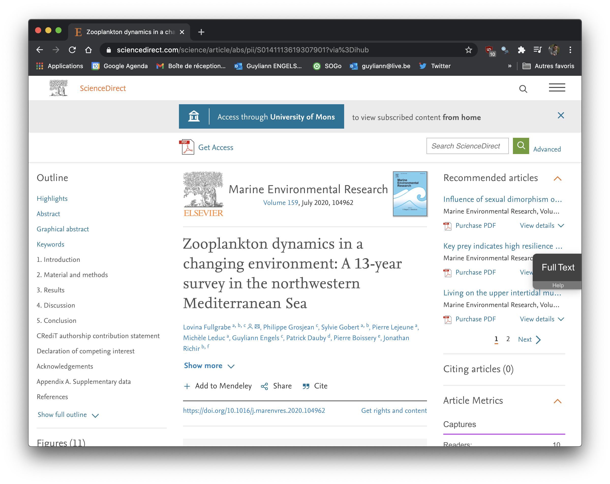
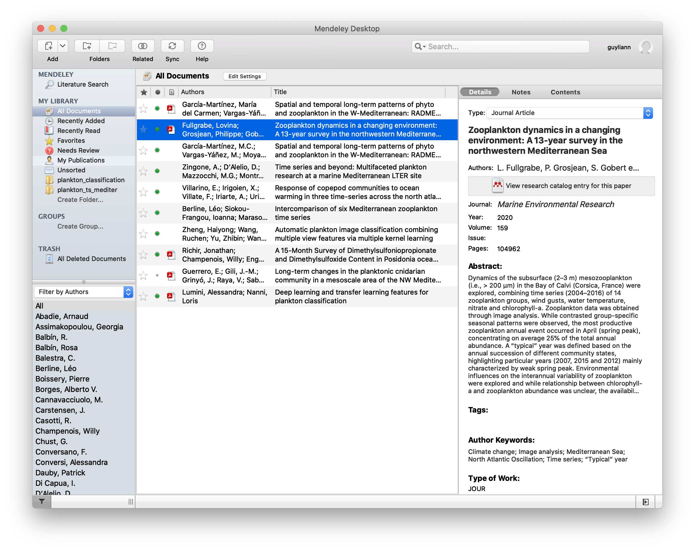

# Projets {#projets}

Ce second module du cours SDD IV : recherche reproductible vous prépare à l'analyse des données d'un gros projet de recherche, qu'il soit basé sur les résultats de votre travail de fin d'études ou sur des données similaires. Les gros projets ne diffèrent pas tellement de ceux que vous avez réalisés jusqu'ici dans les différents cours de science des données, si ce n'est que la quantité de données, le nombre d'étapes (importation - préparation - description - analyse) et les éléments discutés sont plus nombreux. Par conséquent, le nombre de fichiers l'est également. Cela nécessite une organisation et une discipline précises afin que le projet reste compréhensible et utilisable par vous-même bien sûr, mais aussi par d'autres... y compris votre futur "vous"[^08-projets-1] !

[^08-projets-1]: Revenir dans un projet que vous avez écrit il y a plusieurs mois ou années ne vous différencie plus tellement d'un étranger : souvent vous avez oublié de quoi il s'agit et vous redécouvrez son contenu... Donc, autant le rendre compréhensible pour les autres, c'est-à-dire, pour votre futur "vous" également.

##### Objectifs {.unnumbered}

-   Structurer un projet de recherche pour sa partie analyse des données

-   Importer et retravailler les données de manière claire et reproductible

-   Utiliser un carnet de notes à bon escient pour explorer différentes pistes dans l'analyse

-   Rédiger un ou plusieurs documents de synthèse qui reprennent les éléments importants de l'analyse et les communiquent clairement et de manière reproductible à la communauté scientifique

##### Prérequis {.unnumbered}

Dans ce module, nous traiterons de RStudio et des projets RStudio, de R Markdown, de git et GitHub, ainsi que de divers outils de R pour importer, remanier, décrire et analyser des données biologiques. Toutes ces notions doivent être parfaitement connues avant d'aborder le présent module qui va vous emmener un niveau plus loin vers un gros projet constitué de plusieurs étapes successives dans l'analyse. Toutes ces notions ont été utilisées en routine dans les trois cours précédents, [SDD I](https://wp.sciviews.org/sdd-umons/?iframe=wp.sciviews.org/sdd-umons-2024/), [SDD II](https://wp.sciviews.org/sdd-umons2/?iframe=wp.sciviews.org/sdd-umons2-2024/) et SDD III (les six premiers modules du présent cours). Ainsi, si vous avez bien suivi ces trois cours-là, vous êtes en principe parfaitement préparé pour aborder cette matière.

## Structurer un projet

Un **projet dans RStudio** est un dossier particulier contenant un fichier `.Rproj` de paramétrage du projet, ainsi qu'un ou plusieurs sous-dossiers et fichiers. Il coïncide également avec un dépôt git pour la gestion de version si vous avez activé cette option, et peut aussi correspondre à un dépôt GitHub pour sa sauvegarde dans le cloud et pour collaborer à plusieurs dans le projet.

Un **projet scientifique** est essentiellement centré autour d'une question qu'on se pose. Nous avons **planifié des mesures ou des expériences** pour avancer dans les connaissances scientifiques après avoir consulté la littérature scientifique sur le sujet pour en cerner les limites de nos connaissances actuelles. À l'issue de notre travail, nous avons **généré des données** et nous allons ensuite les **analyser** et enfin **discuter les résultats et tirer des conclusions**. La dernière étape consiste à **communiquer** ces résultats à l'équipe, aux collègues et plus généralement, à la communauté scientifique tout entière par l'intermédiaire d'un ou plusieurs rapports, de publications, de posters ou de présentations à des colloques scientifiques, voire en utilisant des outils plus récents comme un tableau de bord interactif ("dashboard") pour permettre à d'autres d'explorer de manière interactive tout ce que l'on aura construit dans notre projet.

Si ces deux projets (RStudio *versus* scientifique) n'ont rien à voir l'un avec l'autre en apparence, ils sont étroitement liés en science des données, du moins si vous avez choisi RStudio, R, git et GitHub pour travailler (il existe bien sûr d'autres outils similaires, comme [Jupyter](https://jupyter.org), [Python](https://www.python.org), [Julia](https://julialang.org), [Matlab](https://fr.mathworks.com/products/matlab.html), [GitLab](https://about.gitlab.com), [Bitbucket](https://bitbucket.org) ...). En effet, un *projet RStudio* sera le contenant informatique idéal pour votre *projet scientifique* quel qu'en soit la taille et la complexité. Par la suite, lorsque nous parlerons de **projet**, il s'agira donc d'un projet RStudio qui lui-même contient le matériel relatif à votre projet scientifique, le tout ne formant donc plus qu'une seule entité.

### Qualités d'un bon projet

Pour que votre projet soit **compréhensible**, **maintenable**, **reproductible** et **cohérent**, vous allez devoir le structurer et le construire en respectant certaines règles. Nous en avons déjà abordé plusieurs dans les modules et cours précédents :

-   Structurer clairement son projet en sous-dossiers (`data`, `R`, `docs`, `reports` ...)
-   Utiliser des noms de sous-dossiers et de fichiers courts, mais représentatifs du contenu
-   Séparer les données des analyses
-   Utiliser des chemins relatifs pour les liens entre fichiers, et ne jamais sortir au-delà du dossier de base du projet afin que celui-ci reste cohérent dans un autre contexte (sur GitHub, ou cloné sur un autre ordinateur)
-   Inclure les analyses directement dans les carnets de notes et les rapports via l'utilisation de R Markdown ou de Quarto
-   Gérer les versions du projet avec git
-   Partager le projet avec GitHub ou tout autre système équivalent (GitLab, Bitbucket), qu'il soit privé ou public
-   Indiquer clairement comment le matériel contenu dans le projet peut être (ré)utilisé an lui associant une licence, y compris pour les données

Il n'est pas si facile que cela d'élaborer un projet qui présente les trois qualités d'être :

-   **compréhensible** (nous retrouvons facilement les différents éléments du projet),
-   **maintenable** (pas de scripts à rallonge ou répétitifs, documents bien structurés et pas trop longs non plus, avec un système de gestion des versions correctement employé) et
-   **reproductible** (toutes les analyses peuvent être réexécutées et les documents régénérés sans erreurs et en obtenant à chaque fois les mêmes résultats et rendus de documents finaux).

Mais en respectant quelques règles, nous pouvons y arriver. Du point de vue du contenu, un projet est également centré sur **une question scientifique**, et toutes les analyses sont réalisées dans l'intention d'y répondre. Et effectivement, la discussion et les conclusions reviennent sur cette question. Cela ajoute une quatrième qualité au projet : sa **cohérence**.

Cela peut sembler évident, mais une erreur fréquente du débutant est de se perdre dans les données, les analyses ou la bibliographie ... pour au final discuter de tout autre chose et **ne pas** répondre à la question de départ. C'est pour cela que la section **but** est très importante : elle exprime de manière concise et claire cette fameuse question qui est, et doit rester centrale pour que le projet soit cohérent.

```{block2, type = 'warning'}
Rédigez méticuleusement la section "but" de votre travail et gardez cela à l'esprit à chaque instant pour éviter de vous perdres dans les méandres des possibilités que l'étude d'un sujet biologique permet. C'est la meilleure façon de rester centré sur ses objectifs... et au final d'y répondre. La cohérence du projet est cruciale.
```

### Structure conseillée

Pour les gros projets, une structure bien pensée dès le départ est *indispensable*. Nous vous en proposons une ici, sachant que des variations sur ce thème (sous-dossiers différents) seront possibles plus tard en fonction de vos goûts personnels. Mais pour l'instant, imprégnez-vous de cette structure et attachez-vous à comprendre en quoi elle permet d'atteindre les trois qualités de clarté, maintenabilité et reproductibilité du projet. Notre projet sera composé des éléments suivants :

-   des **données** avec des métadonnées complètes (pensez au dictionnaire des données), ainsi qu'un **protocole** d'acquisition de ces données détaillé (description des expériences et autres actions entreprises pour obtenir ces données),
-   des **carnets de notes** ("notebooks") détaillant les analyses de manière reproductible,
-   des **documents** de synthèse pour transmettre les résultats du projet dans le format le plus approprié (rapport, présentation, poster, manuscrit plus conséquent, tableau de bord ...).

Si vous avez suivi l'ensemble des cours de sciences de données, vous êtes déjà familier avec la plupart de ces éléments. Dans les cours précédents, nous n'avons pas insisté sur les protocoles, car nous partions la plupart du temps sur des données préexistantes. De même, les projets étant plus restreints, nous n'avons pas encore abordé un outil comme [Quarto](https://quarto.org/docs/tools/rstudio.html) ou [Bookdown](https://bookdown.org/yihui/bookdown/) pour rédiger de gros manuscrits, mais nous avons abondamment utilisé diverses formes de documents R Markdown, ainsi que les notebooks. En fait, les cours précédents ont été structurés pour vous amener progressivement à utiliser correctement les projets et pour vous préparer à utiliser des projets reproductibles sous RStudio.

```{block2, type = 'note'}
Ce module ne s'attarde pas sur le contenu en dehors de sa cohérence. La pertinence de la question de recherche n'est pas abordée ici, par exemple. Néanmoins, nous vous proposons quand même quelques astuces pour gérer au mieux le contenu, et en particulier votre bibliographie en fin de module.
```

La suite reprend et détaille les trois éléments principaux de votre projet : ses données, ses carnets de notes et ses documents de synthèse. Enfin, ce module se clôturera sur quelques astuces et vous aurez un projet GitHub Classroom qui vous permettra de mettre en pratique toute cette théorie.

## Données

Nous avons à plusieurs reprises déjà abordé les points importants à prendre en compte pour représenter ses données sous un format informatique exploitable ensuite. Avant d'aller plus loin, relisez attentivement les sections suivantes :

-   [Acquisition de données](https://wp.sciviews.org/sdd-umons-2024/acquisition-de-donn%C3%A9es.html)

-   [Encodage des données dans un tableau cas par variables](https://wp.sciviews.org/sdd-umons-2024/tableaux-de-donn%C3%A9es.html#tableaux-cas-par-variables)

-   [Ajout de métadonnées](https://wp.sciviews.org/sdd-umons-2024/tableaux-de-donn%C3%A9es.html#m%C3%A9tadonn%C3%A9es) avec utilisation d'un [dictionnaire des données](https://wp.sciviews.org/sdd-umons-2024/tableaux-de-donn%C3%A9es.html#dictionnaire-des-donn%C3%A9es)

Il est de plus intéressant de pouvoir rendre les données de sa recherche accessibles en respectant les normes et les règles de l'[Open Data](https://wp.sciviews.org/sdd-umons2/?iframe=wp.sciviews.org/sdd-umons2-2024/donn%25C3%25A9es-ouvertes.html).

Comme vous le voyez, toutes les grandes règles ont déjà été abordées dans le cadre des cours de sciences de données. La documentation précise et riche des données est une étape longue et fastidieuse. En pratique, elle est très souvent bâclée... et c'est dommage, car c'est leur **réutilisabilité** qui est impactée au final.

```{block2, type = 'note'}
En résumé, des données sans documentation sont des données inutilisables.  Elles seront perdues avec le temps. Votre objectif sera de permettre à une personne externe de comprendre vos données, et si possible, de pouvoir les réutiliser dans son propre contexte (en respect des droits de la licence que vous leurs associerez, bien entendu).

Ne perdez jamais de vue l'importance des données. Cette importance est à placer au même niveau qu'une bonne publication scientifique. Malheureusement, l'évaluation du curriculum d'un scientifique ne mets pas encore assez l'accent sur les données, et c'est dommage, car cela n'insite pas à les rendre réutilisables. Mais la mouvance de science ouverte, et dans son sillage, de données ouvertes (Open Data) est en train de recentrer l'intérêt sur les jeux de données de qualité. A noter d'ailleurs que la même remarque peut être faite pour les logiciels et codes informatiques qui mériteraient aussi d'être mieux valorisés dans une carrière scientifique.
```

### Données brutes et retravaillées

Lors d'une expérience ou d'une observation sur le terrain, les données collectées sont les **données brutes**. Nous conseillons de les placer dans le sous-dossier `data/raw`. Ces données vont devoir être retravaillées afin d'être exploitables dans les carnets de notes et les documents de synthèse par la suite. Voici une liste d'étapes à réaliser pour passer des données brutes aux données remaniées :

-   Importation des données brutes
-   Validation des données brutes
    -   vérification des types de variables (caractère, facteur, numérique, date ...)
    -   vérification des valeurs obtenues
    -   encodage des valeurs manquantes
-   Calcul de nouvelles variables dérivées
-   Élimination des variables et/ou individus inutiles pour le projet, le cas échéant
-   Changement du nom des variables (si cela est nécessaire)
-   Ajout des labels et unités à chaque variable du jeu de données
-   Sauvegarde des données remaniées (voir section suivante)

Ce travail doit être réalisé de manière reproductible et doit être correctement documenté de manière concise (explication de la raison d'être de chaque étape). Deux possibilités s'offrent à vous :

1.  Utiliser un script R. C'est l'approche conseillée, car ce type de document se concentre sur le code et les commentaires sont plus accessoires, ce qui est le cas ici. De plus, dans RStudio, l'éditeur offre plus d'outils pour exécuter et déboguer du code R dans un script que dans un document R Markdown ou Quarto.

2.  Utiliser un notebook. Cette option est surtout intéressante si le remaniement des données n'est pas évident et nécessite de longues explications textuelles ou la présentation de graphiques qui montrent pourquoi les données sont remaniées de cette façon. Dans ce cas, la partie Markdown du document, et sa compilation en page HTML, fourniront une présentation plus adéquate. Vous partirez systématiquement des données retravaillées pour tous vos carnets de notes et documents de synthèse à partir du sous-dossier `data`.

### Format des données

Quel que soit le type de document utilisé, écrivez la version remaniée de vos données dans le sous-dossier `data` dans le format le plus pratique et compact possible. Si les analyses sont réalisées dans R uniquement, le format de données natif `.rds` est idéal, car il préserve tous les attributs des objets R et il permet aussi de stocker des objets spécifiques, comme des tables de contingence ou des séries spatio-temporelles par exemple. De plus, vous pouvez compresser les données afin qu'elles occupent le moins de place possible dans le fichier.

Si les données doivent être exploitées à l'aide d'autres logiciels que R, choisissez alors un format plus universel. Le format [CSV](https://fr.sendinblue.com/blog/fichiers-csv/) que vous avez déjà beaucoup utilisé est l'un des plus standards et il est donc reconnu par *tous* les logiciels. Le format Excel est fréquemment utilisé aussi. C'est une option, mais préférez CSV. Des formats spécifiques, par exemple pour les données spatiales, existent et peuvent aussi être utilisés. Pour les données semi-structurées (donc, pas des tableaux rectangulaires), le [XML](https://www.papergeek.fr/ficher-au-format-xml-quest-ce-que-cest-et-comment-louvrir-407309) et le format [JSON](https://www.json.org/json-fr.html) sont aujourd'hui universellement employés. Enfin, des formats réutilisables ciblant les données scientifiques comme [netCDF](https://pro.arcgis.com/fr/pro-app/help/data/multidimensional/what-is-netcdf-data.htm) ou [HDF5](https://www.neonscience.org/resources/learning-hub/tutorials/about-hdf5) plus anciens, ou encore le nouveau format [arrow](https://arrow.apache.org/docs/format/Columnar.html) poussé par le projet [Apache Arrow](https://arrow.apache.org) qui est très prometteur.

Si les données sont très volumineuses, pensez bien à les exclure (aussi bien les données brutes dans `data/raw` que les données remaniées dans `data`) de la gestion de version en indiquant leurs fichiers dans `.gitignore`. Votre script ou votre notebook doit comporter le code nécessaire pour réimporter les données lorsqu'elles sont absentes. À cet égard, l'argument `cache_file=` de la fonction `read()` pointant sur une URL qui charge les données depuis Internet est intéressant. Il fait en sorte qu'au premier téléchargement de l'URL, une copie soit enregistrée dans `cache_file=`. Les appels suivants liront directement les données depuis ce cache sans repasser par Internet.

Si vous devez travailler sur des sous-ensembles de vos données, ou si vos données sont trop volumineuses pour se charger intégralement en mémoire vive, vous les convertirez plutôt en une base de données ou un autre format qui vous permet de récupérer des sous-tableaux sans devoir passer par l'ouverture du jeu de données complet. Le plus simple (mais pas le plus performant) consiste à utiliser le moteur de base de données SQLite et d'accéder à vos données via des requêtes SQL, ou via le package [{dbplyr}](https://dbplyr.tidyverse.org). SQLite ne nécessite pas d'installer un serveur de base de données, car son code est contenu directement dans le package {RSQLite} qui permet d'y accéder depuis R.

```{block2, type = 'note'}
Lors du choix du format de stockage de vos données retravaillées, vous devez sélectionner le format qui convient le mieux à vos données (taille du fichier de stockage, vitesse d'importation, interopérabilité et requêtes sous-tableaux possibles ou non). Préférez les formats les plus universels aux formats spécifiques. Gardez toujours à l'esprit que des logiciels de niche avec des formats propriétaires peuvent être problématiques dans quelques années s'ils ne fonctionnement plus sur des systèmes informatiques plus récents. Par contre, R, Python, ou Java, par exemple, sont des langages qui ont toutes les chances de perdurer et sont donc sains comme choix.

Pour les données brutes, la question d'interopérabilité est encore plus cruciale si vous voulez ouvrir vos données au maximum. Actuellement, le CSV est le format le plus universel, et donc, le plus sûr pour assurer une réutilisabilité maximale de vos données brutes.
```

## Carnet de notes

Après avoir collecté et remanié vos données, l'étape suivante consiste à explorer et décrire vos données. Ensuite, vous envisagerez diverses pistes d'analyses probablement, et vous serez amené à adopter un processus itératif où vous explorez une idée, celle-ci vous livre de nouvelles informations, ce qui vous conduit à une nouvelle idée, que vous étudiez, et ainsi de suite.

```{block2, type = 'warning'}
Ne négligez jamais le temps nécessaire pour explorer et analyser vos données. Cela peut très facilement vous occuper la moitié du temps de l'ensemble de votre travail ! Une erreur fréquente est de passer tout son temps à la paillasse ou sur le terrain, en espérant que la quantité de données acquise sera ensuite digérée et analysée en quelques jours seulement.
```

Vous avez à nouveau déjà toutes les clés en main pour mener à bien cette tâche avec tout ce que vous avez appris dans les trois cours précédents de science des données. L'outil le plus efficace est le document R Notebook ou R Markdown dans RStudio. Vous avez utilisé ce type de document dans l'ensemble des cours de sciences de données. L'utilisation du R Markdown et de git permet d'associer le code (R, Python, SQL, ou autre) et le texte narratif dans un même document, le tout sous un gestionnaire de version. Le format Markdown permet une lecture aisée du source du document, y compris dans les présentations "diff" (mise en évidence des parties effacées en rouge et ajoutées en vert) qui accompagnent le système de gestion de version. Tout est en place pour analyser vos données confortablement et de manière reproductible. Le nouveau format [Quarto](https://quarto.org) avec extension `.Qmd` est très similaire au Markdown et convient parfaitement également.

Votre objectif sera donc de permettre à une personne externe de comprendre vos analyses grâce à l'intégration de la documentation et du code dans vos carnets de notes. Dans un gros projet, il est tout à fait habituel d'avoir plusieurs carnets de notes différents. Ceux-ci constituent des étapes successives de l'analyse des données et/ou explorent des facettes différentes de ces données. Rassemblez vos carnets de notes dans un sous-dossier (dans la structure proposée dans le projet à la fin de ce module, ce sera dans le sous-dossier `results`).

Nommez vos différents fichiers de manière concise, mais explicite quant au contenu. Cela facilite grandement la clarté de l'ensemble. Enfin, si une succession logique existe entre ces différents fichiers (étapes successives de l'analyse), pensez à les nommer de manière à ce qu'ils apparaissent correctement rangés lorsque les fichiers sont présentés par ordre alphabétique. Le plus simple étant d'utiliser un préfixe numérique correspondant à l'étape de l'analyse, par exemple, `01_description.Rmd`, `02_first_exploration.Rmd`, `03_model1.Rmd`, `04_model2.Rmd`. Si l'analyse est vraiment très complexe, n'hésitez pas à structurer à l'aide de sous-dossiers dans `results`.

```{block2, type = 'warning'}
Tout bon chercheur doit analyser ses données de la ou des manipulations précédentes *avant* de lancer une nouvelle expérience. Sans cela, comment pourra-t-il tirer les enseignements de ses résultats passés pour améliorer ses futurs travaux ? Dans votre palnning, assurez-vous de laisser suffisamment de temps entre deux expériences successives pour permettre l'analyse des données et, éventuellement, l'ajustement du protocole de la seconde manipulation en fonction des enseignements tirés des travaux précédents.
```

## Documents de synthèse

Cette dernière étape s'attaque à la rédaction de documents finalisés qui servent à disséminer les résultats obtenus. C'est, en théorie, l'étape la plus courte des trois. Vous avez d'une part des données et des métadonnées correctement présentées (travail déjà réalisé à l'étape une). D'autre part, vous avez des carnets de notes où toutes vos analyses sont consignées (étape deux). Vous devez à présent extraire les éléments les plus pertinents en tenant compte du format de sortie du document de synthèse qui est le plus souvent imposé.

Il est possible de réaliser  :

-   un rapport (interne à l'équipe, et donc relativement informel, ou externe) avec un document [R Markdown](https://rmarkdown.rstudio.com) classique ou [Quarto](https://quarto.org) et le sortir en format HTML, PDF ou Word,
-   une publication scientifique avec, par exemple, le package [{rticles}](https://pkgs.rstudio.com/rticles/),
-   un poster scientifique avec la package [{posterdown}](https://brentthorne.github.io/posterdown_html_showcase/),
-   une présentation sous forme de dias avec les packages [{rmarkdown}](https://rmarkdown.rstudio.com) sous differentes formes comme PowerPoint ou [Beamer](https://bookdown.org/yihui/rmarkdown/beamer-presentation.html), [{xaringan}](https://slides.yihui.org/xaringan/#1) ou [{revealjs}](https://github.com/rstudio/revealjs),
-   une présentation interactive sous forme de tableau de bord interactif, type "dashboard" avec [Shiny](https://shiny.rstudio.com) et le package [{flexdashboard}](https://pkgs.rstudio.com/flexdashboard/),
-   un site web avec les packages [{blogdown}](https://bookdown.org/yihui/blogdown/), [{distill)}](https://rstudio.github.io/distill/) ou [{packagedown}](https://pkgdown.r-lib.org),
-   un document plus conséquent comme un ouvrage, un manuscrit de mémoire ou de thèse de doctorat avec le package [{bookdown}](https://pkgs.rstudio.com/bookdown/), ou avec [Quarto](https://quarto.org/docs/books/).

Ce qui unifie l'ensemble des formats de sortie ci-dessus est qu'ils sont tous rédigés sur la base de documents R Markdown ou Quarto, tous deux très semblables. Le livre [R Markdown: The Definitive Guide](https://bookdown.org/yihui/rmarkdown/) donne une information détaillée sur ce format et reprend en long et en large une grande partie des formats de sortie possibles avec R Markdown. De plus, [R Markdown Cookbook](https://bookdown.org/yihui/rmarkdown-cookbook/) fournit un grand nombre d'astuces supplémentaires pour devenir expert dans l'utilisation de R Markdown.

La maîtrise de R Markdown dans des projets RStudio sous gestionnaire de version git est une compétence capitale en science des données. Elle vous permettra de vous hisser facilement au-dessus de vos collègues biologistes qui ne maîtrisent souvent pas cet outil.

```{block2, type = 'info'}
Au cours de la carrière d'un des auteurs, un travail de consultant a consisté à explorer de manière méthodique une grosse base de données. Pour chaque catégorie, les commanditaires voulaient un rapport détaillant différentes caractéristiques de cette catégorie. Chaque rapport individuel s'étalait facilement sur plusieurs dizaines de pages et devait présenter de nombreux graphiques. Ce travail aurait été extrêmement chronophage s'il devait être réalisé à la main dans Excel et Word. Mais avec R Markdown et quelques scripts R, le tout a pu être automatisé, et plus de 700 pages de rapports exhaustifs (répondant à la demande) ont pu être générés en quelques jours de travail seulement. C'est évidemment un cas extrême, mais les possibilités d'automatisation et de reproductibilité qu'offrent Quarto et R Markdown font vraiement la différence au quotidien.
```

Pour des projets conséquents, le format {bookdown} est particulièrement intéressant. Vous ne l'avez pas encore utilisé, bien que vous y avez été confronté depuis le début. En effet, tous vos cours de science des données (c.-à-d., les pages que vous êtes précisément en train de lire) sont rédigés avec cet outil. Vous allez maintenant apprendre par la pratique à utiliser ce format dans un gros projet personnel pour présenter vos résultats finaux.

##### À vous de jouer ! {.unnumbered}

```{r assign_D08Ga_project, echo=FALSE, results='asis'}
if (exists("assignment"))
  assignment("D08Ga_project", part = NULL,
    url = "https://github.com/BioDataScience-Course/D08Ga_project",
    course.ids = c(
      'S-BIOG-043'         = !"D08Ia_{YY}M_project"),
    course.urls = c(
      'S-BIOG-043'         = "https://classroom.github.com/a/..."),
    course.starts = c(
      'S-BIOG-043'         = !"{W[6]+1} 08:00:00"),
    course.ends = c(
      'S-BIOG-043'         = !"{W[8]+5} 23:59:59"),
    term = "Q1", level = 3,
    toc = "Organisation d'un projet dans RStudio")
```

## Astuces

Cette section propose quelques astuces pour améliorer encore vos projets.

### Exclusion de fichiers du dépôt git

Vous l'avez certainement remarqué : vos projets liés au gestionnaire de version git ont dans le dossier principal un fichier qui se nomme `.gitignore`. Jusqu'à présent vous n'avez jamais eu à la modifier. Ce fichier permet d'exclure certains fichiers ou dossiers du gestionnaire de version. Il est bien utile pour éviter d'enregistrer les versions de fichiers temporaires et de ceux qui sont générés, mais qu'il n'est pas utile de conserver dans le dépôt directement, comme les compilations HTML ou PDF de vos documents R Markdown dans la plupart des cas.

L'exemple ci-dessous représente une série d'instructions présentes dans un fichier `.gitignore` typique.

```         
.Rproj.user
.Rhistory
.RData
.Ruserdata

README.html

reports/*.html
reports/*.pdf

**.docx

# Ceci est un commentaire

data/raw
data/raw/**
```

Ces instructions vous montrent plusieurs possibilités pour exclure certains fichiers.

-   Les quatre premières instructions permettent d'exclure les fichiers ou dossiers se terminant par ses extensions particulières.
-   Une seconde possibilité est de spécifier un fichier comme `README.html`.
-   Les deux instructions suivantes vont exclure tous les fichiers ayant une certaine extension et se situant dans un dossier particulier. Pour indiquer que le nom du fichier peut être quelconque, nous utilisons l'astérisque `*`.
-   L'instruction suivante `**./docx` utilise deux astérisques et cela exclura *tous* les fichiers ayant une extension `.docx`, quel que soit le dossier dans lequel ils se trouvent.
-   Enfin, les deux dernières instructions vont exclure le sous-dossier `raw` de `data`, ainsi que tous les fichiers qu'il contient. Cela est très utile lorsque l'on a des données brutes trop volumineuses et qui ne peuvent pas être placées dans le gestionnaire de version (vous pouvez aussi faire de même pour les données remaniées directement dans `data`).
-   Les commentaires sont précédés par un dièse (un hashtag si vous préférez), comme dans les scripts R.

Pour plus de détails, voyez la documentation complète de [.gitignore](https://git-scm.com/docs/gitignore).

### Bibliographie

La réalisation d'une bonne bibliographie est indispensable pour toute recherche scientifique. Il est vital d'être à jour concernant les dernières publications proches du sujet de notre recherche. Partons de l'article [Zooplankton dynamics in a changing environment: A 13-year survey in the northwestern Mediterranean Sea](https://www.sciencedirect.com/science/article/abs/pii/S0141113619307901) disponible sur le site ScienceDirect.



Il existe plusieurs outils pour gérer sa bibliographie comme [Mendeley](https://www.mendeley.com/), [EndNote](https://endnote.com/) ou encore [Zotero](https://www.zotero.org/). Nous allons utiliser Mendeley pour cet exemple. Comme le montre la figure ci-dessus, il est possible d'exporter directement la citation de l'article dans Mendeley. Il est également possible d'extraire la citation via le bouton **Cite** juste en dessous du titre et des auteurs. Lorsqu'on clique sur ce bouton, un menu déroulant permet d'exporter cet article dans différents formats de citation, dont `.bib`, `.ris` ou encore `.txt`. Ce fichier peut être par la suite importé dans Mendeley Desktop qui est l'application de Mendeley.



Toutes les informations nécessaires sont ainsi ajoutées dans la base de données bibliographique de Mendeley. Il est également possible d'ajouter le fichier PDF d'un article scientifique. Dans ce cas, l'application va analyser le fichier pour extraire les informations pertinentes pour le citer ensuite. Il faut cependant vérifier les informations que l'on peut modifier facilement (la partie à droite dans la copie d'écran présentée ci-dessus).

```{block2, type = 'note'}
Mendeley propose une fonction de veille automatique. Sur base des articles que vous avez déjà ajouté à votre gestionnaire de bibliographie, Mendeley propose des nouveaux articles en lien avec ceux-ci.
```

Il est possible d'utiliser les informations présentes dans votre bibliographie dans les documents R Markdown. Dans Mendeley Desktop, vous pouvez extraire vos citations en cliquant sur `File > Export...`. Vous choisirez alors le format `.bib`. Vous placez ce fichier dans votre projet. Enfin, dans l'entête YAML de votre document R Markdown, vous vous référez à ce même fichier `.bib` dans l'entrée `bibliography:`. Vous pourrez alors ajouter des citations issues de ce fichier dans votre texte. Le plus simple étant d'utiliser l'addin "Insert citation" du package {citr}.

## Votre projet

Maintenant que vous maîtrisez les principaux types de variables rencontrées en Science des Données Biologiques (module 7) et les gros projets (module 8), vous êtes prêt pour analyser vos données liées à votre mémoire de fin d'études dans les règles de l'art. Nous vous proposons un **template** pour initier votre projet. Nous n'utiliserons pas, ici, GitHub Classroom pour initier votre projet. **Vous allez devoir le créer par vous-même** en partant de [ce template](https://github.com/BioDataScience-Course/D08Gb_project).

-   Cliquez sur **Use this template**

-   Créez un nouveau projet dans *votre* compte, et donnez-lui le nom qui vous semblera le plus opportun par rapport au travail qu'il va contenir

-   Pensez à ajouter une courte description

-   Décidez si vous voulez que votre dépôt soit **public** ou **privé**. Si vos recherches sont confidentielles, choisissez **privé** (si vous ne pouvez répondre à cette question, choisissez aussi **privé** par défaut).

```{block2, type = 'info'}
Rendre votre dépôt public permet de montrer ce que vous savez faire en matière d'analyse de données. Vous pouvez alors indiquer un lien vers ce dépôt dans votre curriculum vitae... un gros plus si naturellement, cela démontre des capacités intéressantes ! Par contre, gardez à l'esprit que vos données de mémoire **ne vous appartiennent pas**. Rendre votre dépôt **public** ne peut se faire qu'avec l'accord de votre promoteur, du chef de labo, du ou des resposables de projet et collaborateurs, et éventuellement aussi, des financeurs. Si, par exemple, un brevet est prévu sur ces données, alors elles **ne peuvent pas** être divulguées prématurément ! Discutez-en avec toutes les personnes concernées au préalable.
```

Une fois le formulaire rempli, vous pouvez cliquer sur **Create repository from template**. La dernière étape consiste à informer vos enseignants de la création de votre projet et à les ajouter comme éditeurs du dépôt pour qu'ils puissent le commenter, et finalement le noter. Pour cela, vous vous rendez dans `Settings -> Manage access` et vous invitez vos enseignants en cliquant sur **Add people**. Demandez leurs logins à vos enseignants et ajoutez-les à votre dépôt. Vous pouvez également inviter d'autres personnes qui sont impliquées dans votre mémoire, *mais dans le cadre de cet exercice, ces personnes ne peuvent pas contribuer directement au projet*.

Enfin, prenez connaissance des différentes instructions, et explorez les dossiers et fichiers qui s'y trouvent. *Bon travail !*

## Récapitulatif des exercices

Ce module vous a permis de revoir un ensemble de notions sur la gestion d'un projet scientifiques dans le cadre de travaux de plus grande envergure. Pour évaluer votre compréhension de cette matière, vous aviez les exercices suivants à réaliser :

`r show_ex_toc()`
